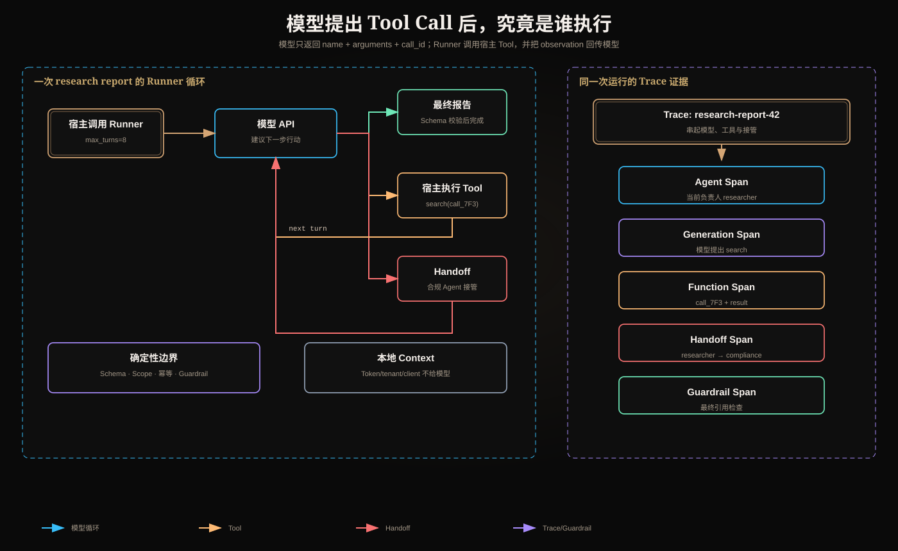

# OpenAI Agents SDK：谁在运行 Agent，谁在执行 Tool，控制权怎样转移



本文仍用同一个任务：研究一个问题、调用搜索工具、让合规专家检查，最后生成带引用的报告。目标不是罗列 SDK 类名，而是回答一条请求进入程序后，**谁在什么时候做了什么**。

## 1. 先纠正最常见的误解：模型不是运行程序的人

一次工具调用的真实链路是：

```text
宿主应用调用 Runner
  → Runner 把消息、指令和工具定义发给模型 API
  → 模型返回“建议调用 search(arguments...)”
  → Runner 找到本地 Tool 并调用它
  → Tool 代码访问搜索服务
  → Runner 把 Tool 结果和 call_id 发回模型
  → 模型基于观察继续决定或给最终答案
```

模型只产生结构化意图，不会直接执行 Python 函数、读取数据库或拿到 Access Token。实际执行者是 SDK 所在的宿主进程，或 SDK 委托的远端工具服务。

这一区分形成安全边界：

- 模型输出是不可信建议；
- Runner 负责循环和分派；
- Tool Runtime 负责参数校验、授权、超时和副作用；
- 资源服务器负责最终访问控制。

## 2. Agent 与 Runner：配置和执行引擎不是一回事

### 2.1 Agent 描述“允许怎样工作”

```python
from agents import Agent

research_agent = Agent(
    name="researcher",
    instructions="先检索证据，再写带来源的结论。",
    tools=[search_documents],
    handoffs=[compliance_agent],
    output_type=ResearchReport,
)
```

这个对象主要包含配置：名称、指令、模型、工具、Handoff、Guardrail、输出类型等。创建它不会启动一个后台进程，也不会自动请求模型。

### 2.2 Runner 才推进循环

```python
from agents import Runner

result = await Runner.run(
    research_agent,
    "研究为什么授权检查不能交给大模型",
    max_turns=8,
)
```

Runner 的核心决策可简化为：

```python
current_agent = research_agent
items = [user_input]

while turns < max_turns:
    response = call_model(current_agent, items)

    if response.has_tool_calls:
        outputs = await execute_tools(response.tool_calls)
        items += response.tool_calls + outputs
        continue

    if response.has_handoff:
        current_agent = resolve_handoff(response.handoff)
        items = apply_input_filter(items)
        continue

    final = validate_output(response, current_agent.output_type)
    run_output_guardrails(final)
    return final

raise MaxTurnsExceeded()
```

这是帮助理解的伪代码，不是 SDK 源码复制。关键是 Runner 持有“继续调用模型还是结束”的控制权。

## 3. 一次 Tool 调用逐帧发生了什么

工具定义：

```python
from agents import function_tool

@function_tool
async def search_documents(query: str, top_k: int = 5) -> SearchResult:
    """检索内部文档，并返回来源和摘要。"""
    return await search_service.search(query=query, top_k=top_k)
```

运行时可能经历：

```text
第 1 次模型响应
  type = function_call
  name = search_documents
  arguments = {"query": "LLM tool authorization", "top_k": 5}
  call_id = call_7F3

Runner
  查表找到 search_documents
  校验 arguments
  执行 async Python 函数

工具结果
  call_id = call_7F3
  output = {"documents": [...]}

第 2 次模型请求
  附带原工具调用及匹配的工具结果
```

`call_id` 的作用是让模型和 Runtime 明确知道哪个结果回答哪个调用。一次响应可能并行提出多个 Tool Call；只凭工具名或数组顺序关联，在重试、并发和流式场景中会出错。

### 3.1 SDK 自动生成 Schema 不等于业务安全

类型注解可以生成类似 JSON Schema 的参数约束，但生产工具仍需处理：

```text
语法校验：top_k 是否整数
业务校验：top_k 是否在 1..20
授权校验：用户是否拥有 documents:read
租户校验：检索过滤是否固定 tenant_id
资源校验：文档 ACL 是否允许当前用户
预算校验：查询是否超过时间或费用限制
```

模型看见的参数不应包含原始 Token。宿主应用在本地 Context 中持有授权上下文，由 Tool 注入到服务调用：

```python
@function_tool
async def search_documents(ctx, query: str, top_k: int = 5):
    auth = ctx.context.auth_context  # 不发送给模型
    require_scope(auth, "documents:read")
    return await search_service.search(
        tenant_id=auth.tenant_id,
        user_id=auth.user_id,
        query=query,
        top_k=min(top_k, 20),
    )
```

## 4. Tool 失败后，谁决定重试

需要区分三层失败：

| 失败 | 例子 | 推荐处理者 |
|---|---|---|
| 参数失败 | `top_k="many"` | Runtime 返回结构化错误；模型可修参 |
| 业务失败 | 没权限、文档不存在 | Runtime 确定性拒绝；通常不应重试 |
| 系统失败 | 连接超时、503 | Runtime 按策略有限重试，仍失败再反馈模型 |

不要把所有异常字符串直接交给模型说“请重试”。对写工具而言，不受控重试可能重复付款或发布。重试策略必须知道：操作是否幂等、是否已经产生结果、超时发生在请求发送前还是响应丢失后。

## 5. Handoff：不是调用专家，而是更换当前负责人

假设研究报告涉及合规判断：

```python
triage_agent = Agent(
    name="triage",
    handoffs=[compliance_agent],
)
```

模型选择 Handoff 后，Runner 把 `current_agent` 从 `triage_agent` 改为 `compliance_agent`，后续模型调用使用新 Agent 的指令、工具和输出规则。

```text
用户 → Triage Agent
          │ handoff
          ▼
      Compliance Agent → 后续工具与最终回复
```

这叫控制权转移，因为原 Agent 不再负责下一轮。

### 5.1 Agent-as-Tool：专家被调用，但负责人不变

```python
manager = Agent(
    name="research_manager",
    tools=[compliance_agent.as_tool(
        tool_name="review_compliance",
        tool_description="检查报告的合规风险并返回审查意见",
    )],
)
```

链路变成：

```text
Manager
  → 调用 review_compliance
  → 专家 Agent 独立运行
  → 返回一份 Tool Result
  → Manager 综合并最终回复
```

| 问题 | Agent-as-Tool | Handoff |
|---|---|---|
| 谁最终拥有会话 | Manager | 接收 Agent |
| 专家结果返回给谁 | 返回 Manager | 不返回，接收者继续运行 |
| 上下文怎样给专家 | 由工具参数明确传入 | 经 Handoff 输入过滤传递 |
| 适合什么 | 有界审查、计算、检索 | 售后转专家、语言坐席接管 |

如果只是让专家给意见，却使用 Handoff，系统会意外失去原 Manager 的整合控制。

## 6. Guardrail：在特定边界执行检查，不是万能安全层

Guardrail 的价值取决于它检查的对象和执行时机：

| 位置 | 看见什么 | 可阻止什么 | 仍不能替代什么 |
|---|---|---|---|
| Input Guardrail | 初始用户输入 | 越界任务、明显恶意输入 | 资源级授权 |
| Tool Input Guardrail | 具体工具参数 | 危险路径、超额金额 | 资源服务器校验 |
| Tool Output Guardrail | 工具返回 | PII 泄漏、异常内容 | 工具内部数据隔离 |
| Output Guardrail | 最终回答 | 格式、引用、合规表述 | 已发生的副作用 |

例如 Output Guardrail 发现“报告含密钥”时可以拦截最终文本，但如果 Tool 之前已经把报告发布到外部，拦截已经太晚。副作用控制必须在工具执行前。

### 6.1 并行 Input Guardrail 的风险窗口

为降低延迟，某些输入检查可与主 Agent 同时运行。但主模型可能已经消耗 Token，甚至请求低风险工具。对付款、删除、发布等操作，应采用阻塞式前置检查，或让工具门禁等待 Guardrail 决议。

## 7. Context：本地依赖和模型所见上下文是两回事

```python
from dataclasses import dataclass

@dataclass
class AppContext:
    tenant_id: str
    user_id: str
    auth_context: AuthContext
    search_service: SearchService
```

SDK Context 是宿主程序传给 Agent 回调、Tool 和 Handoff 回调的 Python 对象。它不会自动进入模型 Prompt。

这使你可以把以下内容留在信任边界内：

- Access Token 和用户身份；
- 数据库/服务 Client；
- tenant_id；
- Trace Logger；
- 预算控制器。

如果某个字段需要模型知道，应用必须有意识地把经过筛选的表示写入 instructions 或消息。不要把整个 Context 序列化给模型。

## 8. Streaming：收到文本不代表 Run 已结束

`Runner.run_streamed()` 可以让 UI 实时显示事件，但完整 Run 仍可能继续发生工具调用、Handoff 或 Guardrail 失败：

```text
model text delta...
tool call added
tool executing
tool output
handoff
new agent text delta...
final output validated
run completed
```

因此：

- 文本 delta 只用于增量展示；
- 不要在第一个文本片段后提交业务结果；
- 取消请求要传播给模型流和 Tool；
- 已发生的副作用不能靠取消“自动撤销”；
- 最终持久化应等待完成事件和输出校验。

## 9. Trace 与 Span：把一次 Run 拆成可定位的因果链

一次研究任务可以形成：

```text
Trace: research-report-42
└─ AgentSpan: researcher
   ├─ GenerationSpan: 模型决定检索
   ├─ FunctionSpan: search_documents(call_7F3)
   ├─ GenerationSpan: 模型决定请求合规审查
   ├─ HandoffSpan: researcher → compliance
   └─ AgentSpan: compliance
      ├─ GenerationSpan
      └─ GuardrailSpan: output citation check
```

- Trace 表示一条端到端业务运行；
- Span 表示其中一个有开始、结束、状态和父子关系的操作；
- `trace_id` 关联所有步骤；
- `span_id` 和 `parent_id` 重建调用树；
- `group_id` 可把同一会话的多次 Run 归组。

好的 Trace 应能回答：

1. 哪个 Agent 在当时拥有控制权；
2. 模型做了几次推理；
3. 每个 Tool Call 的参数、call_id、结果状态和耗时；
4. 哪个 Guardrail 在何时拒绝；
5. Token 和延迟花在哪里；
6. 最终结论用了哪些来源。

### 9.1 Trace 也是数据泄漏面

模型输入输出、工具参数和工具结果可能包含敏感数据。生产中要做字段级脱敏、tenant 隔离、采样、大小限制和保留期设置。Token、Cookie 和密钥绝不能写进 Trace。

## 10. Runner、LangGraph 和宿主应用怎样分工

| 责任 | Agents SDK Runner | LangGraph | 宿主应用/服务 |
|---|---|---|---|
| 模型—工具循环 | 内置 | 可用 Node/ToolNode 构造 | 也可手写 |
| 当前 Agent 与 Handoff | 内置 | 需建模为 State/路由 | 定义业务策略 |
| 图状态与复杂分支 | 不是主要抽象 | 核心能力 | 设计 Schema |
| Checkpoint/暂停恢复 | 有对应状态能力，语义不同 | 核心能力 | 提供存储和恢复 API |
| 授权/租户隔离 | 不自动完成 | 不自动完成 | 必须实现 |
| 外部副作用幂等 | 不自动完成 | 不自动完成 | Tool/资源服务必须实现 |

框架封装的是执行机制，不会替应用决定安全策略和业务完成条件。

## 11. 最小实现的检查问题

1. 谁调用 `Runner.run()`，它的超时是多少？
2. `max_turns` 到达后返回什么业务状态？
3. Tool 参数在执行前经过哪些 Schema 和业务校验？
4. 未知 Tool、超时、拒绝和系统异常怎样结构化返回？
5. Access Token 是否只存在本地 Context？
6. 写 Tool 是否要求幂等键和确认？
7. Handoff 后谁拥有最终回答权？
8. Streaming 取消是否传播到正在运行的 Tool？
9. Trace 是否能用 call_id 关联调用和结果？
10. Trace 是否泄漏了原始凭证或跨租户数据？

## 12. 最终记忆

> Agent 是行为和能力配置；Runner 是推进模型、工具与 Handoff 循环的执行者；Tool 由宿主 Runtime 实际执行；Handoff 更换当前负责人；Guardrail 在特定边界做检查；Trace/Span 记录整条因果链。模型只能建议行动，授权和副作用控制必须由模型之外的确定性系统执行。

## 参考资料

- [OpenAI Agents SDK — Agents](https://openai.github.io/openai-agents-python/agents/)
- [Running agents](https://openai.github.io/openai-agents-python/running_agents/)
- [Tools](https://openai.github.io/openai-agents-python/tools/)
- [Handoffs](https://openai.github.io/openai-agents-python/handoffs/)
- [Guardrails](https://openai.github.io/openai-agents-python/guardrails/)
- [Tracing](https://openai.github.io/openai-agents-python/tracing/)
