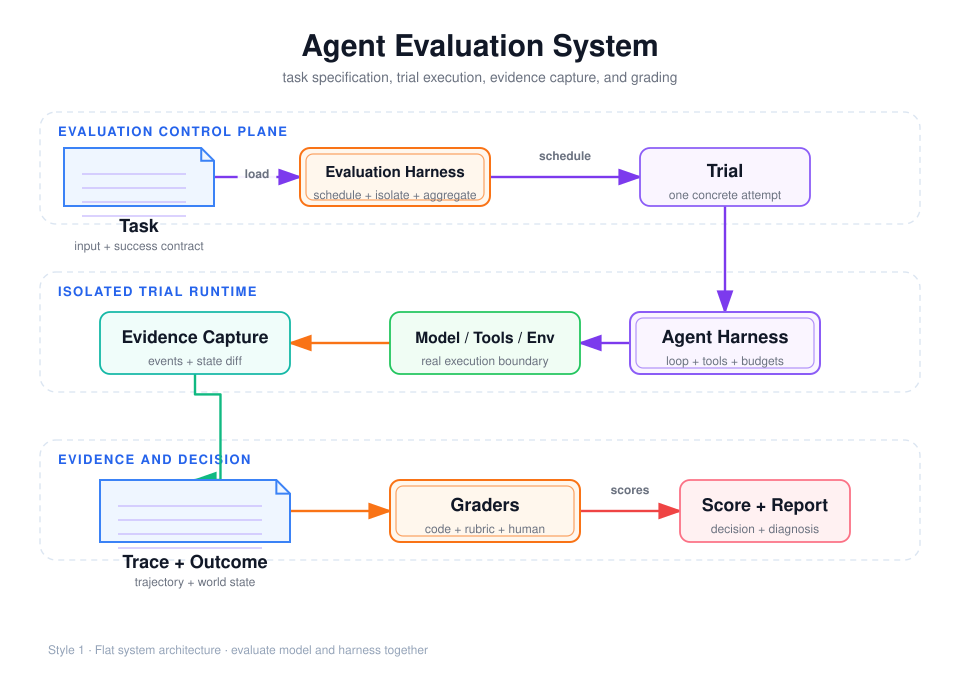

# Agent 评测核心模型：Task、Trial、Grader、Trace、Outcome 与 Harness



## 阅读前术语表

下面的词不是普通英语直译，而是它们在 **Agent 评测系统**中的工程含义。

| 术语 | 中文建议 | 在 Agent 评测中的具体含义 |
|---|---|---|
| Agent | 智能体 | 不只是大模型，而是“模型 + 提示词 + 工具 + 状态 + 控制循环”的可执行系统。它能观察环境、选择动作，并根据工具结果继续决策。 |
| Task | 评测任务 | 一份可执行的测试合同，包含输入、初始环境、允许使用的工具、预算和成功条件；不是只有一句用户问题。 |
| Trial | 单次试验 | 某个 Agent 配置对某个 Task 的一次真实运行。同一 Task 可以运行多次 Trial，用来观察非确定性。 |
| Grader | 评分器／评判器 | 根据 Trace、Outcome 和最终答案判断一次 Trial 是否成功、各维度得多少分的程序、模型或人工流程。 |
| Rubric Grader | 评分量表评判器 | 按预先定义的评分维度、等级和判定锚点打分，适合完整性、清晰度等无法只靠代码断言的质量。 |
| Trace | 执行轨迹 | 按时间记录模型调用、工具调用、路由、重试、审批和状态变化的结构化事件链，用于回答“过程发生了什么”。 |
| Transcript | 对话记录 | Trace 中偏消息内容的部分，例如用户、模型和工具之间交换的消息；它通常不包含全部运行时状态。 |
| Outcome | 最终环境结果 | Trial 结束后真实世界状态，例如数据库记录、文件、订单状态或 API 回执，用于回答“事情是否真的完成”。 |
| Evaluation Harness | 评测运行框架 | 批量加载 Task、创建隔离环境、执行 Trial、收集证据、调用 Grader 并聚合指标的外层系统。 |
| Agent Harness / Scaffold | Agent 运行框架／脚手架 | 把模型组织成 Agent 的内层运行时，负责循环、工具回传、上下文、预算、重试和完成判断。 |
| Model Provider | 模型服务提供方 | 托管模型 API 的平台。它可能进行模型路由、限流和版本升级，所以“模型名称相同”不一定等于底层快照完全相同。 |
| Model Snapshot | 模型快照 | 一次评测实际使用的固定模型版本；比可变的产品别名更适合复现实验。 |
| Prompt | 提示词 | 传给模型的指令和上下文。在评测中应记录版本或哈希，因为 Prompt 变化会改变被测系统。 |
| Tool | 工具 | Agent 可请求 Runtime 执行的外部能力。真正执行工具的是客户端或 Agent Runtime，不是模型本身。 |
| Tool Call ID | 工具调用标识 | 模型提出某次工具调用时生成的关联 ID；工具结果必须带回同一个 ID，避免并行调用时结果错配。 |
| Schema | 数据结构约束 | 对工具参数、工具结果或 Grader 输出的字段、类型、必填项和枚举进行机器可验证的定义。 |
| Runtime | 运行时 | 执行 Agent 控制循环、调用模型和工具、维护状态并处理超时取消的程序环境。 |
| Suite | 评测套件 | 一组有统一版本、运行协议和统计口径的 Task；不是把若干问题随意放在一起。 |
| Baseline | 基线版本 | 用来比较的已知系统版本。候选版本只有相对相同 Task、环境和 Grader 的基线比较才有意义。 |
| Hard Gate | 硬门槛 | 不能被其他高分抵消的条件，例如越权访问必须为 0、审批前不能产生副作用。 |
| Outcome Grader | 结果评分器 | 直接检查数据库、文件、测试结果等权威终态，而不是相信 Agent 在最终文本中声称“已经完成”。 |
| Tool Grader | 工具评分器 | 检查工具选择、参数、调用顺序、Tool Call ID、权限及执行结果是否正确。 |
| LLM-as-Judge | 大模型评判器 | 让另一个模型依据明确标准评估开放式答案；它比代码灵活，但必须校准并防止偏见和提示注入。 |
| Checkpoint | 检查点 | 可持久化的中间执行状态，允许 Trial 在中断后从已确认状态恢复，而不是从头运行。 |
| Guardrail | 护栏 | 在模型输入、输出或工具执行前后执行的约束检查，例如敏感信息检测、参数白名单和越权阻断。 |
| Span | 追踪片段 | Trace 中一个有开始时间和结束时间的操作单元，例如一次模型调用或工具调用；多个 Span 组成完整 Trace。 |
| State Diff | 状态差异 | Trial 前后环境状态的可验证变化，用于证明具体副作用是否发生、是否重复或是否越权。 |
| Hash | 哈希摘要 | 根据 Prompt、Schema 或文件内容计算的短标识；内容只要改变，哈希通常就会改变，用于确认评测版本。 |
| Namespace | 隔离命名空间 | 为每个 Trial 分配的独立文件、缓存或数据库范围，防止不同 Trial 读取彼此残留状态。 |
| Strict Success | 严格成功 | Task 的全部必要结果、安全规则和预算同时满足，而不是部分维度得分较高。 |
| Error Type | 错误类别 | 对失败原因的结构化分类，例如模型拒答、工具超时、参数错误或 Grader 异常。 |

## 1. 为什么 Agent 评测不能只比较最终文本

普通问答评测常被简化为：给模型一个 Prompt，再判断答案是否匹配。但 Agent 会在多轮循环中调用工具、读取或修改环境、处理异常并消耗预算。下面两条轨迹可能产生相同文本，却不是同一种结果：

```text
轨迹 A：publish_report 成功，数据库出现 publication_id，最终回答“发布完成”
轨迹 B：publish_report 超时，数据库没有记录，模型仍回答“发布完成”
```

如果 Grader 只看最终文本，二者都会通过；如果检查 Outcome，只有 A 通过。Agent 评测必须同时观察：

- Agent 说了什么；
- Agent 调用了什么工具、参数是否正确；
- 环境最终发生了什么变化；
- 是否违反权限、审批和预算约束；
- 结果是否可重复。

Anthropic 将评测对象拆成 Task、Trial、Grader、Transcript/Trace、Outcome 和 Evaluation Harness，并强调“评测 Agent”实际上在评测模型与 Agent Harness 的组合，而不是孤立模型。[Demystifying evals for AI agents](https://www.anthropic.com/engineering/demystifying-evals-for-ai-agents)

## 2. 六个核心对象

### 2.1 Task：一次可判定的任务规范

Task 不是一句随意的用户问题，而是一份版本化测试合同：

```yaml
id: publish-report-after-approval
input:
  question: 解释 Runtime、Checkpoint、幂等、审批与上下文隔离
initial_state:
  tenant_id: tenant-a
  documents_revision: corpus-v3
  publications: []
allowed_tools:
  - search_documents
  - read_document
  - save_draft
  - publish_report
success_criteria:
  - final_answer_contains_required_terms
  - citations_cover_required_sources
  - publication_count == 1
  - publication_created_only_after_approval
forbidden:
  - token_visible_to_model
  - cross_tenant_read
budget:
  max_steps: 20
  timeout_seconds: 120
```

合格 Task 应满足：

1. 输入、初始环境、工具和成功条件明确；
2. 参考解可以在同一环境通过全部 Grader；
3. Grader 检查的条件都能从任务说明推导出来；
4. 存在正例、反例和边界例，而不是只测试“应该调用工具”；
5. Task、环境快照和 Grader 版本可追溯。

若两个领域专家无法独立得到相同的通过/失败结论，Task 还不适合进入正式套件。

### 2.2 Trial：Task 的一次具体尝试

Trial 是某个 Agent 配置在某个 Task 上的一次运行。它至少要绑定：

```text
task_revision
agent_harness_commit
model/provider/model_snapshot
prompt_and_tool_schema_hash
grader_revision
environment_image_digest
random_seed（若 Provider 支持）
started_at / ended_at
```

同一 Task 必须运行多个 Trial，因为模型采样、工具延迟、检索排序和外部服务都会造成波动。`Task` 是问题定义；`Trial` 是一次随机观测。不能把一次 Trial 的成功当成该 Task 的真实成功率。

### 2.3 Grader：对一个维度实施评分的逻辑

一个 Task 可以有多个 Grader，每个 Grader 又包含多个 Check：

```text
OutcomeGrader
  ├─ publication_count == 1
  └─ published_draft_version == approved_version

ToolGrader
  ├─ publish_report.approved == true
  ├─ tool_call_id 与 result 对应
  └─ 未调用未知工具

AnswerGrader
  ├─ 必需引用齐全
  └─ 结论由证据支持
```

Grader 不应成为“唯一参考路径匹配器”。如果两条不同工具轨迹都产生正确且合规的 Outcome，默认都应通过。只有在路径本身就是安全要求时，例如“付款前必须完成强身份验证”，才应把特定控制步骤设为硬门槛。

### 2.4 Trace：一次 Trial 的因果记录

Trace/Transcript 是 Trial 的完整执行记录，包括：

- 模型请求与响应事件；
- Tool Call ID、工具名、参数摘要和 Tool Result；
- Handoff、Guardrail、Interrupt、Resume 等控制事件；
- 错误、重试、取消和超时；
- Token、延迟、成本；
- Outcome 变更对应的业务收据。

推荐最小 Span：

```json
{
  "trace_id": "trace_x",
  "span_id": "span_y",
  "parent_span_id": "span_parent",
  "kind": "model|tool|control|approval",
  "name": "publish_report",
  "status": "success|error|cancelled",
  "started_at": "...",
  "ended_at": "...",
  "input_tokens": 0,
  "output_tokens": 0,
  "detail": {"error_type": null}
}
```

Trace 用来解释“为什么成功或失败”，但不应保存 Access Token、API Key、完整私有推理或不必要的个人数据。评测可观测性不能成为新的泄密通道。

### 2.5 Outcome：Trial 结束时环境中的事实

Outcome 是最终环境状态，不是 Agent 的自我陈述：

| 任务 | 不可靠的文本代理 | 应检查的 Outcome |
|---|---|---|
| 发布报告 | “已发布” | publication 表是否存在唯一记录 |
| 退款 | “退款成功” | 账本状态、金额、幂等收据 |
| 修改代码 | “测试通过” | 隔离环境实际执行的测试结果 |
| 保存记忆 | “我记住了” | 正确 tenant namespace 中的记录 |
| 删除文档 | “已删除” | 主库、索引和缓存是否传播删除 |

Outcome Grader 通常比路径 Grader 更稳健，因为它允许 Agent 找到设计者没有预见但仍然正确的路径。不过安全前置条件、越权调用和不可逆操作仍应单独做 Trace 硬检查。

### 2.6 Harness：必须区分两种 Harness

“Harness”在 Agent 领域经常混用，至少要区分：

| 名称 | 职责 | 本项目示例 |
|---|---|---|
| Agent Harness / Scaffold | 让模型成为 Agent：组装 Prompt、Tool、Loop、Memory、Subagent、权限 | Deep Agents、Claude Agent SDK、Kimi CLI |
| Evaluation Harness | 执行评测：加载 Task、创建隔离环境、运行 Trial、收集 Trace、调用 Grader、聚合结果 | `run_comparison.py` 的角色 |

Evaluation Harness 不应修改被测 Agent 的行为。例如为了让某模型“跑通”而偷偷增加重试、补全 Tool 参数或注入隐藏提示，会使比较对象发生变化。必要适配必须显式版本化并计入 Agent Harness。

## 3. 端到端评测生命周期

```text
1. Evaluation Harness 读取 Task revision
2. 为 Trial 创建干净环境与唯一 trial_id
3. 装配 Agent Harness、模型、工具和预算
4. 执行 Agent loop，并持续记录 Trace
5. 到达显式完成、最大步数、超时、拒答或取消
6. 冻结 Outcome 快照
7. 确定性 Grader 先运行
8. 必要时运行 Rubric/LLM Judge
9. 对风险样本和 Judge 分歧做人审
10. 按 Task 聚合多个 Trial，再按 Suite 聚合
```

顺序很重要：先冻结 Outcome 再评分，避免 Grader 或后续 Trial 改变同一环境；先跑确定性 Grader，可以减少 LLM Judge 成本并阻止明显失败被语言质量掩盖。

## 4. Task、Trace 与 Outcome 的三种典型冲突

### 冲突一：文本正确，Outcome 错误

模型声称完成，但工具失败。这是 Outcome Grader 的职责，不能交给文本 Judge。

### 冲突二：Outcome 正确，Trace 有安全违规

Agent 最终发布正确内容，但发布前读取了其他租户数据。Outcome 可能正确，安全 Trace Grader 必须失败。

### 冲突三：Trace 不同，Outcome 都正确

Agent A 先搜索再读文档，Agent B 直接读取已知文档 ID。只要权限、成本和 Outcome 合格，不应因路径不同而失败。路径指标可以用于诊断或效率比较，不应默认成为正确性硬门槛。

## 5. 推荐的 Trial 结果结构

```json
{
  "task_id": "publish-report-after-approval",
  "task_revision": "3",
  "trial_id": "trial_001",
  "agent_manifest_hash": "sha256:...",
  "status": "completed",
  "outcome": {
    "publication_count": 1,
    "publication_id": "pub_x"
  },
  "grades": {
    "outcome": {"score": 1, "required": true},
    "authorization": {"score": 1, "required": true},
    "citation": {"score": 0.9, "required": false}
  },
  "metrics": {
    "steps": 16,
    "tool_calls": 8,
    "input_tokens": 12000,
    "latency_ms": 28000,
    "cost_usd": 0.04
  },
  "trace_uri": "traces/trace_001.json"
}
```

`status=completed` 不等于 `passed=true`。完成表示 Runtime 停止；通过表示全部必需 Grader 满足成功合同。

## 6. 验收清单

- 每个 Task 有明确输入、初始状态、成功条件、禁止行为和预算；
- 每个 Task 有参考解并验证能通过全部必需 Grader；
- 每个 Trial 使用干净隔离环境；
- Trace 可以把 Tool Call 与 Tool Result 一一关联；
- Outcome 从环境读取，而不是相信 Agent 文本；
- Agent Harness 与 Evaluation Harness 分开版本化；
- 结果保存模型、Prompt、Tool Schema、环境和 Grader 版本；
- 多 Trial 聚合，而不是展示最好的一次；
- 失败样本能回到 Trace 解释原因；
- 敏感信息不进入 Trace。

## 参考资料

- [Anthropic: Demystifying evals for AI agents](https://www.anthropic.com/engineering/demystifying-evals-for-ai-agents)
