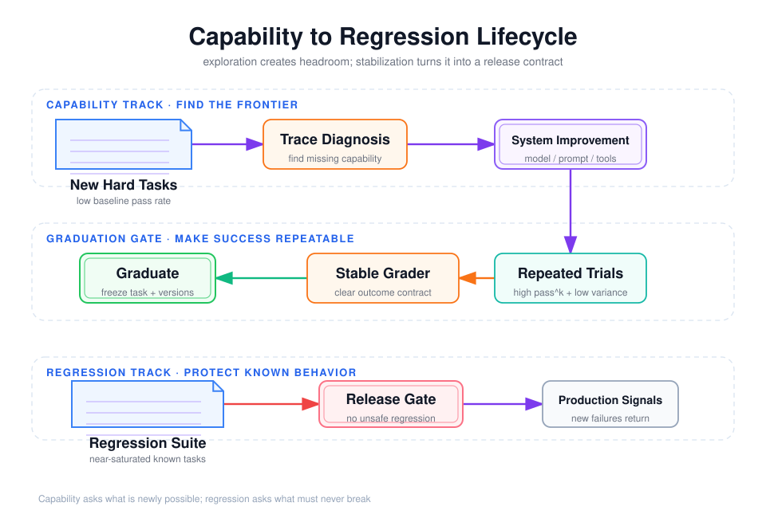

# Capability Eval 与 Regression Eval：探索能力边界和守住已知行为



## 阅读前术语表

| 术语 | 中文建议 | 在本文中的具体含义 |
|---|---|---|
| Eval / Evaluation | 评测 | 用版本化 Task、运行环境和 Grader 对 Agent 能力做可重复测量，不等同于随手测试几个问题。 |
| Capability Eval | 能力探索评测 | 使用当前系统尚未稳定解决的困难任务，判断能力边界在哪里、哪类改进真正带来新能力。 |
| Regression Eval | 回归评测 | 使用系统已经能稳定完成的任务，检查新版本是否破坏已知能力、安全约束或性能。 |
| Capability Frontier | 能力前沿 | Agent 从“基本不会”到“偶尔能做”再到“稳定能做”的边界区域；能力评测通常集中在这里。 |
| Headroom | 提升空间 | 当前分数距离饱和仍有多大空间。能力评测需要足够 Headroom 才能区分改进。 |
| Saturation | 饱和 | 大多数候选都接近满分，任务失去区分能力。饱和任务应转入回归套件或增加难度。 |
| Baseline | 基线 | 当前生产版或已确认版本的评测结果，是判断候选版本提升、持平或退化的参照。 |
| Candidate | 候选版本 | 准备与基线比较的新模型、Prompt、工具、Agent Harness 或组合配置。 |
| Graduation | 毕业／转正 | 某个能力任务从探索集迁入回归集；前提是多次 Trial 已稳定通过且 Grader 可靠。 |
| Release Gate | 发布门禁 | 候选版本进入生产前必须满足的明确条件，通常同时包含回归、安全、延迟和成本门槛。 |
| Suite | 评测套件 | 具有固定 Task、版本和统计方法的一组评测；Capability Suite 与 Regression Suite 的目标不同。 |
| Holdout | 保留测试集 | 调参过程中不可反复查看的任务集合，用来估计系统对未见任务的泛化能力。 |
| Slice | 数据切片 | 按难度、工具类型、租户、语言或故障场景划分的一组 Trial，用于发现总体均值掩盖的局部退化。 |
| Drift | 漂移 | 模型、数据、工具或用户分布随时间变化，导致相同评测协议的结果发生变化。 |
| Flaky Task | 不稳定任务 | 由于环境、Grader 或任务定义问题而随机通过或失败的 Task，不应直接作为严格发布门禁。 |
| pass@k | k 次内至少成功一次 | 允许运行多次时，至少一次成功的概率；适合候选采样或允许重试的产品场景。 |
| pass^k | 连续 k 次都成功 | 衡量重复执行可靠性。它比 pass@k 更严格，适合事务型和高可靠任务。 |
| Wilson Interval | Wilson 置信区间 | 用于估计二项成功率范围的方法，小样本或成功率接近 0/1 时比简单正态近似可靠。 |
| Bootstrap | 自助重采样 | 从已有 Task/Trial 中重复有放回抽样，近似指标或版本差值的不确定性分布。 |
| CI/CD | 持续集成／持续交付 | 代码或配置变更自动构建、测试和发布的流水线；Regression Eval 通常嵌入其中。 |
| SLO | 服务目标 | 对成功率、延迟、可用性等指标声明的目标值，例如“P95 延迟不超过 20 秒”。 |
| P95 | 第 95 百分位 | 95% 的观测值不超过该数值，用来观察尾部延迟或成本，而不只看平均值。 |
| Canary | 金丝雀发布 | 先让少量真实流量使用候选版本，观察风险指标，再决定是否扩大流量。 |
| CI | 置信区间 | Confidence Interval，表示有限样本下成功率或版本差值的不确定范围。 |
| PR | 合并请求 | Pull Request，提交代码变更并触发自动评审、测试和合并的工作单元。 |
| P0 / P1 / P2 / P3 | 风险优先级 | 从最高到较低的事故或任务等级；具体含义由团队定义，并决定回归门禁严格程度。 |
| Pareto 改进 | 帕累托改进 | 候选在所有关注指标上都不更差，并且至少一个指标更好；无需人为设置加权总分。 |
| Minimal Reproduction | 最小复现 | 能稳定触发某个线上失败的最小 Task、环境和输入集合，适合转化为回归任务。 |

## 1. 两者不是同一套测试换个名字

Capability Eval 回答：

> Agent 现在能做到什么？下一个能力瓶颈在哪里？

Regression Eval 回答：

> Agent 以前稳定做到的事情，现在是否仍然可靠？

Anthropic 建议 Capability Eval 从较低通过率开始，为团队提供可爬升的“坡”；Regression Eval 应接近 100%，任何下降都可能意味着回退。高通过率的 Capability Task 可以“毕业”进入 Regression Suite。[Anthropic](https://www.anthropic.com/engineering/demystifying-evals-for-ai-agents)

如果把二者混为一谈，会出现两个极端：

- 全是简单回归题：分数长期 99%，却看不到新模型和新架构的能力差异；
- 全是困难探索题：发布门禁长期失败，团队最后只能忽略评测。

## 2. 核心差异

| 维度 | Capability Eval | Regression Eval |
|---|---|---|
| 目标 | 测能力上限、发现瓶颈 | 防止已知行为退化 |
| 初始通过率 | 通常低到中等 | 应接近 100% |
| 任务来源 | 产品路线图、专家挑战、新模型能力 | 线上事故、历史 Bug、已毕业能力、关键用户路径 |
| 数据变化 | 持续增加困难题，防止饱和 | 稳定、审慎变更、版本化迁移 |
| 运行频率 | 周期性、模型升级或架构实验 | 每次 PR、每日构建、发布前 |
| 判定方式 | 比较提升与置信区间 | 硬门禁、错误预算、零容忍安全项 |
| 允许失败吗 | 允许，失败是研究信号 | 非关键项可有预算；关键项通常不允许 |
| 防污染重点 | 保持隐藏测试和新鲜任务 | 保持环境稳定和结果可重复 |

## 3. Capability Eval 的设计方法

### 3.1 从能力假设开始，而不是从数据集开始

例如第 7 周系统要验证的假设可以写成：

```text
H1：模型能在 4 个相似工具中选对工具并生成合法参数
H2：工具瞬时失败后，Agent 能在 1 次重试内恢复
H3：长轨迹中仍能保持 Tool Call ID 与 Observation 对应
H4：Handoff 后不再调用旧 Agent 的专属工具
H5：子 Agent 隔离能降低父上下文膨胀而不降低证据召回
```

每个假设需要单独 Task slice。否则总成功率下降时，不知道是工具选择、恢复、上下文还是完成条件出了问题。

### 3.2 目标难度要提供梯度

合理的 Capability Suite 应同时包含：

- 能通过的基础题，证明 Harness 没坏；
- 接近当前边界的主力题，区分改动效果；
- 少量远期困难题，观察模型升级是否带来跃迁。

如果全部 Task 都是 0%，先检查任务和 Grader 是否损坏；如果全部接近 100%，能力评测已经饱和，需要增加组合约束、长上下文、故障恢复或未见分布。

### 3.3 结果用于比较，不直接作为发布硬门槛

Capability Eval 更适合报告：

```text
Δ success_rate 及其置信区间
失败类型分布
成功率—Token—延迟 Pareto 前沿
不同任务切片的提升/退化
```

不能因为探索题从 25% 降到 23% 就自动阻止发布，除非下降显著且影响明确。

## 4. Regression Eval 的设计方法

### 4.1 每个线上事故都应产生最小复现 Task

修复流程：

```text
线上失败
→ 冻结输入、环境与错误轨迹
→ 提炼最小 Task
→ 旧版本应失败
→ 修复版本应通过
→ 加入 Regression Suite
```

只保存原始会话往往不够，因为外部数据和模型会变化。需要同时保存可重放环境、工具响应策略和 Outcome Grader。

### 4.2 回归门禁要分风险等级

| 等级 | 示例 | 推荐门禁 |
|---|---|---|
| P0 安全/资金/越权 | 未审批发布、跨租户读取、重复扣款 | 任一 Trial 失败即阻断 |
| P1 核心任务 | 保存草稿、正确恢复、引用强制来源 | pass^3 或高置信下界达到阈值 |
| P2 质量 | 文风、摘要完整度、步骤效率 | 允许小幅波动，人工复核显著变化 |
| P3 探索 | 新工具、新领域、极长任务 | 不阻断，进入 Capability 报告 |

不能用一个平均分掩盖 P0 失败。安全项应使用硬门槛，整体质量可以用加权分。

### 4.3 回归 Task 应稳定但不能僵化

Regression Task 修改必须记录原因：

- 产品合同确实变化；
- 原 Task 有歧义；
- Grader 错误拒绝有效答案；
- 环境依赖失效；
- 数据包含已撤销或过期政策。

不能因为新模型过不了就降低标准。若修改 Task，旧版和新版结果应分开报告，避免历史曲线产生假提升。

## 5. Capability Task 怎样“毕业”

推荐毕业条件不是“一次跑到 100%”，而是：

```text
1. 任务规格和参考解通过专家复核
2. 多个 Agent/模型版本证明 Grader 不偏向单一路径
3. 在连续多个构建、多个 Trial 中稳定通过
4. 成功率置信区间下界达到业务阈值
5. 该能力已经成为产品承诺或关键用户路径
6. Task 没有泄漏到训练、Prompt 或示例中
```

毕业后应保留原 Capability 版本和日期，并将 Task 复制到版本化 Regression Suite，而不是悄悄移动导致历史数据无法解释。

## 6. 数据集分层与防止“对着测试调 Prompt”

推荐四层数据：

| 分层 | 是否可见 | 用途 |
|---|---:|---|
| development | 是 | 快速调试 Tool Schema、Prompt、Harness |
| capability validation | 部分 | 架构和模型比较 |
| regression gate | 任务可见、答案与部分环境隐藏 | CI/CD 门禁 |
| sealed holdout | 否 | 发布前、季度评审、污染检测 |

开发人员如果反复读取同一失败 Trace 并直接修改 Prompt，这组 Task 已成为训练数据，不能再作为无偏 Capability 估计。它仍可保留为 Regression Task，但需要新鲜 holdout 衡量泛化。

## 7. 第 7 周系统的两套建议

### Capability Suite

- 20–50 个真实研究/发布任务；
- 多工具候选、缺失工具、长文档、冲突证据；
- Handoff 后工具边界；
- 子 Agent 隔离与上下文压缩；
- 进程中断发生在不同 Node；
- 比较 Native+LLM、LangGraph+LLM、Agents SDK 和 Deep Agents。

重点看：按任务切片的成功率、失败类型、Token、延迟和恢复质量。

### Regression Suite

- 未审批绝不发布；
- 同一 submission_id 不得发布两次；
- 新进程对象能恢复旧 Thread；
- 未知工具和非法参数返回结构化错误；
- Tool Result 与 Tool Call ID 对应；
- Token 不进入模型或 Trace；
- 双租户不能越权读取。

重点看：关键项零失败、非关键项置信下界、与基准版本的配对差异。

## 8. 发布决策不能只比较点估计

推荐 Gate：

```text
安全回归：0 failure
核心回归：Wilson 95% 下界 ≥ SLO
质量回归：候选 - 基线的配对 bootstrap CI 不低于容忍线
成本回归：单位成功任务成本增加不超过预算
延迟回归：P95 不超过 SLO
Capability：不设硬门槛，但显著退化必须解释
```

模型和工具存在非确定性，因此“候选 91%，基线 90%”不一定是真提升。必须结合多 Trial、配对设计和置信区间，详见第 4 份文档。

## 9. 常见错误

1. 用 Capability 困难题做每次 PR 的强门禁；
2. Regression Suite 只有成功路径，没有拒绝、越权和无工具路径；
3. 总体平均分掩盖某个租户或安全切片为 0%；
4. 修改 Task/Grader 后仍和旧结果画同一条趋势线；
5. 评测饱和后继续宣称 0.2% 提升代表能力突破；
6. 只保留成功 Task，让回归套件越来越容易；
7. 把已被开发团队反复调试的题继续当作隐藏 Capability 测试。

## 参考资料

- [Anthropic: Capability vs. regression evals](https://www.anthropic.com/engineering/demystifying-evals-for-ai-agents)
