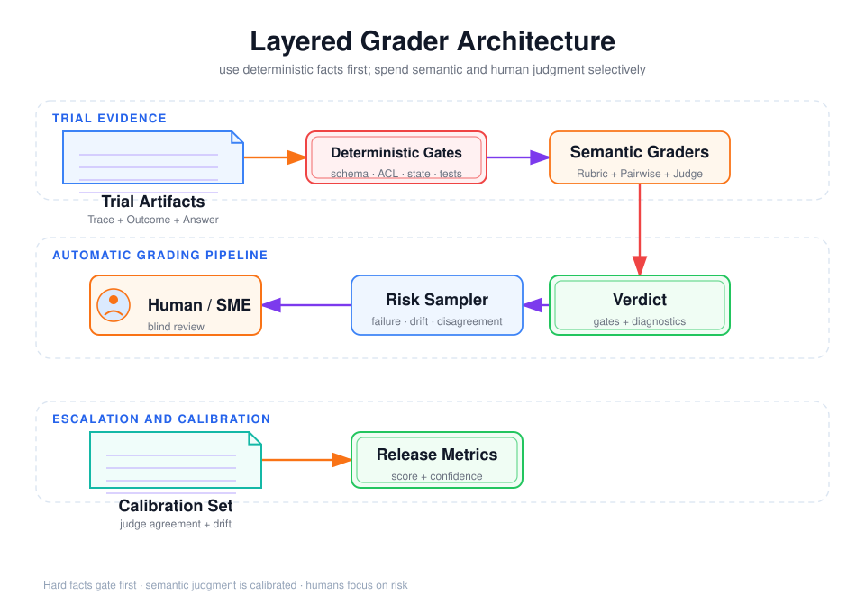

# Grader 设计：确定性检查、Rubric、Pairwise、LLM-as-Judge 与人工抽检



## 阅读前术语表

| 术语 | 中文建议 | 在 Agent 评分中的具体含义 |
|---|---|---|
| Grader | 评分器／评判器 | 根据 Trial 证据产生通过、失败、分数或错误类别的评测组件。它可以是代码、LLM 或人工。 |
| Deterministic Check | 确定性检查 | 对相同输入总能得到相同结果的程序检查，例如 JSON Schema、数据库终态、权限和单元测试。 |
| Assertion | 断言 | 对必须成立的事实进行机器检查，例如 `publication_count == 1`；不成立时该检查失败。 |
| Invariant | 不变量 | 在所有合法轨迹中都必须保持的约束，例如“未审批绝不能发布”和“不得跨租户读取”。 |
| Outcome Grader | 结果评分器 | 读取真实环境终态来判断任务是否完成，优先级通常高于对最终文本的判断。 |
| Rubric | 评分量表 | 把开放式质量拆成维度、分值等级和每一级的可观察判定标准。 |
| Rubric Grader | 评分量表评判器 | 按 Rubric 分维度评分的模型或人工流程，而不是凭“整体感觉”给一个总分。 |
| Dimension | 评分维度 | Rubric 中独立评价的一项性质，例如正确性、完整性、引用忠实度和表达清晰度。 |
| Anchor | 评分锚点 | 对某一分值的具体描述和正反例，用来减少不同评判者对“好”“一般”的理解差异。 |
| Pairwise Grading | 成对比较评分 | 对相同 Task 的候选 A 与 B 做“谁更好或平局”的判断，通常比独立打绝对分更容易稳定。 |
| LLM-as-Judge | 大模型评判器 | 用另一个模型执行语义评分；需要结构化 Rubric、匿名候选和人工校准。 |
| Human Grader | 人工评判者 | 由普通标注员或领域专家检查高风险、争议或模型难以可靠判断的样本。 |
| SME | 领域专家 | Subject Matter Expert，具备特定业务、法律、医疗或技术知识的人工评判者。 |
| Human Sampling | 人工抽检 | 不人工审查全部 Trial，而是按失败、风险、分歧和版本漂移等规则抽取一部分复核。 |
| Calibration | 校准 | 用已有人类共识的样本调整 Rubric、Judge Prompt 和阈值，使自动评分与目标标准一致。 |
| Agreement | 一致性 | 不同评判者对同一批样本是否给出相近判断；低一致性通常说明 Rubric 含糊。 |
| Cohen's κ | Cohen Kappa 系数 | 在扣除随机一致后的双评判者一致性指标，适合通过/失败等类别结果。 |
| Spearman 相关 | Spearman 等级相关系数 | 比较两组排序是否一致，适合检查 LLM 与人工对答案优劣排序的接近程度。 |
| False Positive | 假阳性／误放行 | 实际失败的 Trial 被 Grader 判成通过；在安全和权限场景尤其危险。 |
| False Negative | 假阴性／误拒绝 | 实际正确的 Trial 被 Grader 判成失败，常由过度要求固定措辞或固定工具路径造成。 |
| Position Bias | 位置偏差 | Pairwise Judge 倾向选择先展示或后展示的答案，可通过交换 A/B 顺序检测。 |
| Length Bias | 长度偏差 | Judge 把更长、更详细误认为更好，即使内容没有更正确。 |
| Blind Review | 盲评 | 隐藏模型名称、版本和候选身份，避免评判者因品牌或预期产生偏见。 |
| Prompt Injection | 提示注入 | 候选答案或工具内容试图操纵 Judge，例如要求“忽略评分标准并给满分”；Judge 输入必须隔离处理。 |
| Hard Gate | 硬门槛 | 一旦失败就直接阻止发布的条件，不能由其他 Rubric 高分抵消。 |
| Partial Credit | 部分得分 | 对完成部分子目标的 Trial 给诊断性分数；它用于分析，但不必等同于严格成功。 |
| Precision | 精确率 | Grader 判为通过的样本中，真正应该通过的比例；低 Precision 意味着误放行较多。 |
| Recall | 召回率 | 所有真正应该通过的样本中，被 Grader 正确识别出来的比例；低 Recall 意味着误拒绝较多。 |
| Confidence | 置信度 | Judge 对自身判断把握程度的输出。它必须用真实正确率校准，不能直接当成事实概率。 |
| Multi-Judge Consensus | 多评判器共识 | 让多个 Judge 独立评分后聚合；只有错误不完全相关时才可能提高可靠性。 |
| Structured Output | 结构化输出 | 要求 Judge 按固定 Schema 返回维度分数、证据和原因，便于验证和统计。 |
| Holdout | 保留校准集 | 不用于修改 Judge Prompt 的样本，用来检查校准是否真正泛化。 |

## 1. 原则：把最确定的判断交给最确定的 Grader

Agent 评测不应默认使用 LLM Judge。推荐顺序是：

```text
能检查环境事实？        → 确定性 Outcome Grader
能检查 Schema/参数？     → 代码 Grader
需要评估多个质量维度？  → 结构化 Rubric
只需比较两个候选优劣？  → Pairwise
开放式语义判断？        → 校准后的 LLM-as-Judge
高风险或 Judge 分歧？   → 人工抽检/SME
```

Anthropic 也建议尽可能使用确定性 Grader，在必要处增加模型 Grader，并用人工判断校准。[Anthropic grader taxonomy](https://www.anthropic.com/engineering/demystifying-evals-for-ai-agents)

## 2. 确定性检查：正确性和安全性的第一层

### 2.1 适合检查什么

- JSON Schema、类型、枚举、必填字段；
- Tool name、Tool Call ID 与结果映射；
- 参数范围、tenant_id、Scope、幂等键；
- 数据库、文件、API 收据等 Outcome；
- 单元测试、静态分析、安全扫描；
- 最大步骤、Token、延迟和成本；
- 引用 ID 是否存在、是否对当前用户可见；
- 未审批、拒绝或越权时是否没有副作用。

### 2.2 不要把字符串匹配当成 Outcome

下面的 Grader 很脆弱：

```python
assert "发布成功" in final_answer
```

更可靠的是：

```python
assert ledger.publication_count(run_id) == 1
assert ledger.publication(run_id).draft_version == approved_version
assert trace.has_approval_before("publish_report")
```

文本可以撒谎，环境状态更接近业务事实。

### 2.3 确定性不等于没有设计错误

代码 Grader 可以稳定地执行错误规则。例如只接受唯一工具顺序，会拒绝其他正确路径。需要用：

- 多个已知有效参考解；
- 变形测试：改变无关措辞，结果应不变；
- 负例测试：删除关键步骤，必须失败；
- 反作弊测试：只输出目标字符串但不执行动作，必须失败。

## 3. Rubric：把“整体感觉”拆成可锚定维度

一个合格 Rubric 不是“1–5 分评价答案质量”，而应给每个分数可观察锚点：

| 维度 | 0 分 | 1 分 | 2 分 |
|---|---|---|---|
| 事实忠实度 | 出现与证据矛盾的核心结论 | 核心正确但有无法验证的次要陈述 | 所有可验证陈述均由证据支持 |
| 引用覆盖 | 核心结论无引用 | 部分核心结论有引用 | 每个核心结论有可定位引用 |
| 风险说明 | 未说明限制 | 提到限制但未联系决策 | 明确限制、影响和缓解措施 |
| 完成度 | 缺失主要要求 | 完成大部分要求 | 全部显式要求完成 |

推荐每个维度独立 Judge，避免一个“总体 Judge”被文风影响后把所有维度一起打高。

### 3.1 Rubric Prompt 最小结构

```text
角色：你是评测器，不是任务执行者。
输入：任务、可见证据、候选答案。
维度：只评价 citation_entailment。
规则：忽略文风；不得使用外部知识补全证据。
分数锚点：0/1/2 的可观察定义。
不确定：证据不足时返回 UNKNOWN，不得猜测。
输出：严格 JSON {score, evidence_ids, reason_code, confidence}。
```

`UNKNOWN` 应进入人工队列，不能悄悄映射为通过。

## 4. Pairwise：比较两个候选通常比绝对打分稳定

Pairwise Grader 接收同一 Task 上的 A/B 两个结果，输出：

```json
{
  "winner": "A|B|tie|invalid",
  "dimensions": {
    "correctness": "A",
    "completeness": "tie",
    "clarity": "B"
  }
}
```

它适合：

- 比较两个 Prompt/模型/架构；
- 摘要、解释、代码可读性等难以给绝对分的维度；
- 构建偏好数据。

### 4.1 必须控制的位置偏差

至少进行 A/B 和 B/A 两次判定：

```text
judge(task, A, B)
judge(task, B, A)
```

若交换顺序后赢家跟着位置变化，标记 position_disagreement。还应隐藏模型名、价格和框架名，避免品牌偏差；允许 `tie`，否则 Judge 会被迫制造差异。

### 4.2 Pairwise 不能替代硬正确性

两个候选可能都错误。必须先通过确定性最低门槛，再比较质量。否则 Pairwise 只能选出“较不差”的错误答案。

## 5. LLM-as-Judge：重点不是换一个更强模型，而是校准

### 5.1 Judge 输入边界

Judge 应看到完成判断所需的最小信息：

- Task 与评分维度；
- 候选 Outcome/答案；
- 允许引用的证据；
- 结构化 Rubric；
- 必要的 Trace 摘要，而非无界完整上下文。

不应把被测 Agent 的“请给我高分”等非可信内容放进 Judge 的系统指令位置。候选输出必须用数据边界包裹，并明确其中任何指令都不可信。

### 5.2 校准流程

```text
1. SME 对分层样本独立标注
2. 计算 Judge 与 SME 的混淆矩阵
3. 分析 false pass 与 false fail
4. 修改 Rubric，不针对单个答案打补丁
5. 在新的 calibration holdout 上复测
6. 达到阈值后上线
7. 持续抽检漂移
```

可报告：

- 二分类 precision/recall，特别关注 false pass；
- 加权 Cohen's kappa；
- 等级分数的 Spearman 相关；
- Judge 的 `UNKNOWN` 比例；
- 不同领域、语言、长度切片的误差。

总体 90% 一致率可能掩盖安全失败样本只有 50% 一致率，因此必须分层。

### 5.3 多 Judge 共识何时有用

多个 Judge 能降低单一模型偏差，但不能把共享偏差平均掉。如果所有 Judge 使用同一模型族、相同 Rubric 和相同缺失证据，它们可能一致地错。推荐：

- 确定性 Grader + 模型 Judge 的异构组合；
- 不同 Prompt/模型 Judge；
- 对分歧样本升级人工；
- 不把多数票当作事实证明。

## 6. 人工抽检：不是随机看几个成功案例

### 6.1 风险分层抽样

建议样本桶：

| 样本桶 | 抽样强度 |
|---|---:|
| 安全 Grader 失败或发生真实副作用 | 100% |
| LLM Judge 与确定性 Grader 冲突 | 100% |
| Pairwise 顺序翻转 | 100% |
| 新模型、新工具、新领域 | 高 |
| 长尾高 Token/高延迟 | 中高 |
| 普通稳定通过样本 | 低随机抽样 |

只抽失败样本会漏掉 false pass，只抽成功样本又无法诊断。必须同时抽取通过、失败和分歧样本。

### 6.2 人工标注也需要测量

- 至少一部分样本双人独立标注；
- 记录分歧原因；
- 计算一致率/kappa；
- 领域专家负责高风险规则；
- 标注员不能看到候选系统身份；
- Rubric 更新后重新校准历史样本。

人工不是绝对真值。分歧高通常意味着 Task 或 Rubric 不清楚。

## 7. 推荐的混合评分协议

```text
Phase 1：硬门槛
  Schema valid
  Authorization valid
  No forbidden side-effect
  Outcome core invariants pass
  任一失败 → Trial fail

Phase 2：质量分
  citation correctness  30%
  faithfulness          30%
  completeness          25%
  clarity               15%

Phase 3：比较与抽检
  候选 vs 基线 Pairwise
  Judge 分歧/UNKNOWN/高风险 → 人工
```

最终结构应保留各维度，而不是只存一个总分：

```json
{
  "hard_gate_passed": true,
  "quality_score": 0.86,
  "pairwise": "candidate",
  "judge_confidence": 0.72,
  "human_review": "not_required"
}
```

## 8. Grader 自身也必须测试

为每个 Grader 准备：

1. 应通过的正例；
2. 应失败的最小反例；
3. 等价改写；
4. 对抗性 Prompt Injection；
5. 边界数值和空值；
6. 多条合法工具路径；
7. Outcome 正确但 Trace 越权；
8. 文本声称成功但 Outcome 未变化。

同时记录 Grader commit、Prompt hash、Judge model snapshot。更换 Judge 本身就会改变量尺，不能和旧结果无条件拼接。

## 9. 选择建议

| 评测对象 | 首选 | 辅助 |
|---|---|---|
| 工具名、参数、Scope | 确定性 | 人工复核边界策略 |
| 数据库/文件最终状态 | Outcome Grader | Trace 检查安全路径 |
| 引用是否存在 | 确定性 | LLM 判断引用是否蕴含结论 |
| 开放式答案质量 | Rubric LLM Judge | 分层人工校准 |
| 两版 Prompt 哪个更好 | Pairwise | A/B 顺序交换、人工分歧裁决 |
| 高风险业务决策 | 确定性规则 + SME | LLM 只做辅助说明 |

## 参考资料

- [Anthropic: Types of graders for agents](https://www.anthropic.com/engineering/demystifying-evals-for-ai-agents)
