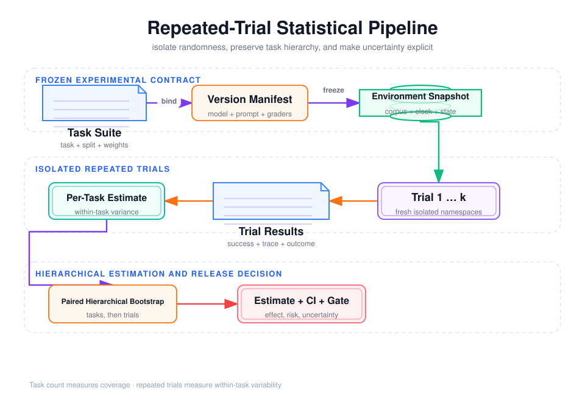

# 多次 Trial、置信区间、非确定性与评测污染



## 阅读前术语表

| 术语 | 中文建议 | 在本文中的具体含义 |
|---|---|---|
| Trial | 单次试验 | Agent 对一个 Task 的一次完整运行。相同 Task 重复运行会形成多个 Trial。 |
| Non-determinism | 非确定性 | 输入看似相同，运行轨迹或结果仍可能变化；来源包括模型采样、工具响应、并发顺序和环境变化。 |
| Random Variable | 随机变量 | 运行前无法确定具体取值的量。本文用 0/1 随机变量表示一次 Trial 失败或成功。 |
| Bernoulli Variable | 伯努利变量 | 只取 0 和 1 的随机变量；适合表示单次 Trial 是否严格成功。 |
| Success Probability | 成功概率 | 系统在指定 Task、版本和环境下成功的长期概率，不等于某一次恰好得到的 0 或 1。 |
| Estimand | 目标统计量 | 实验真正想估计的对象，例如“平均任务成功率”或“候选比基线提升多少”；应在收集数据前定义。 |
| Point Estimate | 点估计 | 用一个数概括未知量，例如观测成功率 82%；它没有表达估计的不确定程度。 |
| Confidence Interval / CI | 置信区间 | 根据有限样本给出的参数合理范围；区间越宽，说明当前证据越不确定。 |
| Wilson Interval | Wilson 置信区间 | 计算二项成功率区间的方法，在样本小或成功率接近 0/1 时通常比简单正态近似可靠。 |
| Normal Approximation | 正态近似 | 用钟形分布近似二项成功率的方法；在 0/10、10/10 等小样本极端结果下容易产生误导。 |
| Macro Average | 宏平均 | 先计算每个 Task 的成功率，再让每个 Task 等权平均，避免重复次数多的任务主导结果。 |
| Micro Average | 微平均 | 把所有 Trial 放在一起计算成功比例；每次 Trial 等权，因此重复次数多的 Task 权重更大。 |
| Within-task Variance | 任务内方差 | 同一个 Task 多次 Trial 之间的波动，主要反映 Agent 和运行环境的非确定性。 |
| Between-task Variance | 任务间方差 | 不同 Task 因难度、领域和工具需求不同产生的差异，反映测试集覆盖的任务分布。 |
| Bootstrap | 自助重采样 | 从已有观测中有放回地反复抽样，用模拟出的统计量分布估计区间和波动。 |
| Hierarchical Bootstrap | 分层自助重采样 | 先重采样 Task，再在 Task 内重采样 Trial，保留“Trial 隶属于 Task”的层级关系。 |
| Paired Comparison | 配对比较 | 让候选和基线运行相同 Task，再比较同题差值，减少任务难度差异带来的噪声。 |
| Effective Sample Size | 有效样本量 | 考虑样本相关性后，实际相当于多少个独立样本；共享 Task 或环境会使它小于 Trial 总数。 |
| Statistical Power | 统计功效 | 当系统确实存在一定幅度提升时，实验能够识别出该提升的概率。样本太少会导致功效不足。 |
| pass@k | k 次至少一次成功 | 在允许 k 次尝试时至少成功一次的概率，适合可以重试或多候选采样的场景。 |
| pass^k | 连续 k 次全部成功 | 系统连续运行 k 次都成功的概率，用来衡量稳定性和重复可靠性。 |
| Sampling | 采样 | 模型根据概率分布选择下一个 Token 的过程；temperature 和 top-p 会影响随机程度。 |
| Seed | 随机种子 | 随机过程的起始值。即使 Provider 接受 seed，也未必能控制服务端路由、工具和并发造成的全部变化。 |
| Snapshot | 快照 | 某个确定时刻的模型、语料、数据库或环境版本，用于让不同 Trial 从一致状态开始。 |
| Immutable | 不可变 | 创建后不再原地修改。不可变环境快照比“运行后清理”更能防止 Trial 相互污染。 |
| Evaluation Contamination | 评测污染 | Agent 获得正式评测中本不应知道的答案、状态或线索，使分数虚高。 |
| Leakage | 泄漏 | 参考答案、测试任务、前次状态或 Judge 私有信息意外进入 Agent 输入，是评测污染的一种形式。 |
| Holdout | 保留集 | 与开发调参隔离、限制查看次数的任务集，用于检验未见任务上的真实泛化。 |
| Multiple Comparisons | 多重比较 | 同时尝试很多 Prompt、模型或指标后只报告最好结果，会增加偶然“显著提升”的概率。 |
| Sequential Testing | 序贯检验 | 数据逐步到达时按预先设计的规则决定继续或停止；不能简单地每跑几次就检查“是否显著”。 |
| Reproducibility Manifest | 可复现实验清单 | 记录 Task、模型、Prompt、工具、Grader、环境、采样和预算版本的元数据集合。 |
| IID | 独立同分布 | Independent and Identically Distributed，指样本彼此独立且来自相同分布；同一 Task 的 Trial 往往不完全满足。 |
| Temperature | 温度参数 | 调整模型 Token 概率分布平坦程度的采样参数；通常越高，输出变化越大。 |
| top-p | 核采样阈值 | 只从累计概率达到 p 的候选 Token 集中采样；它与 temperature 都会影响输出随机性。 |
| Cluster Correlation | 组内相关 | 属于同一 Task、批次或环境的 Trial 更相似，使它们提供的信息少于同数量的独立样本。 |
| Statistical Significance | 统计显著性 | 在预设统计模型下，观测差异不太像纯随机波动；它不等于差异足够大或具有业务价值。 |

## 1. 为什么“跑一次通过”不能证明 Agent 可靠

Agent 的输出不是普通确定性函数。即使 Task、模型名称和 Prompt 相同，两次运行也可能因采样、上下文裁剪、工具响应、并发顺序或服务端模型路由不同而走出不同轨迹。因此评测对象不是“这个任务有没有成功过”，而是一个随机过程：

\[
Y_{i,j}\sim\operatorname{Bernoulli}(p_i)
\]

- \(i\)：第几个 Task；
- \(j\)：该 Task 的第几次 Trial；
- \(Y_{i,j}=1\)：这次 Trial 满足全部成功条件；
- \(p_i\)：Agent 在任务 \(i\) 上的真实成功概率。

只跑一次时，观测值只有 0 或 1，却容易被误写成“成功率 0% 或 100%”。正确问题应是：在明确的任务分布、版本和运行环境下，该系统的成功概率是多少，估计有多大不确定性？

## 2. 非确定性从哪里进入系统

### 2.1 模型层

- temperature、top-p 和采样随机性；
- 模型服务端快照、量化版本或路由后端变化；
- Provider 未承诺确定性的 seed，或 seed 只控制部分采样过程；
- 隐式 reasoning budget、拒答策略和安全分类器变化。

### 2.2 Harness 与上下文层

- 检索结果并列时的排序不稳定；
- Context 压缩、摘要或裁剪边界不同；
- 并行 Tool Result 回传顺序不同；
- 多 Agent 的消息到达次序、Handoff 时机和 Reducer 合并顺序不同。

### 2.3 工具与环境层

- 搜索索引更新、外部网页变化、API 数据漂移；
- 网络超时、限流、瞬时错误与重试抖动；
- 时间、区域、账户余额或库存等环境状态变化；
- 前一次 Trial 留下的缓存、文件、草稿、幂等记录或数据库副作用。

因此“temperature=0”最多减少一部分模型采样波动，不能把整个 Agent 系统变成确定性程序。

## 3. 先定义估计对象，再决定怎样重复

### 3.1 三种容易混淆的成功率

设共有 \(T\) 个任务，每个任务运行 \(R_i\) 次：

**Trial 微平均**把所有运行视为同权：

\[
\hat p_{micro}=\frac{\sum_i\sum_jY_{i,j}}{\sum_iR_i}
\]

如果困难任务运行次数较少，微平均会被简单任务主导。

**Task 宏平均**先求每个任务成功率，再让每个任务同权：

\[
\hat p_{macro}=\frac{1}{T}\sum_{i=1}^{T}\left(\frac{1}{R_i}\sum_{j=1}^{R_i}Y_{i,j}\right)
\]

**一次发布的任务完成率**要求每个任务只取一次随机运行，适合模拟真实单次服务；但它需要通过跨 Task 重采样或多轮实验估计波动。

正式报告必须写清分母、任务权重以及同一 Task 是否重复，否则两个“80%”可能不是同一个量。

### 3.2 重复次数不是越多越好

一个实用分层方案是：

1. 开发期每个 Task 运行 1–3 次，快速发现明显错误；
2. 候选发布版本在固定 Suite 上运行 5–10 次，观察任务内方差；
3. 高风险或历史波动任务增加 Trial，稳定简单任务减少 Trial；
4. 最终发布门禁保留固定预算、固定任务权重和预先声明的停止规则。

与其把一个简单 Task 跑 100 次，不如优先扩大任务覆盖面；但若要回答“同一任务是否稳定”，每题一次又完全不够。任务数量估计任务分布的不确定性，重复 Trial 估计任务内非确定性，两者不能互相替代。

## 4. 置信区间：不要只报告一个点估计

### 4.1 二项成功率优先使用 Wilson 区间

观测 \(n\) 次独立 Trial，成功 \(x\) 次，\(\hat p=x/n\)。Wilson 区间为：

\[
\frac{\hat p+\frac{z^2}{2n}\ \pm\ z\sqrt{\frac{\hat p(1-\hat p)}{n}+\frac{z^2}{4n^2}}}{1+\frac{z^2}{n}}
\]

95% 置信水平取 \(z\approx1.96\)。它比 \(\hat p\pm1.96\sqrt{\hat p(1-\hat p)/n}\) 更适合样本小或成功率接近 0/1 的情况。后者在 10/10 成功时会给出荒谬的零宽度区间。

置信区间的含义不是“真实成功率有 95% 概率在本区间内”；频率学派的准确表述是：若以同一方法无限重复抽样，约 95% 的此类区间会覆盖真实参数。

### 4.2 Agent 评测通常不是独立同分布

同一 Task 的多次 Trial 共享 Prompt、环境和难度，彼此相关；简单地把所有 Trial 当作独立样本会低估方差。推荐使用**分层 Bootstrap**：

1. 有放回重采样 Task；
2. 在每个抽到的 Task 内再重采样 Trial；
3. 每轮计算宏平均或差值；
4. 用 Bootstrap 分布的分位数构造区间。

比较新旧系统时，应对同一 Task、同一环境批次做**配对比较**，每轮重采样任务后计算 \(\Delta=p_{candidate}-p_{baseline}\)。配对设计会消去大量任务难度噪声。

### 4.3 样本量粗估与局限

若暂时把 Trial 当作独立二项样本，最坏情形 \(p=0.5\)，希望 95% 区间半宽不超过 \(e\)，可粗估：

\[
n\approx\frac{1.96^2\times0.25}{e^2}
\]

半宽 5 个百分点约需 385 个独立样本。但真实 Agent 数据存在 Task 聚类、长尾失败和环境相关性，有效样本量更小。这个公式只能用于预算量级估算，不能替代基于历史方差的功效分析。

## 5. pass@k、pass^k 与生产可靠性

对某任务执行 \(n\) 次，成功 \(c\) 次，从中无放回选择 \(k\) 次，“至少一次成功”的无偏估计为：

\[
pass@k=1-\frac{\binom{n-c}{k}}{\binom{n}{k}}
\]

它适合用户允许重试或采样多个候选的场景。反之，\(pass^k\) 要求连续 \(k\) 次全部成功，更接近“系统是否稳定可靠”。若各次独立且成功率为 \(p\)，理论上是 \(p^k\)；但共享限流、缓存和环境故障会造成相关性，生产报告应优先给出经验值。

不要用 pass@k 掩盖低单次成功率。一次在线请求只执行一次时，pass@10 再高也不是用户体验；若产品确实并行采样 10 次，还必须把 10 倍 Token、延迟和工具副作用计入成本与安全评测。

## 6. 评测污染：系统可能只是“见过答案”

评测污染不只指训练集泄漏，还包括任何让被测系统获得正式运行中不应拥有的信息或状态。

| 污染类型 | 典型现象 | 防护措施 |
|---|---|---|
| 训练/数据污染 | 模型记住公开基准答案 | 使用新鲜私有任务、变体与时间切分 |
| Prompt 泄漏 | Task ID、参考答案或 Rubric 进入上下文 | 分离 Agent 输入与 Grader 私有数据 |
| 状态污染 | 上一 Trial 的文件、缓存、数据库记录仍存在 | 每次从只读快照创建隔离环境 |
| 工具污染 | 搜索结果含评测答案页，或 API 版本漂移 | 固定数据快照、记录工具版本与响应摘要 |
| Judge 污染 | Judge 知道候选名称，或被候选文本提示注入 | 匿名化候选、隔离 Judge 指令、确定性事实复核 |
| 人工污染 | 标注员反复见同一题并记住参考答案 | 轮换盲测、记录暴露历史 |
| 调参污染 | 持续在 Test 集上改 Prompt | Dev/Test/Holdout 分离，限制 Holdout 开启次数 |

### 6.1 环境隔离的最小合同

每个 Trial 应获得：

- 独立工作目录、数据库 Schema 或 tenant；
- 明确初始快照和虚拟时钟；
- 独立缓存命名空间、幂等键前缀和测试账户；
- 固定工具、语料、模型和 Grader 版本；
- 运行后可校验的环境差异，而不是只依赖 Trace 自报。

清理脚本不是强隔离：若 Trial 崩溃，清理可能未执行。更可靠的是从不可变快照创建临时环境，结束后销毁整个隔离单元。

## 7. 可复现实验清单

每批评测至少保存：

```yaml
suite_id: agent-eval-v8
task_revision: sha256:...
split: private-regression
repetitions: 5
agent_commit: ...
prompt_hash: ...
tool_schema_hash: ...
model_provider: ...
model_snapshot: ...
grader_revision: ...
environment_digest: ...
corpus_revision: ...
sampling: {temperature: 0.2, top_p: 1.0}
concurrency: 8
timeout_seconds: 120
retry_policy: ...
started_at: ...
```

还要保存失败 Trial 的 Trace、Outcome 和环境差异。只有聚合指标而没有原始轨迹，无法区分模型推理退化、工具故障、Grader Bug 与数据漂移。

## 8. 发布判断不要“看到显著就停”

反复查看结果并在刚好显著时停止，会放大假阳性；同时尝试很多 Prompt、模型和指标而只报告最好结果，也构成多重比较。发布前应预先声明：

- 主指标和安全门槛；
- 样本量或序贯检验规则；
- 允许比较的候选数量；
- 任务排除条件；
- 对缺失、超时和环境故障的计分方法。

一个稳健结论应类似：“候选版本在 80 个任务、每题 5 次 Trial 的配对评测中，宏平均成功率提高 4.2 个百分点，95% 分层 Bootstrap 区间为 [1.1, 7.0]；越权率仍为 0，P95 延迟未超过门槛。”而不是“跑了几次，看起来更好”。

## 9. 本文结论

1. Agent 结果是随机变量；单次成功不能证明可靠。
2. Task 数量与每题 Trial 数量回答不同问题，二者都要设计。
3. 小样本二项率用 Wilson 区间；跨任务比较优先使用配对分层 Bootstrap。
4. pass@k 衡量“多次至少成功一次”，pass^k 更接近连续可靠性，必须匹配产品执行方式。
5. 污染包括答案泄漏，也包括状态、缓存、工具、Judge 和调参泄漏。
6. 版本、隔离环境、原始 Trace/Outcome 与预先声明的统计规则共同构成可复现性。

## 参考资料

- [Anthropic: Demystifying evals for AI agents](https://www.anthropic.com/engineering/demystifying-evals-for-ai-agents)
- [Brown, Cai & DasGupta: Interval Estimation for a Binomial Proportion](https://doi.org/10.1214/ss/1009213286)
