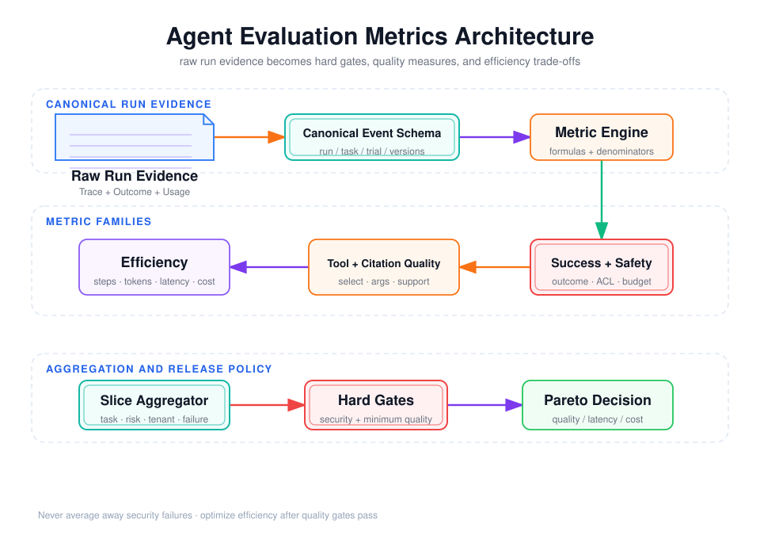

# Agent 评测指标体系：正确性、效率、可靠性与成本



## 阅读前术语表

| 术语 | 中文建议 | 在 Agent 指标中的具体含义 |
|---|---|---|
| Metric | 指标 | 从 Trial 证据按固定公式计算出的量；必须同时定义分子、分母、统计范围和版本。 |
| Strict Success | 严格成功 | Task 的所有必要结果、安全条件和硬预算同时满足；任一硬条件失败都记为不成功。 |
| Partial Credit | 部分得分 | 对已完成的子目标给诊断性分数，用于定位问题，但不能自动替代严格成功。 |
| Hard Gate | 硬门槛 | 不允许被其他指标抵消的发布条件，例如跨租户访问次数必须为 0。 |
| Denominator | 分母／统计口径 | 指标“除以谁”。例如工具正确率可以按调用数、按任务数或按应调用机会数计算，含义不同。 |
| Macro Average | 宏平均 | 先按 Task 计算，再让每个 Task 等权平均。适合避免简单任务或高重复任务主导总分。 |
| Micro Average | 微平均 | 把全部 Trial 或事件合并计算，每个事件等权。适合观察总体流量，但可能掩盖少数困难任务。 |
| Slice | 数据切片 | 按风险、难度、租户、工具或故障类型划分的数据子集，用于检查局部指标。 |
| Tool Selection | 工具选择 | Agent 是否在应该调用工具时选对工具，并在不应调用时保持不调用。 |
| Precision | 精确率 | Agent 发出的某类预测中有多少是正确的。例如选择的工具中有多少确实适用。 |
| Recall | 召回率 | 所有应该被发现或执行的目标中，Agent 找到了多少。例如必要工具调用有多少没有遗漏。 |
| F1 | F1 分数 | Precision 与 Recall 的调和平均；只有在二者定义和业务代价合理时才有意义。 |
| Schema Validity | 结构合法率 | 工具参数或结果是否满足 JSON Schema 的类型、必填项、枚举和范围约束；合法不代表业务语义正确。 |
| Argument Correctness | 参数正确率 | 工具参数指向的实体、数值、时间和业务含义是否正确，通常需要确定性或语义 Grader。 |
| Tool Call ID Correlation | 工具调用关联正确性 | 并行调用时，工具结果是否回传给发起它的正确 Tool Call ID。 |
| Idempotency | 幂等性 | 同一个副作用请求重复提交时，业务结果只发生一次；常通过幂等键实现。 |
| Citation Validity | 引用有效性 | 引用 ID、URL 或文档片段是否真实存在且可以解析。 |
| Citation Correctness / Entailment | 引用支撑正确性／蕴含性 | 引用内容是否真的支持对应主张，而不是仅仅主题相关。 |
| Citation Coverage | 引用覆盖率 | 应当提供证据的重要主张中，有多少得到了有效引用支持。 |
| Faithfulness | 忠实度 | 回答是否只陈述证据能够支持的内容，不自行添加与证据冲突或不存在的信息。 |
| ACL | 访问控制列表 | 规定哪些用户或主体可以访问某份数据的权限规则；越权引用即使内容正确也属于失败。 |
| Step | 执行步骤 | 一次可计数的模型轮次、工具尝试或控制转移。不同框架定义不同，因此本文拆成多个明确计数。 |
| Critical Path | 关键路径 | 并行执行中决定总完成时间的最长依赖链；总延迟由它决定，而不是所有组件耗时简单相加。 |
| Redundant Tool Rate | 冗余工具率 | 重复、无必要或对成功没有贡献的工具调用占比，用于发现轨迹膨胀。 |
| Token | 模型计费与上下文单位 | 模型处理文本的基本片段；输入、输出、缓存输入和推理 Token 可能采用不同计价方式。 |
| Cached Token | 缓存 Token | Provider 命中 Prompt Cache 后复用的输入 Token；通常仍应记录，并按实际计价规则计算成本。 |
| TTFT | 首 Token 延迟 | Time To First Token，从请求开始到用户收到第一个输出 Token 的时间。 |
| End-to-end Latency | 端到端延迟 | 从接收任务到最终响应结束的墙钟时间，包含模型、工具、调度和等待。 |
| Time-to-outcome | 达成结果时间 | 从任务开始到数据库、文件或业务状态真正完成的时间，可能早于或晚于最终文本结束。 |
| P50 / P95 / P99 | 延迟百分位 | 分别表示 50%、95%、99% 的观测不超过该值；P95/P99 用于观察慢请求长尾。 |
| Deadline Success | 时限内成功率 | 同时满足“结果正确”和“在截止时间前完成”的 Trial 比例。超时后得到正确答案也不算通过。 |
| Cost per Trial | 单次试验成本 | 模型、工具、搜索、计算、存储和人工成本之和除以 Trial 数。 |
| Cost per Success | 每次成功成本 | 总成本除以严格成功次数，可暴露“单次便宜但大量失败”的系统。 |
| SLO | 服务目标 | 业务对成功率、延迟或可用性声明的目标，而不是某次实验恰好达到的数值。 |
| Pareto Frontier | 帕累托前沿 | 不存在另一个方案在所有目标上都不差、且至少一项更好的方案集合；用于比较质量、延迟和成本。 |
| Telemetry | 遥测数据 | Runtime 自动产生的 Trace、Span、Token、延迟、状态和错误等可观测事件。 |
| `null / unavailable` | 未测得／不可获得 | 表示指标没有数据。不能写成 0，因为 0 表示已经测量且确实没有消耗或事件。 |
| HTTP 200 | HTTP 成功状态码 | 只表示请求在协议层成功返回，不能证明工具参数、业务结果或权限是正确的。 |
| Wall-clock Time | 墙钟时间 | 从现实世界时钟观察到的实际经过时间；并行组件耗时不能简单相加得到它。 |
| Span | 追踪片段 | 一次模型调用、工具调用或控制操作的起止记录，是计算分组件延迟的基础。 |
| Billable Token | 计费 Token | Provider 实际纳入价格计算的 Token；可能与日志中的原始总 Token 不完全相同。 |
| Unit Task Cost | 单位任务成本 | 完成一个 Task 或一个成功 Task 的平均成本，必须明确是否包含失败重试和人工费用。 |
| Measurement Status | 测量状态 | 指标是否完整、缺失、估算或不可用的标记，防止把采集失败误认为数值为 0。 |

## 1. 指标体系不是一张越大越好的表

Agent 可能给出正确答案，却调用了错误工具、访问了越权数据、重复执行了副作用，或花费不可接受的时间和成本。因此不能用一个“综合分”替代所有判断。合理架构分三层：

1. **硬门槛**：安全、权限、数据一致性、必要业务结果；任何一项失败即不发布。
2. **主质量指标**：Task 成功率、工具正确率、引用正确率和无答案处理。
3. **效率与体验指标**：步骤、Token、延迟、成本；在质量达标后做 Pareto 比较。

如果把安全和成本直接加权平均，系统可能用“答案更流畅”抵消一次越权访问，这在业务上没有意义。

## 2. 成功率：先定义“成功”的逻辑表达式

### 2.1 严格成功与部分得分

任务 \(i\) 的严格成功可写为：

\[
S_i=Q_i\land O_i\land A_i\land B_i
\]

- \(Q_i\)：答案质量达标；
- \(O_i\)：Outcome 正确；
- \(A_i\)：授权、审批和租户隔离正确；
- \(B_i\)：没有超过步骤、时间或费用硬预算。

严格成功适合作为发布门禁。诊断时再报告各子项和加权 Rubric 分，定位失败来自检索、工具、推理还是表达。部分得分不能覆盖硬失败。

### 2.2 宏平均、微平均与切片

```text
Macro success = 各 Task 成功率之和 / Task 数
Micro success = 成功 Trial 数 / 全部 Trial 数
```

当各任务重复次数不同时，两者不同。还应按以下切片报告：

- 难度、领域、语言、工具类型；
- 只读与副作用任务；
- 正常、超时、工具错误、冲突证据等故障场景；
- tenant、数据新鲜度和上下文长度；
- 首次尝试与重试后成功。

总体均值可能掩盖某个高风险切片的严重退化。

## 3. 工具正确率：不是 HTTP 200 比例

工具评测至少拆成六层：

| 层次 | 判断问题 | 示例指标 |
|---|---|---|
| 决策 | 该不该调用、调用哪个工具 | tool selection precision/recall |
| 参数 | 参数含义、类型、实体是否正确 | schema-valid rate、argument exact/semantic match |
| 关联 | Tool Call ID 与结果是否正确对应 | result correlation accuracy |
| 执行 | 工具是否在预算内成功 | execution success、timeout rate |
| 序列 | 前置依赖、审批和顺序是否正确 | valid sequence rate |
| 业务结果 | 最终状态是否正确且无重复副作用 | outcome correctness、idempotency rate |

### 3.1 选择正确率必须包含“不调用”

若测试集全是工具必需题，Agent 可以每次乱调工具仍获得看似不错的召回率。必须包含：

- 工具必要任务；
- 无需工具任务；
- 没有适用工具，应澄清或拒绝的任务；
- 多工具都能完成，但成本和权限不同的任务。

把工具调用视为多标签决策时，可统计选择 Precision、Recall、F1；但若顺序和依赖重要，还需轨迹或状态机 Grader。

### 3.2 参数正确率不能只做字符串完全匹配

`{"city":"上海"}` 与 `{"city":"Shanghai"}` 可能语义相同；反之，Schema 合法不代表业务正确。建议分开报告：

```text
Schema validity       = 通过 JSON Schema 的调用 / 全部调用
Argument correctness  = 业务语义正确的参数 / 应评估参数调用
Authorization validity= 满足 tenant、scope、审批的调用 / 全部受控调用
```

参数中 tenant_id 不应由模型自由生成，而应由可信 Runtime 注入；相应 Grader 应检查模型不可见 Token、不可覆盖授权上下文。

## 4. 引用正确率：引用存在不等于支撑结论

至少区分四件事：

1. **Citation validity**：引用 ID、URL 或文档片段真实存在且可解析；
2. **Citation correctness/entailment**：引用内容确实支持紧邻主张；
3. **Citation coverage**：所有需要证据的重要主张有多少得到支持；
4. **Source quality**：来源是否权威、最新、未过期且当前用户有访问权。

设回答中有 \(m\) 个引用，正确支持主张的有 \(c\) 个：

\[
Citation\ Precision=\frac{c}{m}
\]

设有 \(r\) 个应被引用的可核查主张，其中有支持证据的为 \(s\)：

\[
Citation\ Coverage=\frac{s}{r}
\]

二者必须同时看。Agent 只给一个完全正确的引用可能 Precision=100%，但 Coverage 很低；堆砌大量弱相关引用则可能覆盖高、正确率低。

在多租户 RAG 中，再增加：

```text
ACL-valid citation rate = 当前用户可访问的引用 / 全部引用
Fresh citation rate     = 未过期且版本正确的引用 / 全部时效性引用
```

越权引用即使内容正确也属于硬失败。

## 5. 步骤数：先定义什么算一步

不同框架对“Step”的定义不同。为保证可比性，建议同时记录：

- `model_turns`：发起模型推理的次数；
- `tool_attempts`：工具尝试次数，失败和重试均计入；
- `tool_successes`：成功工具次数；
- `control_transitions`：路由、Handoff、审批中断等控制转移；
- `max_parallel_width`：同时执行的最大分支数；
- `critical_path_steps`：决定墙钟时间的关键路径长度。

“并行调用 5 个工具”可以是一个模型轮次、五个工具尝试，关键路径却只有一次工具延迟。如果只报单一 `steps=1`，既看不见成本，也无法比较串行与并行架构。

冗余率可定义为：

\[
Redundant\ Tool\ Rate=\frac{重复或对成功无贡献的工具调用}{全部工具调用}
\]

但“无贡献”应基于反事实或轨迹规则谨慎标注，不能因为最终答案没直接引用某次查询就判定它无用。

## 6. Token：统计整个运行时，不只统计最后一次调用

总 Token 应聚合所有模型调用和子 Agent：

\[
Tokens_{total}=\sum_{call}(input+output+reasoning_{visible}+cached_{billed})
\]

Provider 对 cached token 和 reasoning token 的暴露、计价不同，所以保存原始 usage 字段，再映射到统一列：

```text
input_tokens
output_tokens
cached_input_tokens
reasoning_tokens_if_reported
provider_reported_total
normalized_billable_tokens
```

需要重点看：

- 每 Task Token 与每成功 Task Token；
- P50/P95 Token，而不只是均值；
- Prompt、历史、检索证据、工具结果、子 Agent 上下文的占比；
- 失败运行是否产生“越失败越循环、越循环越贵”的长尾。

若某实现拿不到 Token，不应填 0。应填 `null` 并标记 `measurement_status=unavailable`；0 表示经过测量且确实没有消耗，二者语义完全不同。

## 7. 延迟：端到端时间与组件时间要分开

建议记录：

| 指标 | 起止点 | 用户感知 |
|---|---|---|
| TTFT | 请求接收到首个可见 Token | 首屏响应速度 |
| model latency | 每次模型请求起止 | 推理耗时 |
| tool latency | 每次工具调用起止 | 外部依赖耗时 |
| time-to-outcome | 请求开始到业务状态达成 | 任务实际完成速度 |
| end-to-end latency | 请求开始到最终响应完成 | 总等待时间 |
| human wait | Interrupt 到审批恢复 | 应单独报告，不混入系统执行效率 |

并行系统中：

\[
Latency_{wall}\neq\sum Latency_{component}
\]

总墙钟时间由关键路径决定，而资源消耗仍来自所有并行分支。因此延迟优化可能通过增加并行工具数换取，必须与成本、限流和副作用风险共同判断。

均值会隐藏尾延迟，线上体验至少报告 P50/P95，关键业务可加 P99、超时率和截止时间内成功率：

\[
Deadline\ Success=\frac{在时限内完成且结果正确的Trial}{全部Trial}
\]

## 8. 成本：把“便宜但总失败”纠正回来

单次 Task 成本应包括：

\[
C=C_{model}+C_{tool/API}+C_{search}+C_{compute}+C_{storage}+C_{human}
\]

至少报告：

```text
cost_per_trial       = 总评测成本 / Trial 数
cost_per_success     = 总评测成本 / 严格成功 Trial 数
cost_per_1k_tasks    = cost_per_trial × 1000
incremental_cost     = candidate - baseline
```

`cost_per_success` 对低成功率系统尤其重要。一个每次 $0.02、成功率 20% 的 Agent，在允许独立重试且不计额外风险时，完成一次任务的期望模型成本约为 $0.10，并不一定比每次 $0.06、成功率 90% 的系统便宜。

价格会变化，评测记录应保存价格表版本与币种，避免日后无法复算。

## 9. 从指标到发布门禁

一个可执行的门禁例子：

```yaml
hard_gates:
  cross_tenant_access: 0
  unauthorized_side_effect: 0
  duplicate_side_effect_rate: 0
  task_success_macro: ">= 0.85"
  regression_drop_vs_baseline: ">= -0.01"
soft_objectives:
  citation_correctness: maximize
  p95_end_to_end_seconds: minimize
  cost_per_success_usd: minimize
  tool_attempts_per_success: minimize
slices:
  - tenant_isolation
  - tool_timeout
  - conflicting_evidence
  - long_context
```

通过硬门槛后，再比较 Pareto 前沿：若方案 A 在成功率、延迟和成本上都不差于 B，且至少一项更好，则 B 被 A 支配；否则需要依据业务偏好选择，不能强行压成一个任意加权总分。

## 10. 最小事件与聚合 Schema

```json
{
  "run_id": "run-...",
  "task_id": "task-...",
  "trial_index": 2,
  "slice": ["tool-timeout", "tenant-a"],
  "strict_success": false,
  "grader_scores": {"outcome": 1, "citation": 0.75, "authorization": 1},
  "counts": {"model_turns": 4, "tool_attempts": 5, "tool_successes": 4},
  "tokens": {"input": 9200, "output": 820, "cached_input": 4000},
  "latency_ms": {"ttft": 620, "end_to_end": 18400, "human_wait": 0},
  "cost_usd": {"model": 0.021, "tools": 0.006, "total": 0.027},
  "measurement_status": "complete",
  "trace_id": "trace-...",
  "versions": {"suite": "v8", "agent": "commit", "grader": "g3"}
}
```

聚合层必须从此类原始事件计算，不能只保存仪表盘结果。这样才能重算分母、修复 Grader 后回放，以及解释某个指标为什么变化。

## 11. 本文结论

1. 成功率需要用 Outcome、安全和预算共同定义，不能只看最终文本。
2. 工具正确率应覆盖选择、参数、关联、执行、顺序和最终副作用。
3. 引用评测至少拆成有效性、支撑正确性、覆盖率、来源质量与 ACL。
4. 步骤、Token、延迟和成本都要统计完整 Agent Runtime，包括并行分支和子 Agent。
5. 未测得的指标必须是 `null/unavailable`，不能伪装成 0。
6. 安全与业务结果采用硬门槛；质量达标后用 Pareto 分析效率权衡。

## 参考资料

- [Anthropic: Demystifying evals for AI agents](https://www.anthropic.com/engineering/demystifying-evals-for-ai-agents)
- [Berkeley Function-Calling Leaderboard](https://gorilla.cs.berkeley.edu/leaderboard)
- [τ-bench / τ²-bench evaluation documentation](https://github.com/sierra-research/tau2-bench/blob/main/docs/evaluation.md)
