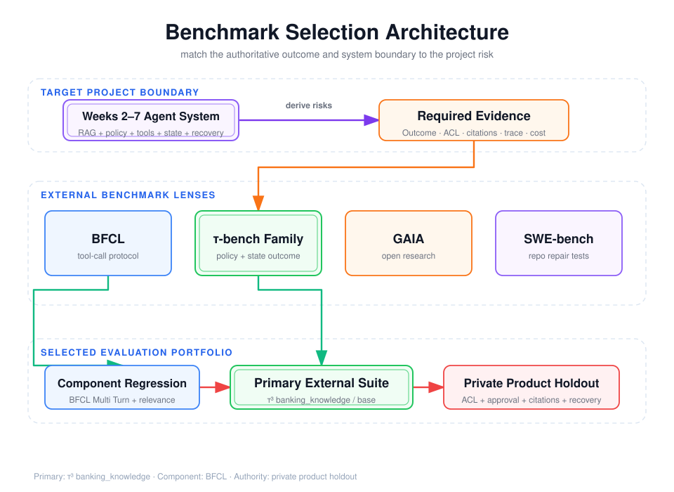

# BFCL、τ-bench、GAIA 与 SWE-bench：任务、评分设计与项目子集选择



## 阅读前术语表

| 术语 | 中文建议 | 在基准评测中的具体含义 |
|---|---|---|
| Benchmark | 基准评测 | 公开或标准化的 Task、环境、Harness 和评分协议，用于在相同条件下比较不同系统。 |
| Task | 评测任务 | 基准中的最小问题单元，包含输入以及重建初始环境和判断成功所需的信息。 |
| Dataset | 数据集 | Task 的集合及其字段定义；同一个 Benchmark 可能提供多个版本、配置和 Split。 |
| Environment | 执行环境 | Agent 运行时可访问的数据库、文件、仓库、网页和工具；它决定哪些行为能真实执行。 |
| Harness | 运行框架 | 准备环境、启动 Agent、限制预算、收集结果并运行 Grader 的程序。 |
| Grader | 评分器 | 按基准规则检查函数调用、最终答案、数据库终态或测试结果的自动或人工组件。 |
| Outcome | 最终结果 | Agent 执行结束后的权威环境状态。不同基准可能把函数结构、数据库或测试结果作为 Outcome。 |
| System Boundary | 系统边界 | 基准实际纳入评分的组件范围，例如只测模型函数调用，或测完整 Agent、工具和环境。 |
| BFCL | Berkeley 函数调用排行榜 | 主要评估函数选择、参数生成、并行/多轮调用以及不应调用时能否避免工具幻觉。 |
| AST | 抽象语法树 | 将函数调用解析成结构化语法节点后比较，避免空格、字段顺序等表面差异影响评分。 |
| Executable Evaluation | 可执行评测 | 真正执行函数、代码或测试，根据运行结果评分，而不是只比较输出字符串。 |
| Tool Relevance | 工具相关性 | 当前请求是否存在适用工具。相关性任务同时检查“该调用时调用”和“无适用工具时不乱调用”。 |
| Tool Hallucination | 工具幻觉 | Agent 调用不存在、不适用或未提供的工具，或虚构工具执行结果。 |
| τ-bench Family | τ 系列多轮事务基准 | 在领域 Policy、有状态数据库、工具和模拟用户共同参与下评估 Agent 的多轮任务完成能力。 |
| Policy | 业务政策／规则 | Agent 执行任务时必须遵守的领域规则，例如身份核验、退款条件和信息披露要求。 |
| Stateful Environment | 有状态环境 | 工具调用会读取或改变持续存在的数据库状态，后续动作依赖前面的结果。 |
| User Simulator | 用户模拟器 | 在多轮基准中扮演用户的模型或程序，持有隐藏目标并根据 Agent 的提问继续回应。 |
| Reward Basis | 奖励判定分量 | 构成总奖励的独立依据，例如数据库终态、必须向用户传达的信息和必要动作。 |
| Gold Actions | 参考动作 | 基准作者提供的可行工具操作，用于生成目标状态或辅助评分；不一定要求 Agent 逐步复制相同路径。 |
| Split | 数据划分 | 按用途分开的 Task 集，例如训练、开发、公开测试、私有测试或 `base`。 |
| `base` Split | 基础评测划分 | τ 系列仓库中用于标准运行的一组任务；具体内容必须结合固定版本解释。 |
| GAIA | 通用 AI 助手基准 | 评估开放世界问题求解，通常需要网页检索、文件处理、计算、多模态信息和多步推理。 |
| Level | 难度等级 | GAIA 对任务复杂度的分级；等级越高通常需要更多工具、步骤和信息组合。 |
| SWE-bench | 软件工程修复基准 | 给 Agent 真实 GitHub Issue 和仓库基线，要求生成 Patch 并通过隔离环境中的测试。 |
| Issue | 问题单／缺陷描述 | 真实项目中描述 Bug 或需求的文本，是 Coding Agent 理解修改目标的主要输入。 |
| Base Commit | 基线提交 | 应用 Agent Patch 前固定的仓库提交，保证不同系统从相同代码状态开始。 |
| Patch | 代码补丁 | Agent 对仓库文件产生的差异，是 SWE-bench 最终执行和评分的提交物。 |
| FAIL_TO_PASS | 目标修复测试 | 补丁前失败、补丁后必须通过的测试，用来证明 Issue 对应问题已修复。 |
| PASS_TO_PASS | 回归保护测试 | 补丁前已通过、补丁后仍必须通过的测试，用来发现修复造成的既有功能回归。 |
| SWE-bench Verified | 专家验证子集 | 经过人工检查、提高任务可解性和描述质量的 500 个 SWE-bench Task。 |
| Lite | 精简子集 | 为降低运行成本而筛选的较小任务集合；数量和过滤规则必须与具体版本绑定。 |
| Smoke Suite / Smoke Test | 冒烟测试集 | 少量、运行较快的任务，用来快速发现系统无法启动或出现明显退化，不代表完整能力结论。 |
| Leaderboard | 排行榜 | 在官方固定协议下汇总不同系统分数的页面；只在版本、Harness 和任务集合一致时可比较。 |
| Version Pinning | 版本固定 | 固定仓库 commit/tag、数据 revision、镜像、模型和 Grader，防止基准更新后分数失去可比性。 |
| External Benchmark | 外部基准 | 由外部组织维护、便于横向比较的评测；不一定覆盖本项目特有的权限和业务规则。 |
| Private Holdout | 私有保留集 | 不公开答案、与调参隔离的产品任务，用于验证 ACL、审批、引用和恢复等真实业务风险。 |
| Contamination | 评测污染 | 模型训练或调参过程接触测试题、答案、Gold Actions 或补丁，使成绩不能代表未见任务能力。 |
| Leaderboard-comparable | 可与排行榜比较 | 严格使用官方完整任务、版本、Harness 和计分规则；本地筛选子集的结果不具备该资格。 |
| Single Turn | 单轮任务 | Agent 根据一次用户输入直接产生答案或工具调用，不需要后续用户交互。 |
| Multi Turn | 多轮任务 | Agent 需要在多轮用户消息、工具结果和状态变化之间持续决策。 |
| RAG | 检索增强生成 | 先从外部知识库检索证据，再把证据交给模型生成回答；需要额外评估召回和引用忠实度。 |
| MCP | 模型上下文协议 | 连接 Agent 应用与工具、资源、Prompt 模板的协议；它定义连接方式，不等于 Agent 的决策循环。 |
| HITL | 人在回路 | Human-in-the-loop，在高风险动作前暂停 Agent，由人工批准、拒绝或修改后再恢复。 |
| Checkpoint | 检查点 | 持久化的 Agent 中间状态，用于中断恢复、重复提交保护和故障重放。 |
| Agentic Web Search | Agent 式网页搜索 | Agent 自主决定搜索词、浏览结果、继续追查和停止，而不是只调用一次固定搜索接口。 |
| Retrieval Strategy | 检索策略 | 从知识库选择证据的方法，例如向量检索、BM25、混合检索或在沙箱中使用 grep。 |

## 1. 基准名称不能代替评测目标

四类基准观察的是不同系统边界：

- **BFCL**：模型能否理解并正确产生工具调用，重点在函数选择、参数和调用结构；
- **τ-bench 系列**：Agent 能否在领域政策和有状态工具环境中与用户交互并完成事务；
- **GAIA**：通用助手能否通过推理、网页、文件和多模态工具解决真实世界问题；
- **SWE-bench**：Coding Agent 能否在真实代码仓库中修复 Issue，并让隐藏测试通过且不破坏既有行为。

它们不是从低到高的统一排行榜。BFCL 高分不能证明多轮事务可靠，GAIA 高分也不能证明代码补丁通过回归测试。选型必须从目标项目的失败风险反推，而不是挑最知名的基准。

## 2. 统一比较框架

| 基准 | Task 输入 | Environment / Tools | 主要证据 | Grader | 最擅长发现 |
|---|---|---|---|---|---|
| BFCL | 用户函数调用请求、函数定义 | 函数集合，部分任务可执行 | 生成的调用、参数、拒绝调用 | AST/可执行结果/规则 | 工具选择、参数、并行与多轮调用 |
| τ-bench 系列 | 用户目标、领域 Policy、初始 DB | 领域 API、用户模拟器、有状态 DB | 对话、Tool Trace、最终 DB、沟通结果 | Outcome reward basis | 政策遵循、多轮事务、状态一致性 |
| GAIA | 真实世界开放问题，部分带附件 | Web、代码、文件和多模态工具 | 最终短答案与轨迹 | 答案匹配，测试答案私有 | 开放研究、信息整合、工具规划 |
| SWE-bench | GitHub Issue、仓库与 base commit | 容器化仓库、测试框架 | 代码 Patch、测试日志 | FAIL_TO_PASS + PASS_TO_PASS | 代码定位、修改、回归保护 |

真正重要的差异是**评分证据落在哪里**：字符串、函数结构、数据库终态还是可执行测试。越接近业务的权威状态，Grader 越不容易被流畅文本欺骗。

## 3. BFCL：工具调用协议能力的组件评测

### 3.1 它在测什么

Berkeley Function-Calling Leaderboard 持续演进，当前官方页面的 BFCL V4 覆盖 Single Turn、Multi Turn、函数相关性/幻觉、Agentic Web Search、Memory、格式敏感性以及延迟等维度。[BFCL leaderboard](https://gorilla.cs.berkeley.edu/leaderboard)

其核心 Task 通常包含用户请求和一组函数定义，模型要输出结构正确的调用。常见能力包括：

- 单函数选择与参数填充；
- 一个请求中调用多个函数；
- 并行调用与嵌套/复杂参数；
- 多轮对话中的状态延续；
- 没有相关函数时不应调用，避免工具幻觉；
- 对可执行函数比较实际返回，而不只比较字符串。

### 3.2 为什么 AST/执行式评分比文本匹配可靠

以下两个调用在 JSON 字符串上不同，但语义可能等价：

```json
{"name":"weather","arguments":{"city":"上海","unit":"celsius"}}
{"arguments":{"unit":"celsius","city":"上海"},"name":"weather"}
```

解析为 AST 或执行后比较，可以消除字段顺序、空格和部分表示差异。但执行式评分仍有边界：外部 API 不稳定会把环境故障误算成模型失败，因此正式评测需要固定实现、可重复数据和明确的超时归因。

### 3.3 盲点

BFCL 主要观察工具接口层，通常不足以单独证明：

- 长任务是否会在失败后恢复；
- 用户授权、审批、幂等和租户隔离是否正确；
- RAG 引用是否忠实；
- 工具调用后真实业务 Outcome 是否一致；
- 多 Agent 的 Handoff 与 Checkpoint 是否可靠。

因此它适合作为本项目的**工具调用组件回归集**，而不是唯一端到端验收。

## 4. τ-bench：政策约束下的有状态多轮事务

### 4.1 从 τ-bench 到 τ²/τ³

原始 τ-bench 聚焦 Agent 与模拟用户、领域工具之间的多轮交互。[τ-bench paper](https://arxiv.org/abs/2406.12045) 当前官方仓库已发展为 τ²/τ³ 体系，包含 mock、airline、retail、telecom 和 `banking_knowledge` 等领域，并持续更新评分与版本。[tau2-bench repository](https://github.com/sierra-research/tau2-bench)

一个领域通常包含：

- `policy`：Agent 必须遵守的业务规则；
- `tools`：可查询或修改状态的 API；
- `tasks`：用户目标、初始状态与参考结果；
- 用户模拟器：根据隐藏目标与 Agent 对话；
- 可选用户侧工具：模拟真实双边操作。

它比“函数参数是否匹配”更接近生产系统，因为正确性取决于多轮澄清、政策判断、工具序列和最终数据库状态。

### 4.2 Outcome 评分为什么允许多条正确路径

官方评测文档说明，默认 Reward 可由数据库终态与必须向用户传达的信息等 basis 组合；参考 `actions` 可在干净环境执行以生成目标状态，并不天然要求 Agent 严格复现同一路径。[Evaluation and Scoring](https://github.com/sierra-research/tau2-bench/blob/main/docs/evaluation.md)

这解决了 Agent 评测中的关键问题：

```text
路径 A：先查询账户 → 核对身份 → 执行变更
路径 B：先核对身份 → 查询账户 → 执行变更
```

若二者都符合 Policy 且产生相同合法 Outcome，就不应因调用顺序与参考轨迹不同而误判。只有当顺序本身是安全要求，例如“确认后才能扣款”，才应增加 Action/Trace Grader。

### 4.3 Reward 乘积的含义

若总奖励是多个 basis 的乘积：

\[
R=R_{DB}\times R_{communicate}\times R_{policy}
\]

任何关键项为 0，整体失败。这适合表达“事务正确但没有告知关键限制，也不算完整成功”。同时应保存各分量，否则只能看到 0，无法诊断是状态错误、沟通遗漏还是政策违规。

### 4.4 版本漂移风险

官方仓库会修正任务和 Grader；例如不同版本可能调整某个领域的评分，前后分数不可直接比较。报告不能只写“τ-bench 得分”，而应固定：仓库 commit/tag、领域、split、任务 ID、用户模拟器模型、Agent 模型、Trial 次数和 Grader 配置。

## 5. GAIA：开放世界研究型 Agent 评测

GAIA 包含 466 道真实世界问题，要求推理、Web 浏览、工具使用和多模态处理；题目分三级，难度随所需步骤和工具组合提高。[GAIA paper](https://arxiv.org/abs/2311.12983) 数据集提供公开开发集和答案受保护的测试集，部分任务带文件附件。[GAIA dataset card](https://huggingface.co/datasets/gaia-benchmark/GAIA)

### 5.1 任务设计价值

GAIA 不把问题约束成固定函数调用。例如任务可能需要：

1. 理解问题中隐藏的实体和时间范围；
2. 找到权威网页或解析附件；
3. 进行计算、交叉验证或格式转换；
4. 输出精确短答案。

它适合评估研究 Agent 的检索规划、信息综合、文件处理和长链路错误累积。

### 5.2 最终答案评分的优势与不足

短答案便于客观评分，也能避免 LLM Judge 偏见。但最终答案正确并不能证明：

- 引用来源权威且可访问；
- 没有依赖污染页面或记忆答案；
- 轨迹满足成本、安全和工具政策；
- Agent 对无答案、冲突证据处理正确。

本项目若采用 GAIA 风格任务，应在答案评分之外增加引用 entailment、来源时效性、ACL 和 Trace 预算 Grader。

## 6. SWE-bench：以仓库测试为权威 Outcome

SWE-bench 的每个 Task 通常绑定真实 GitHub Issue、仓库和 base commit。Agent 生成 Patch 后，Harness 在隔离环境执行测试。[SWE-bench repository](https://github.com/SWE-bench/SWE-bench)

完整解决一般要求：

- `FAIL_TO_PASS`：原本失败、补丁后应通过的目标测试全部通过；
- `PASS_TO_PASS`：原本通过的保护性测试继续通过。

这比“补丁看起来合理”强得多：Grader 检查可执行 Outcome，并同时检测回归。评分实现可在官方 `grading.py` 中追溯。[grading.py](https://github.com/SWE-bench/SWE-bench/blob/main/swebench/harness/grading.py)

### 6.1 Verified、Lite 与版本固定

SWE-bench Verified 是经过专家筛选、确认可解决且描述质量更高的 500 题子集。[Introducing SWE-bench Verified](https://openai.com/index/introducing-swe-bench-verified/) 官方数据说明和排行榜可能随版本演进，对 Lite 的数量或过滤规则出现不同历史口径；正确做法不是记住一个数字，而是固定数据集配置与 revision，并在报告中列出 Task ID。[SWE-bench datasets](https://www.swebench.com/SWE-bench/guides/datasets/)

### 6.2 它没有自动覆盖什么

测试通过也不保证补丁：

- 代码可维护、安全且符合项目风格；
- 没有针对测试过拟合；
- 性能、兼容性和文档完整；
- 工具轨迹和 Token 成本可接受。

生产 Coding Agent 还应增加静态分析、安全扫描、Patch 范围、人工抽检和成本指标。

## 7. 针对本 16 周项目的子集选择

### 7.1 项目实际能力边界

第 2–7 周系统已经覆盖：

- Model → Tool → Observation → Model 循环；
- MCP 工具、授权上下文、超时、幂等和结构化错误；
- RAG、引用、记忆、ACL 与删除传播；
- Workflow、ReAct、Plan-and-Execute、恢复和多 Agent 消融；
- LangGraph、Agents SDK、Harness、Checkpoint、HITL 和 Trace。

所以最需要验证的不是孤立 JSON 函数调用，而是“在政策、检索与有状态工具共同约束下，Agent 能否稳定达成正确 Outcome”。

### 7.2 主基准：τ³ `banking_knowledge/base`

建议将官方仓库 **v1.0.1（或执行时固定的明确 commit）** 的 `banking_knowledge` 领域、`base` split 作为最相关外部子集。原因是它同时覆盖：

- 大型知识库检索与证据选择；
- 多轮用户交互和政策遵循；
- 工具调用与有状态环境；
- 终态 Outcome 和必要沟通内容；
- 可替换的检索策略，适合比较自建 RAG、记忆和不同 Harness。

这是**主外部基准**，不是完整产品验收。还需叠加本地 Grader：

```text
引用正确率与覆盖率
tenant_id / user_id / Scope / ACL
审批前不得产生副作用
幂等与重复提交
Checkpoint 恢复和工具异常
Token、P95 延迟、成本
```

### 7.3 互补子集

| 目的 | 建议子集 | 定位 |
|---|---|---|
| 工具协议组件回归 | BFCL Multi Turn + relevance/hallucination | 快速定位函数选择、参数和多轮调用退化 |
| 开放研究能力 | GAIA Level 1/2 的开发集，选与 Web/文件/计算相关任务 | 检查开放检索和多工具规划，不接触私有 Test 答案 |
| Coding Agent 扩展 | SWE-bench Verified | 只有项目目标扩展到真实仓库修复时启用 |

如果做 Coding Agent 试验，可先选 25 个 Python 项目、依赖可构建且耗时可控的 Verified Task 作为本地 Smoke Suite。必须明确标注“本地过滤子集，不可与官方排行榜横向比较”；要获得可比较结果，应跑完整 Verified、使用官方 Harness 和固定镜像。

## 8. 推荐实验协议

```yaml
primary:
  benchmark: tau2-bench repository
  version: v1.0.1-or-pinned-commit
  domain: banking_knowledge
  split: base
trials_per_task: 3
paired_baseline: native-agent
candidate: langgraph-or-agents-sdk
frozen:
  - agent_model_and_sampling
  - user_simulator_model
  - tool_and_corpus_revision
  - concurrency_and_timeout
graders:
  - official_reward_components
  - local_acl_and_authorization
  - local_citation_correctness
  - local_budget_and_recovery
report:
  - macro_success_with_ci
  - per_reward_basis
  - failure_taxonomy
  - tool_and_citation_metrics
  - steps_tokens_latency_cost
```

对同一 Task 进行配对多 Trial；记录官方奖励分量、Trace、Outcome 和本地安全门槛。外部环境或用户模拟器异常应单独标注，不可静默重跑直到成功。

## 9. 基准污染与排行榜误用

公开基准可能已进入模型训练语料，且长期针对排行榜调参会把 Test 集变成事实上的 Dev 集。控制措施包括：

- 公开基准用于可比性，私有新鲜任务用于发布门禁；
- 不把参考答案、gold actions、测试补丁提供给 Agent；
- 对任务做语义等价变体和时间切分；
- 记录模型快照、基准 revision 和是否可能训练污染；
- 不根据 Test 失败逐题修改 Prompt；
- 报告完整 Trial，而不是挑选最好轨迹。

排行榜回答“在特定公开协议下表现如何”，不能直接回答“在我的权限模型、数据、工具与用户分布下是否能上线”。

## 10. 本文结论

1. BFCL 测工具调用接口能力，τ-bench 测政策约束的有状态事务，GAIA 测开放研究，SWE-bench 测真实仓库修复。
2. 基准差异的核心是 Task 环境、权威 Outcome 和 Grader，而不是题目数量。
3. 本项目最相关的主子集是固定版本的 `banking_knowledge/base`；BFCL Multi Turn 用作组件回归。
4. SWE-bench Verified 只在目标扩展到 Coding Agent 时启用；本地 25 题只能作为 Smoke Suite。
5. 所有外部基准都要补本地 ACL、授权、引用、恢复和成本 Grader。
6. 固定版本、隔离环境、重复 Trial 与私有 Holdout 比单一排行榜分数更重要。

## 参考资料

- [Anthropic: Demystifying evals for AI agents](https://www.anthropic.com/engineering/demystifying-evals-for-ai-agents)
- [BFCL Leaderboard](https://gorilla.cs.berkeley.edu/leaderboard)
- [Gorilla / BFCL repository](https://github.com/ShishirPatil/gorilla)
- [τ-bench paper](https://arxiv.org/abs/2406.12045)
- [τ²/τ³ benchmark repository](https://github.com/sierra-research/tau2-bench)
- [τ²/τ³ evaluation and scoring](https://github.com/sierra-research/tau2-bench/blob/main/docs/evaluation.md)
- [GAIA paper](https://arxiv.org/abs/2311.12983)
- [GAIA dataset](https://huggingface.co/datasets/gaia-benchmark/GAIA)
- [SWE-bench repository](https://github.com/SWE-bench/SWE-bench)
- [SWE-bench datasets](https://www.swebench.com/SWE-bench/guides/datasets/)
- [SWE-bench Verified](https://openai.com/index/introducing-swe-bench-verified/)
