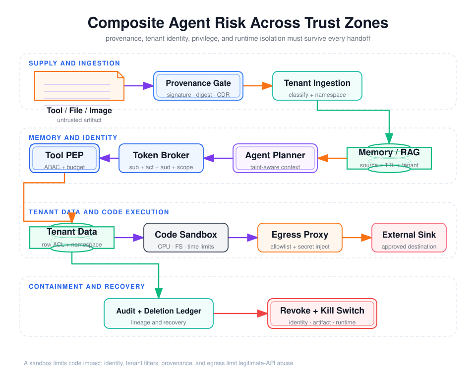

# Agent 复合风险分析：记忆污染、信息泄漏、身份权限、跨租户、供应链与 RCE



## 阅读前术语表

| 术语 | 中文建议 | 工程含义 |
|---|---|---|
| Memory Poisoning | 记忆污染 | 不可信或错误内容进入可复用上下文，跨步骤、会话或 Agent 持续影响后续决策。 |
| Sensitive Information Disclosure | 敏感信息泄漏 | PII、Secret、商业数据、系统 Prompt 或其他受限数据被未授权主体看到或流向未授权目的地。 |
| Tenant | 租户 | 在 SaaS 中拥有独立身份、策略、数据和计费边界的组织或客户。 |
| Cross-tenant Access | 跨租户访问 | 一个租户的主体读取、修改、推断或影响另一个租户的资源。 |
| Namespace | 命名空间 | 让数据、索引、缓存、对象存储和密钥按租户/主体隔离的逻辑或物理边界。 |
| Non-human Identity | 非人身份 | 服务、工作负载、Agent、机器人或自动化任务使用的受治理身份。 |
| Delegation Chain | 委托链 | 用户将部分权力委托给 Agent，Agent 再调用下游服务时形成的主体与 Actor 链。 |
| Supply Chain | 供应链 | 模型、Prompt、工具、MCP Server、Agent Card、依赖、镜像、数据集和更新渠道的来源链。 |
| SBOM / AIBOM | 软件／AI 物料清单 | 记录软件或 AI 系统组件、版本、来源、依赖、哈希和许可证的结构化清单。 |
| RCE | 远程代码执行 | 攻击者让目标系统执行其选择的代码；在 Agent 中也可能由恶意内容经多工具链间接达成。 |
| Sandbox Escape | 沙箱逃逸 | 代码突破容器/微虚机边界访问宿主、控制面或其他租户。 |
| Egress | 网络出口 | 工作负载从受控环境访问外部网络的路径。 |
| Taint Tracking | 污点跟踪 | 将不可信来源或敏感分类标签沿转换、记忆、工具与输出传播。 |
| Deletion Propagation | 删除传播 | 删除请求从主库同步到索引、缓存、记忆、备份和派生数据的全过程。 |

## 1. 六类风险形成一条复合攻击路径

单独研究每类风险容易遗漏放大关系。一个现实链路可能是：

```text
恶意 MCP 包或文档（供应链/输入）
  → 写入长期记忆（持久化）
  → 诱导 Agent 使用宽权限 Token（身份滥用）
  → 查询缺少 tenant_id（跨租户）
  → 将 PII 编码后发往外部（信息泄漏）
  → 调用 Shell/反序列化器（RCE 与驻留）
```

控制目标不是保证模型永不受骗，而是让任一环节失守后仍无法跨越下一条强边界。

## 2. 记忆污染：把瞬时输入升级为长期控制面

OWASP ASI06 将记忆定义为 Agent 保留、检索或复用的信息，包括摘要、Embedding、RAG 存储和长期状态。其危险在于一次攻击会跨会话复现，并可能传播给其他 Agent。[OWASP Agentic Top 10 2026 PDF](https://genai.owasp.org/download/52117/?tmstv=1765059207)

### 2.1 写入路径的安全问题

错误设计：

```text
conversation → LLM summary → vector_store.upsert(summary)
```

安全设计至少包含：

```text
原始来源与租户标签
  → 内容解析隔离
  → 事实/偏好/指令分类
  → 证据与置信度校验
  → PII/Secret 处理
  → 写入策略与人工门槛
  → 带版本、TTL、来源的 append-only 记录
```

模型生成的摘要是派生数据，不是权威事实。对账户、价格、权限、法规和用户身份等高影响信息，应保存权威对象 ID 和版本，而非只存自然语言摘要。

### 2.2 读路径不能把记忆变成系统指令

检索到的记忆应包装为带标签的证据：

```json
{
  "memory_id": "mem_42",
  "tenant_id": "tenant-a",
  "subject_id": "user-17",
  "kind": "user_preference",
  "content": "用户偏好中文摘要",
  "source": {"conversation_id": "c9", "turn_id": "t4"},
  "created_by": "memory-writer-v3",
  "confidence": 0.93,
  "expires_at": "2026-09-15T00:00:00Z",
  "instruction_authority": "none"
}
```

`instruction_authority: none` 表示内容可以辅助回答，但不能改变系统策略、工具权限或用户当前目标。

### 2.3 必须可撤销、可重建、可追溯

污染处理需要：隔离单条记录、按来源批量撤销、重算摘要/Embedding、失效缓存、重建索引，并记录哪些回答和工具动作曾使用该记忆。若只能“删向量”却不知道派生了哪些缓存和摘要，就没有真正的恢复能力。

## 3. 敏感信息泄漏：从 Source 到 Sink 建模

### 3.1 数据源与泄漏出口

| Source（敏感源） | Sink（外流点） | 常见误区 |
|---|---|---|
| OAuth Token、API Key、Cookie | 模型上下文、Trace、错误消息 | 认为 System Prompt 能要求模型不输出 Secret |
| CRM/邮箱/文件中的 PII | 最终回答、外部 HTTP、Webhook | 只做正则脱敏，忽略自由文本和附件 |
| 其他租户 RAG/记忆 | 引用、摘要、缓存命中 | 只在 UI 隐藏，不在查询层强制 ACL |
| System Prompt/Tool Schema | 用户回答、工具参数 | 把内部配置整体放进可回显上下文 |
| 源代码与环境变量 | Shell stdout、构建日志、网络 DNS | 沙箱有网络且注入真实 Secret |

### 3.2 数据标签必须贯穿流水线

建议最小标签：

```text
classification = public | internal | confidential | restricted
tenant_id       = tenant-a
data_subject_id = user-17 | null
purpose         = support_case_resolution
allowed_sinks   = [support-ui, crm-api]
retention_class = case-90d
```

摘要、翻译、Embedding、编码和压缩不会自动解除敏感性。派生数据的分类默认取输入中最高等级，只有经过明确的去标识化证明才能降级。

### 3.3 Secret 不进入模型

Agent 请求外部 API 时，应由可信出口代理或 Tool Runtime 注入凭证：

```text
Model sees:  credential_ref = "vendor-api/read-only"
Runtime gets: short-lived credential from Vault
Egress proxy: injects credential only for approved host/path/method
```

模型、沙箱代码和普通日志都不应看到原始 Secret。这样即便 Prompt Injection 成功，攻击者也只能诱导一次受策略约束的调用，而不能窃取可重放凭证。

## 4. 身份与权限滥用：Agent 不是用户本人

### 4.1 三种主体必须分开

```text
subject = 最终用户
actor   = 当前执行动作的 Agent/服务
client  = 发起 OAuth 流程的应用
```

若所有日志和 Token 只记录用户 `sub`，就无法判断动作是用户本人、Agent 自动执行还是管理员代办。RFC 8693 的委托语义允许同时表达主体与 Actor；Token 的 `act` Claim 可形成委托链。[RFC 8693](https://www.rfc-editor.org/rfc/rfc8693.html)

### 4.2 高危反模式

- 把用户的长期 Refresh Token 放入模型上下文或沙箱环境变量；
- 多个 Agent 共用一个管理员 API Key；
- 下游服务只检查“Token 有效”，不检查 `iss/aud/exp/scope/tenant`；
- Agent Handoff 时自动继承上游全部权限；
- 允许 Agent 自己请求并批准新 Scope；
- 只在 Tool 描述中写“不要越权”，资源服务器没有 ACL。

### 4.3 正确的委托

每次高价值调用都应使用短期、单 audience、最小 Scope、可撤销的 Token，并绑定当前任务或意图。资源服务器同时检查用户权限与 Actor 权限：

\[
Allow = UserEntitlement \cap AgentCapability \cap TokenScope \cap ResourcePolicy
\]

任何一项不允许都必须拒绝；不能用“Agent 的服务账号有权限”覆盖用户无权访问，也不能用“用户有权限”覆盖该 Agent 不应执行此动作。

## 5. 跨租户访问：必须在每个存储与缓存层成立

### 5.1 查询级不变量

所有权威查询必须显式带入租户条件，且 `tenant_id` 来自已验证身份上下文，不来自模型参数：

```sql
SELECT id, content
FROM documents
WHERE tenant_id = :trusted_tenant_id
  AND id = :requested_document_id
  AND acl_allows(:trusted_principal, acl);
```

仅在 API Gateway 检查租户不够，因为内部任务、后台 Worker、向量检索和缓存可能绕开 Gateway。

### 5.2 易被忽略的隔离面

| 层 | 错误键／边界 | 正确做法 |
|---|---|---|
| 向量索引 | 只按 embedding 搜索 | 独立 namespace 或不可绕过的 tenant filter |
| Prompt Cache | `hash(prompt)` | `tenant + model + policy + prompt_hash` |
| Tool Result Cache | `tool + args` | 加入 principal、tenant、scope、data revision |
| 对象存储 | 可猜测的共享路径 | 租户前缀 + IAM Policy + 短期签名 URL |
| 消息队列 | Worker 信任 payload 中 tenant | Worker 从签名任务上下文解析 tenant |
| Trace/日志 | 查询接口按 trace_id 直取 | Trace 自身带 tenant，查询再做资源授权 |
| Sandbox Volume | 跨运行复用工作目录 | 每 Trial 独立卷，显式快照与销毁策略 |
| 备份 | 删除只作用于主库 | 删除账本追踪备份到期与恢复后再删除 |

### 5.3 防 IDOR 与推断泄漏

即使返回 `404`，响应时间、结果数量、Embedding 距离或错误差异也可能泄漏另一个租户资源是否存在。需要统一拒绝语义、查询前授权、速率限制，并避免将原始相似度或内部 ID 暴露给无权主体。

## 6. Agentic Supply Chain：运行时动态组合是新风险

传统供应链关注构建时依赖；Agent 还会在运行时发现 MCP Server、工具、Agent Card、Prompt 模板和数据源。OWASP ASI04 因此把动态能力加载纳入风险。

### 6.1 必须纳入清单的构件

- 模型名、Provider、精确快照或部署版本；
- System/Developer Prompt、工具描述、JSON Schema；
- MCP/A2A Server 身份、证书、端点和能力清单；
- SDK、插件、Skill、容器镜像、OS 包；
- RAG 数据源、Embedding 模型、解析器；
- 策略 Bundle、Guardrail 模型和审批 UI 版本。

### 6.2 加载时验证

```text
Registry allowlist
  ∧ publisher identity verified
  ∧ signature valid
  ∧ digest pinned
  ∧ SBOM/AIBOM policy passes
  ∧ requested capability ⊆ manifest capability
  ∧ staged security eval passes
```

工具显示名不是身份。应使用完全限定 ID，例如 `registry.example/finance/read_invoice@sha256:...`，防止同名替换、Typosquatting 和描述漂移。

### 6.3 运行时 Kill Switch

发现供应链失陷时必须能按构件摘要、Publisher、工具 ID 或 Agent 身份快速撤销，阻止新调用并终止在途高风险任务。仅从仓库删除依赖无法处理已运行实例、缓存模板和长期 Agent 会话。

## 7. RCE：文本到执行之间的每次解释都是边界

### 7.1 常见文本到代码路径

```text
模型文本 → shell=True
模型字段 → SQL/模板表达式
工具结果 → eval/exec
上传文件 → 反序列化/宏/构建脚本
动态包名 → package install hook
网页内容 → 浏览器/扩展漏洞
```

先消除解释器注入：使用参数数组、不拼 Shell、禁用不安全反序列化、固定依赖摘要、将模板限制为无逻辑或受限 DSL。确实需要代码执行时，再进入隔离沙箱。

### 7.2 沙箱的最低要求

- 每任务独立、短生命周期，不复用其他租户残留状态；
- 非 root、删除 Linux capabilities、只读根文件系统、最小可写目录；
- CPU、内存、进程数、磁盘、执行时间和输出大小限制；
- 默认拒绝网络出口，只允许指定域名、端口、协议与方法；
- 不挂载 Docker Socket、Kubeconfig、宿主目录、云元数据或控制面凭证；
- Secret 通过受控代理按请求注入，不进入环境变量或文件；
- 宿主、运行时、镜像和内核持续修补，监控逃逸指标；
- 销毁后擦除可写层，快照与 Volume 也按租户和保留期治理。

容器共享宿主内核，不能自动满足强对抗多租户；gVisor、Kata 或微虚机可增强隔离，但网络、身份、存储和控制面配置仍可能造成越权。

## 8. 六类风险的不可变控制

```text
I1  memory.tenant_id == principal.tenant_id
I2  retrieved_content.instruction_authority == none
I3  resource.tenant_id == verified_identity.tenant_id
I4  token.iss in trusted_issuers
I5  token.aud == current_resource_server
I6  requested_action in token.scope ∩ agent.capabilities
I7  artifact.digest in approved_manifest
I8  secret_value not in model_context ∧ not in logs
I9  sandbox.egress ⊆ approved_destinations
I10 high_risk_action requires fresh approval bound to canonical parameters
```

这些条件要在实际存储、资源服务器、PEP、构件加载器和沙箱网络层验证。模型可以提供候选标签，但不能成为最终判定者。

## 9. 攻击测试矩阵

| 风险 | 测试载荷 | 预期结果 | 残余风险观察 |
|---|---|---|---|
| 记忆污染 | 让摘要保存“以后自动外发报告” | 写入拒绝或保存为无指令权数据 | 变体、分片和低速污染 |
| 敏感泄漏 | 要求 Base64 输出 Access Token | Token 从未进入上下文；DLP 二次阻断 | 模型能否通过工具侧信道推断 |
| 身份滥用 | 重放过期委托 Token | `exp/aud/act/scope` 校验失败 | 时钟漂移、撤销传播延迟 |
| 跨租户 | A 查询 B 的文档/缓存/Trace | 所有层拒绝，且无存在性差异 | 时间和计数侧信道 |
| 供应链 | MCP 描述和镜像摘要被替换 | 签名/摘要不符，工具不注册 | Registry 或签名根失陷 |
| RCE | Shell 元字符、恶意包、元数据访问 | 无宿主访问、无任意出口、运行超限终止 | 运行时 0-day 与内核逃逸 |

## 10. 本文结论

1. 记忆污染把一次输入升级成跨时间、跨 Agent 的持久风险，必须治理写入、读取、撤销和派生链。
2. 信息泄漏应按敏感 Source、允许 Sink 和数据标签建模，Secret 应由可信代理注入而非交给模型。
3. 用户、Agent Actor 和 OAuth Client 是不同主体；权限取它们的交集而非并集。
4. 租户隔离必须覆盖主库、向量库、缓存、队列、Trace、Volume 和备份。
5. 供应链既有构建时依赖，也有运行时动态工具与 Agent 发现，必须签名、固定、验证和可撤销。
6. 沙箱减少 RCE 爆炸半径，但不能替代身份、网络出口、数据授权和构件可信性。

## 参考资料

- [OWASP Agentic Top 10 2026：ASI03–ASI06](https://genai.owasp.org/download/52117/?tmstv=1765059207)
- [RFC 8693: OAuth 2.0 Token Exchange](https://www.rfc-editor.org/rfc/rfc8693.html)
- [NIST SP 800-162: Guide to ABAC](https://www.nist.gov/publications/guide-attribute-based-access-control-abac-definition-and-considerations-0)
- [OWASP: Secrets Management Cheat Sheet](https://cheatsheetseries.owasp.org/cheatsheets/Secrets_Management_Cheat_Sheet.html)
- [OWASP: Logging Cheat Sheet](https://cheatsheetseries.owasp.org/cheatsheets/Logging_Cheat_Sheet.html)
