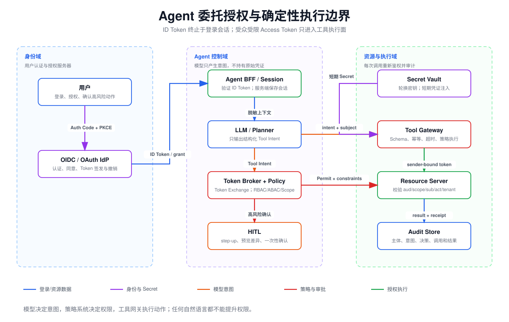

# Agent 身份治理设计：OAuth/OIDC、委托授权、RBAC/ABAC、数据治理与人工确认



## 阅读前术语表

| 术语 | 中文建议 | 工程含义 |
|---|---|---|
| OAuth 2.0 | 开放授权协议 | 让 Client 获得访问 Resource Server 的受限 Access Token；它解决授权，不等同于用户登录协议。 |
| OpenID Connect / OIDC | 开放身份连接 | 建立在 OAuth 2.0 之上的身份层，用 ID Token 表达认证后的用户身份。 |
| Authorization Server / AS | 授权服务器 | 认证 Client/用户、获得授权并签发 Token 的可信组件；OIDC 中也称 OpenID Provider。 |
| Resource Server / RS | 资源服务器 | 持有受保护 API/数据并验证 Access Token、Scope 与资源策略的服务。 |
| Client | 客户端 | 请求授权并代表用户调用 API 的应用；Agent Runtime 通常是机密 Client，而模型不是 Client。 |
| ID Token | 身份令牌 | 给 Client 证明“谁完成了认证”的 Token，目标 audience 是 Client；不应拿它直接调用业务 API。 |
| Access Token | 访问令牌 | 给 Resource Server 表达“允许哪些访问”的凭证，必须检查 issuer、audience、期限和 Scope。 |
| Scope | 授权范围 | Token 层面的粗粒度能力边界，例如 `invoice.read`；不是完整资源级授权策略。 |
| RBAC | 基于角色的访问控制 | 根据用户/Agent 所属角色授予权限，适合稳定的岗位与职责集合。 |
| ABAC | 基于属性的访问控制 | 根据主体、资源、动作和环境属性实时判定，适合租户、所有权、风险、时间和设备等条件。 |
| PDP | 策略决策点 | 根据结构化事实与策略返回 Allow/Deny/Require-Approval 的组件。 |
| PEP | 策略执行点 | 在动作真正发生前调用 PDP 并执行决定的组件，通常位于 Tool Gateway 或 Resource Server。 |
| Delegation | 委托 | 用户保留主体身份，Agent 以自己的 Actor 身份代表用户执行有限动作。 |
| Token Exchange | Token 交换 | 用现有主体 Token 和 Actor 身份换取更窄、面向下游资源的短期 Token。 |
| DPoP / mTLS | 持有证明／双向 TLS | 将 Token 与具体客户端密钥或证书绑定，降低 Token 被窃取后的重放风险。 |
| PII | 个人可识别信息 | 能直接或间接识别自然人的数据，必须按目的、最小化、保留和删除策略治理。 |

## 1. 先分清认证、授权和策略执行

```text
OIDC：谁登录了？Client 能否相信这个身份会话？
OAuth：Client 被授予哪个 API 的哪些 Scope？
RBAC/ABAC：这个主体在此时能否对这个具体资源执行此动作？
PEP：谁保证拒绝决定真的挡在副作用之前？
```

常见错误是拿 ID Token 调工具 API，或认为 Access Token 签名有效就可访问所有资源。正确关系为：OIDC 建立用户身份；OAuth 传递有限能力；Resource Server 和 PEP 对具体资源再次授权。

## 2. 推荐的 Agent 委托架构

### 2.1 信任边界

| 组件 | 信任职责 | 不可信输入 |
|---|---|---|
| User Agent | 完成交互与展示同意 | 网页、扩展、重定向参数 |
| Agent Application | 维护会话、目标与用户体验 | 用户 Prompt、模型建议 |
| Agent Runtime | 编排模型与工具，不持有全局管理员权力 | 模型输出、工具结果、记忆 |
| Authorization Server | 认证、同意、签发/撤销 Token | Client 请求的新 Scope |
| Token Broker / STS | 将用户授权与 Agent Actor 组合成下游短 Token | 上游 Token、Actor 声明 |
| PDP | 对结构化主体/资源/动作/环境作决定 | 属性源与策略版本 |
| Tool Gateway / PEP | 校验参数、Token、策略与审批后执行 | 模型提出的工具调用 |
| Resource Server | 资源级 ACL、租户隔离和权威状态 | Tool Gateway 请求 |
| Secret Manager | 生成、轮换、租赁和撤销 Secret | 工作负载取密请求 |
| Audit Store | 保存不可抵赖决策链 | 来自各组件的事件 |

模型不位于 OAuth 信任计算基中：它可以建议调用，但不得读取 Refresh Token、Client Secret、私钥，也不得决定自己的 Scope。

### 2.2 Authorization Code + PKCE

面向用户的登录/授权使用 Authorization Code Flow，并使用 PKCE、精确 Redirect URI、`state` 与 OIDC `nonce`。RFC 9700 建议避免不安全的 Implicit Grant，并要求限制 Access Token 的 audience 和权限。[RFC 9700](https://www.rfc-editor.org/rfc/rfc9700.html)

简化流程：

1. Client 生成 `state`、`nonce`、`code_verifier` 和 `code_challenge`；
2. 浏览器跳转 AS，用户认证并同意明确 Scope；
3. AS 将一次性 Code 返回已注册 Redirect URI；
4. Client 后端用 Code + `code_verifier` 换 Token；
5. Client 验证 ID Token 的 `iss/aud/exp/nonce`，建立会话；
6. Access/Refresh Token 只保存在服务端安全存储，不进入模型上下文。

## 3. 用户委托授权：保留 Subject 与 Actor

RFC 8693 区分委托与冒充：委托中 Agent 保留自身身份，同时代表用户；冒充可能让接收者只看到用户。Agent 场景优先委托，因为可追责性更强。

```json
{
  "iss": "https://auth.example",
  "sub": "user:17",
  "act": {"sub": "agent:invoice-reviewer:v3"},
  "aud": "https://invoice-api.example",
  "scope": "invoice.read payment.draft",
  "tenant_id": "tenant-a",
  "purpose": "invoice-review",
  "jti": "token-unique-id",
  "exp": 1786779300,
  "cnf": {"jkt": "dpop-public-key-thumbprint"}
}
```

建议流程：

1. Agent Runtime 接收用户会话，但不把原始 Token发给模型；
2. 模型提出候选动作；
3. Runtime 规范化动作和资源；
4. Token Broker 依据原始授权、Agent 能力清单和策略，交换一个短期 Token；
5. Token 限定唯一 `aud`、最小 Scope、租户、Purpose、Actor、很短 TTL；
6. PEP 与 Resource Server 都验证 Token，防止网关旁路；
7. 完成、取消、异常或用户撤销时使 Token 失效。

`resource` 参数可按 RFC 8707 请求特定 Resource Server，从签发阶段减少跨服务重放。[RFC 8707](https://www.rfc-editor.org/rfc/rfc8707.html) 对高风险客户端，可用 DPoP 或 mTLS 做 sender-constrained Token，避免仅窃取 Bearer Token 即可重放。

## 4. RBAC、ABAC 与 Scope 如何组合

### 4.1 三者解决不同问题

| 层 | 示例 | 优点 | 局限 |
|---|---|---|---|
| RBAC | `finance_reviewer` 可创建付款草稿 | 易管理、易审计 | 难表达租户、金额、时间和所有权 |
| Scope | Token 含 `payment.draft` | 可下放、可过期、可绑定 audience | 通常是动作级，不足以约束具体对象 |
| ABAC | 同租户、金额 ≤ 阈值、工作时段、风险低 | 细粒度、上下文感知 | 属性质量和策略复杂度需要治理 |

最终授权建议取交集：

```text
RBAC 允许角色进行某类动作
∧ Token Scope 允许本次委托使用该动作
∧ ABAC 允许当前主体/资源/环境组合
∧ Agent Manifest 声明该能力
∧ 高风险批准条件已满足
```

### 4.2 PDP 输入必须来自可信事实

```json
{
  "principal": {
    "subject": "user:17",
    "actor": "agent:invoice-reviewer:v3",
    "tenant_id": "tenant-a",
    "roles": ["finance_reviewer"]
  },
  "token": {
    "issuer": "https://auth.example",
    "audience": "invoice-api",
    "scopes": ["invoice.read", "payment.draft"],
    "expires_at": "2026-08-15T10:15:00Z"
  },
  "action": "payment.create_draft",
  "resource": {
    "id": "invoice:8842",
    "tenant_id": "tenant-a",
    "classification": "confidential",
    "amount": 3800,
    "owner_department": "finance"
  },
  "environment": {
    "risk_score": 22,
    "device_trust": "managed",
    "goal_id": "invoice-review-v3",
    "approval": null
  }
}
```

`tenant_id`、资源金额、所有权和角色必须由身份系统/业务数据库提供，不能接受模型在工具参数中自报。

### 4.3 决策结果不应只有布尔值

```json
{
  "decision": "require_approval",
  "decision_id": "pd_01J...",
  "policy_version": "finance-agent-12",
  "reason_codes": ["PAYMENT_SIDE_EFFECT", "AMOUNT_OVER_AGENT_LIMIT"],
  "obligations": {
    "mask_fields": ["bank_account"],
    "approval_ttl_seconds": 300,
    "max_amount": 5000
  }
}
```

PEP 负责履行 `obligations`。策略服务超时、属性缺失或 Token 验证异常时，高风险动作应 fail-closed。

## 5. Secret 生命周期与轮换

OWASP 建议集中存储、自动轮换、最小权限、可撤销、不过度记录 Secret，并审计创建、使用、轮换、失效和异常复用。[Secrets Management Cheat Sheet](https://cheatsheetseries.owasp.org/cheatsheets/Secrets_Management_Cheat_Sheet.html)

### 5.1 Secret 分层

| Secret | 建议 | Agent 特别约束 |
|---|---|---|
| 用户 Access Token | 短期、audience/scope 限定、可撤销 | 只在 Runtime/Token Broker 中处理 |
| Refresh Token | 加密存储、轮换、设备/Client 绑定 | 不下发工具和沙箱 |
| 工作负载身份 | OIDC 联邦或短期证书 | 每个 Agent/环境独立身份 |
| 第三方 API Key | Vault 托管、自动轮换 | 出口代理按 host/path 注入 |
| 签名密钥 | KMS/HSM、`kid`、双阶段轮换 | 模型和 Agent 进程不可导出私钥 |

### 5.2 零停机轮换

1. 生成 `new` 版本并发布公钥/验证材料；
2. 验证端同时接受 `old + new`；
3. 新签发和新连接只使用 `new`；
4. 等待旧凭证最大 TTL 与缓存传播期；
5. 撤销 `old`，监控旧版本使用；
6. 从运行环境、备份和文档中清理，保留非敏感审计元数据。

失陷轮换与计划轮换不同：失陷时要先撤销、隔离调用方和追踪使用范围，不能等待平滑窗口结束。

## 6. PII 脱敏、保留与删除

### 6.1 最小化优先于脱敏

顺序应为：不收集 → 不送入模型 → 字段级 Tokenization/掩码 → 受控解密 → 最终删除。掩码只是展示控制，不能把同一底层明文继续广泛复制。

| 场景 | 推荐处理 |
|---|---|
| 模型不需要身份证号 | 字段删除，不进入 Prompt |
| 需要关联但不需明文 | 租户独立的 HMAC/Tokenization |
| UI 需确认后四位 | 后端返回 `****1234` |
| 调试日志 | 结构化字段 Allowlist，默认不记录正文 |
| 向量库 | 先去标识化，记录来源与删除句柄 |
| 人工复核 | 最小字段、短时访问、Watermark 与审计 |

不要用无盐普通哈希处理低熵标识符；手机号、邮箱和身份证可被字典枚举。跨租户还应使用不同 Tokenization 域，避免相同输入形成可关联的全局标识。

### 6.2 保留策略

每类数据至少定义：目的、法定依据、Owner、存储位置、保留期、触发事件、删除方式、例外冻结和验证方法。例如：

```yaml
retention_class: agent-trace-30d
applies_to: [tool_metadata, policy_decision, redacted_prompt]
excludes: [access_token, raw_secret, private_chain_of_thought]
active_days: 30
cold_days: 335
delete_trigger: expiry_or_subject_request
legal_hold: supported
verification: deletion_ledger_and_sample_retrieval
```

### 6.3 删除传播

```text
删除请求 → 身份与范围校验 → 主记录 Tombstone
       → RAG/Embedding → Cache → Memory → Object → Analytics
       → 备份过期/恢复后重放删除 → 完成证明
```

删除不能只覆盖业务主库。应维护 `deletion_id`、数据主体、租户、各存储目标、状态、最后错误、重试和完成时间；备份通常采用加密擦除或到期删除，但恢复备份后必须重放删除账本。

## 7. 审计字段设计

```json
{
  "event_id": "evt_...",
  "occurred_at": "2026-08-15T10:01:02.123Z",
  "trace_id": "tr_...",
  "run_id": "run_...",
  "goal_id": "invoice-review-v3",
  "tenant_id": "tenant-a",
  "subject_id": "user:17",
  "actor_id": "agent:invoice-reviewer:v3",
  "client_id": "agent-app",
  "action": "payment.create_draft",
  "resource_type": "invoice",
  "resource_id_hash": "hmac:...",
  "token_jti_hash": "hmac:...",
  "scope": ["payment.draft"],
  "policy_decision_id": "pd_...",
  "policy_version": "finance-agent-12",
  "decision": "allow",
  "reason_codes": ["SAME_TENANT", "WITHIN_LIMIT"],
  "approval_id": null,
  "tool_call_id": "call_...",
  "outcome": "success",
  "side_effect_receipt": "draft_882",
  "data_classes": ["confidential"],
  "redaction_version": "redact-4"
}
```

不记录 Access Token、Refresh Token、密码、私钥、完整 PII、数据库连接串和不必要的模型内部推理。OWASP Logging Cheat Sheet 也明确建议对 Access Token、敏感 PII 和主 Secret 做删除、掩码、哈希或加密。[Logging Cheat Sheet](https://cheatsheetseries.owasp.org/cheatsheets/Logging_Cheat_Sheet.html)

## 8. 人工确认不是一个“确定”按钮

### 8.1 何时确认

| 风险条件 | 策略 |
|---|---|
| 只读、同租户、低敏、可逆 | 可自动执行并记录 |
| 首次外部目的地或敏感数据外发 | 必须确认目的地与字段 |
| 删除、发布、付款、权限变更 | 强确认；必要时二人复核 |
| 超过金额/数量/租户阈值 | 升级审批，不允许拆单绕过 |
| 来源不可信或 Goal Drift | 暂停并展示来源与计划差异 |
| 策略/身份/审计不可用 | 高风险 fail-closed |

### 8.2 确认对象

确认必须展示并绑定：动作、资源、规范化参数、金额/数量、目标主体、外部目的地、数据分类、预期副作用、来源证据、有效期和撤销方式。

```text
approval.intent_hash = H(action + resource + canonical_params + subject + actor + goal + expiry)
```

执行前重新计算。任何参数变化、资源版本变化、Scope 变化或超过 TTL 都要求重新确认，从而抵抗 TOCTOU 和批准重放。

### 8.3 抵抗确认疲劳

- 不为低风险动作频繁弹窗；
- 合并同一批次但显示范围上限和样本；
- 高风险使用差异视图，而非 Agent 自写摘要；
- 禁止倒计时、情绪操纵和默认勾选；
- 记录拒绝、超时、重复请求和批准后变更；
- 对连续批准和异常时间段触发二次认证或二人控制。

## 9. 本文结论

1. OIDC 证明身份，OAuth 传递有限授权，RBAC/ABAC 对具体资源做决策，PEP 在副作用前强制执行。
2. Agent 是独立 Actor，不应冒充用户；委托 Token 应保留 `sub + act` 并限定 audience、Scope、租户、目的和 TTL。
3. RBAC、Scope、ABAC、Agent Manifest 和人工批准是交集关系，任何一层都不能单独放大权限。
4. Secret 应通过 Vault/代理按需注入并自动轮换，不能进入模型、沙箱和日志。
5. PII 治理必须覆盖最小化、派生数据、保留、删除传播和完成证明。
6. 人工确认要绑定具体不可变意图，防止模糊批准、疲劳和 TOCTOU。

## 参考资料

- [OpenID Connect Core 1.0](https://openid.net/specs/openid-connect-core-1_0-final.html)
- [RFC 9700: Best Current Practice for OAuth 2.0 Security](https://www.rfc-editor.org/rfc/rfc9700.html)
- [RFC 8693: OAuth 2.0 Token Exchange](https://www.rfc-editor.org/rfc/rfc8693.html)
- [RFC 8707: Resource Indicators for OAuth 2.0](https://www.rfc-editor.org/rfc/rfc8707.html)
- [RFC 9449: OAuth 2.0 Demonstrating Proof of Possession](https://www.rfc-editor.org/rfc/rfc9449.html)
- [NIST SP 800-162: Guide to Attribute Based Access Control](https://www.nist.gov/publications/guide-attribute-based-access-control-abac-definition-and-considerations-0)
- [OWASP: Secrets Management Cheat Sheet](https://cheatsheetseries.owasp.org/cheatsheets/Secrets_Management_Cheat_Sheet.html)
- [OWASP: Logging Cheat Sheet](https://cheatsheetseries.owasp.org/cheatsheets/Logging_Cheat_Sheet.html)
