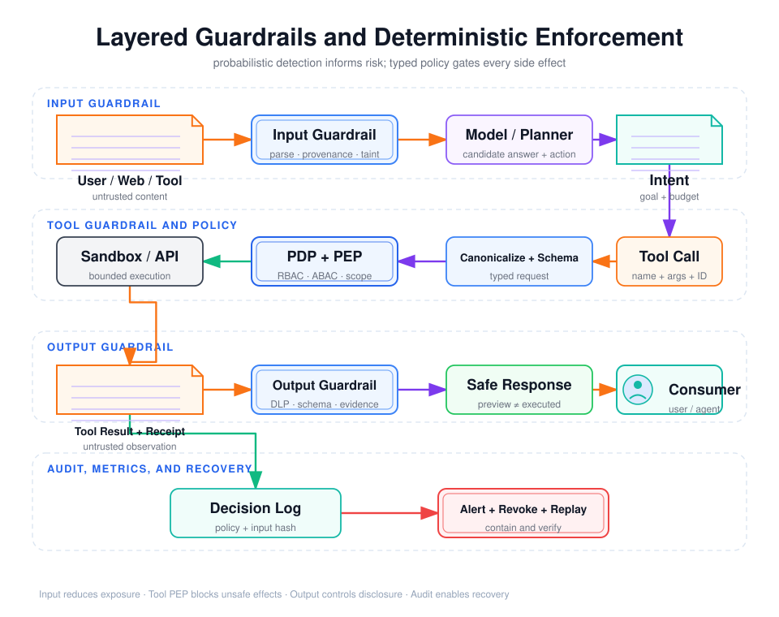

# Agent Guardrail 分层设计：输入、工具、输出与确定性策略执行



## 阅读前术语表

| 术语 | 中文建议 | 工程含义 |
|---|---|---|
| Guardrail | 护栏 | 在 Agent 数据与动作路径上检测、转换、阻断或升级风险的控制；可由规则、模型、策略引擎或人工实现。 |
| Input Guardrail | 输入护栏 | 在内容进入模型/记忆前处理来源、格式、恶意载荷、数据分类和长度。 |
| Tool Guardrail | 工具护栏 | 在模型提出工具调用后、真实执行前后，对工具、参数、权限、副作用和结果做约束。 |
| Output Guardrail | 输出护栏 | 在内容返回用户、进入下游系统或持久化前检查泄漏、格式、证据、可执行内容和渠道策略。 |
| Deterministic Policy | 确定性策略 | 对相同的规范化输入和固定策略版本产生相同决定的代码/策略规则。 |
| Probabilistic Detector | 概率检测器 | 输出分数或类别的模型，存在误报、漏报、漂移和非确定性。 |
| PDP / PEP | 策略决策点／执行点 | PDP 算出决定；PEP 位于不可绕过的执行路径上落实允许、拒绝或审批义务。 |
| Canonicalization | 规范化 | 将路径、URL、金额、Unicode、JSON 等转成唯一表示后再校验，防止等价编码绕过。 |
| Obligation | 决策义务 | PDP 除 Allow/Deny 外要求 PEP 执行的附加动作，如脱敏、限额、审批或记录。 |
| DLP | 数据防泄漏 | 识别和阻断敏感数据流向未授权目的地的控制。 |
| Policy-as-Code | 策略即代码 | 将安全与合规规则版本化、测试、发布和审计，而不是散落在 Prompt 和业务分支中。 |
| Decision Log | 决策日志 | 记录策略输入摘要、策略版本、决定、原因和执行结果的审计事件。 |

## 1. 核心原则：Guardrail 与安全边界不是同义词

输入/输出分类器能降低风险，但分类器不是权限系统。自然语言可能被改写、编码、拆分，检测模型也会漂移。高影响动作必须满足：

\[
Execute = ValidSchema \land Authenticated \land Authorized \land WithinBudget \land ApprovalValid
\]

这些条件应由确定性代码、PDP/PEP、Resource Server 和 Sandbox 强制，而不是由同一个会受注入的模型判断。

正确分工：

```text
概率护栏：发现可疑、打分、隔离、请求更多证据
确定性策略：允许/拒绝具体结构化动作
人工确认：对有限的高风险、语义性决策负责
运行时隔离：即使上层失误仍限制真实影响
```

## 2. 四层控制的边界

| 层 | 检查对象 | 典型控制 | 擅长 | 不能单独证明 |
|---|---|---|---|---|
| 输入 Guardrail | 用户输入、网页、文件、工具结果、Agent 消息 | 大小/类型、解析隔离、来源、注入检测、PII 分类 | 减少恶意内容与脏数据进入 | 最终动作一定安全 |
| 工具 Guardrail | 工具名、参数、主体、资源、调用序列、结果 | Allowlist、Schema、RBAC/ABAC、Scope、审批、幂等、沙箱 | 阻止越权和危险副作用 | 最终文本不会泄密或误导 |
| 输出 Guardrail | 文本、附件、引用、结构化响应、下游消息 | DLP、脱敏、Schema、可信渲染、引用核验 | 控制外发与消费格式 | 已执行动作真的成功 |
| 确定性策略执行 | 规范化的主体-动作-资源-环境 | PDP/PEP、默认拒绝、不变量、义务 | 可重复、可测试、不可被 Prompt 改写 | 开放语义一定正确 |

护栏应同时覆盖模型调用前后和工具执行前后。只在最终回答做输出过滤，已经来不及阻止删库、付款或网络外发。

## 3. 输入 Guardrail

### 3.1 先处理载体，再处理语义

推荐顺序：

1. 请求体大小、文件数量、MIME 与魔数一致性；
2. 压缩炸弹、递归归档、宏、脚本、恶意字体和解析器漏洞；
3. 在隔离解析进程中提取正文，使用超时、内存和页数上限；
4. 记录 URL/文档/邮件来源、哈希、时间、租户和处理版本；
5. Unicode 规范化、隐藏文本和编码检测；
6. PII/Secret/数据分类；
7. Prompt Injection 与越狱检测，输出风险信号；
8. 分块时保留来源和污点标签，禁止洗掉 provenance；
9. 决定通过、隔离、截断、人工复核或拒绝。

### 3.2 输入护栏的结果应结构化

```json
{
  "content_id": "doc_8842#chunk_7",
  "tenant_id": "tenant-a",
  "source_type": "external_email_attachment",
  "source_trust": "untrusted",
  "sha256": "...",
  "classifications": ["confidential"],
  "taints": ["indirect_prompt_injection_suspected"],
  "instruction_authority": "none",
  "allowed_uses": ["extract_invoice_fields"],
  "expires_at": "2026-08-16T00:00:00Z"
}
```

即使注入分类器返回低风险，`instruction_authority` 仍应为 `none`。检测结果可以决定是否升级审查，不应动态赋予外部内容指令权。

### 3.3 流式输入与增量检测

流式内容不能只检查首块。攻击载荷可能跨 Chunk 分割，或在模型已开始调用工具后才到达。需要：

- 在完整消息边界完成前不允许高风险工具；
- 增量保留规范化状态，检测跨块模式；
- 总大小、Chunk 数、时间和解压后大小预算；
- 取消时清理临时文件，不把半成品写入记忆；
- 内容版本变化后使旧的分析/批准失效。

## 4. 工具 Guardrail：最关键的强制点

### 4.1 执行前流水线

```text
模型 Tool Call
  → 工具 ID/版本 Allowlist
  → 参数 JSON 解析与 canonicalization
  → JSON Schema 验证
  → 从权威系统解析 resource/tenant
  → Token iss/aud/exp/scope/actor 校验
  → PDP: RBAC + ABAC + 风险 + 预算
  → 审批或强认证义务
  → 幂等键/并发版本检查
  → Sandbox/Resource Server 执行
  → 结果 Schema、数据分类与副作用收据
```

Tool Call ID 只解决调用与结果关联，不构成授权。并行调用时还要确保每个结果只回传给对应运行、租户和调用者。

### 4.2 参数规范化

必须在验证前处理：

- 文件路径：解析 `..`、符号链接、大小写和挂载边界；
- URL：解析 scheme、punycode、重定向、DNS 结果和私网/元数据地址；
- 金额：使用 Decimal 与币种最小单位，不使用浮点；
- Unicode：统一规范形式，拒绝控制字符和双向覆盖；
- JSON：拒绝重复键、未知字段、过深嵌套和非有限数；
- Shell：优先参数数组，不经 Shell；确实需要时采用固定命令模板。

### 4.3 语义授权示例

```text
permit if
  principal.tenant_id == resource.tenant_id
  and action in principal.role.permissions
  and action in token.scopes
  and action in agent_manifest.capabilities
  and amount <= policy.agent_auto_limit
  and destination in approved_beneficiaries
  and current_goal.allows(action, resource)
```

OPA 将策略决策与执行解耦：应用作为 PEP，把结构化 JSON 交给 OPA/PDP，再落实返回决定和义务。[OPA Documentation](https://www.openpolicyagent.org/docs) 生产中 PDP 应靠近 PEP 以降低延迟和网络故障面，同时策略 Bundle、属性和决策日志必须版本化。

### 4.4 执行后检查

工具返回 HTTP 200 不等于任务成功。执行后应校验：

- 结果满足 Tool Result Schema，且 `tool_call_id` 匹配；
- 副作用收据、资源版本和幂等键一致；
- 返回数据仍属于当前租户和 Scope；
- 工具错误文本作为不可信 Observation，不成为新指令；
- 结果中的 PII/Secret 在回到模型前按最小字段裁剪；
- 实际网络、文件和资源消耗未超过策略。

## 5. 输出 Guardrail

### 5.1 面向用户的输出

- 结构化输出必须通过 JSON Schema，拒绝模型附加的未定义字段；
- DLP 检查 Token、密钥、连接串、PII、跨租户 ID 和大段源代码；
- 引用必须存在、可访问并支持对应结论；
- HTML/Markdown 在展示层安全渲染，禁止脚本、危险 URL 和公式注入；
- “已完成”必须由 Outcome/业务收据支持，不能相信模型自述；
- 对不确定性、建议与事实、预览与已执行状态做明确标识。

### 5.2 面向下游系统的输出

模型输出如果进入 SQL、Shell、模板、邮件、工单、代码审查或另一个 Agent，就变成新的输入边界：

```text
model_output → typed schema → semantic validation → destination policy → safe encoder
```

对下游 Agent 消息要包含发送者身份、任务 ID、nonce、时间、Schema 版本、内容哈希和签名；接收方不能因消息来自“内部 Agent”就跳过验证。

### 5.3 流式输出

流式输出一旦发给用户就难以撤回。敏感场景可选择：

- 先在服务器缓冲完整结构，再做 DLP 和 Schema 后发送；
- 只流式发送低风险文本，高风险字段延迟到验证完成；
- 使用状态机，验证失败后明确发送终止事件，而不是拼接“更正”；
- 已发送片段也要计入审计与保留策略。

## 6. 确定性策略执行

### 6.1 PDP/PEP 不是再调用一次 LLM

确定性策略输入必须是已规范化、来源明确的结构化事实。模型可以提议 `action=invoice.pay`，但资源金额、租户、用户角色、Token Scope 和批准状态应从权威系统读取。

建议决策模型：

```text
deny              明确违反禁止规则
require_approval  权限可授予但风险超过自动执行阈值
allow             全部不变量满足
error             属性/策略/依赖不可用；高风险按 deny 处理
```

### 6.2 默认拒绝与优先级

可采用类似 Cedar 的组合语义：默认拒绝；任何显式 `forbid` 覆盖 `permit`；没有满足允许规则则拒绝。[Cedar Authorization](https://docs.cedarpolicy.com/auth/authorization.html)

推荐优先级：

```text
平台不可突破禁令
  > 法律/合规/租户策略
  > 资源所有者策略
  > 用户本次授权与审批
  > Agent Manifest
  > 模型建议
```

下层不能放宽上层，只能进一步收窄。

### 6.3 决策与执行绑定

```json
{
  "decision_id": "pd_01J...",
  "decision": "allow",
  "policy_bundle_hash": "sha256:...",
  "input_hash": "sha256:canonical-action...",
  "valid_until": "2026-08-15T10:05:00Z",
  "one_time_nonce": "...",
  "obligations": {
    "max_rows": 100,
    "egress_allow": ["api.vendor.example"],
    "redact": ["bank_account"]
  }
}
```

PEP 只能执行与 `input_hash` 完全一致的动作；超过 TTL、资源版本变化或重复 nonce 均需重新决策。这同时降低批准重放和 TOCTOU。

### 6.4 策略不可用时

OPA 文档指出 fail-open/fail-closed 的选择由集成方承担。对生产 Agent：

| 动作 | PDP 超时建议 |
|---|---|
| 公共只读、无敏感数据 | 可使用短时缓存的已知 Allow，并记录降级 |
| 租户私有读取 | 默认拒绝或只允许本地已验证缓存 |
| 写、删、发布、付款、权限变化 | 必须 fail-closed |
| 紧急 Break-glass | 强认证、限时、双人批准、独立审计 |

## 7. 护栏部署中的常见缺陷

1. Input Guardrail 只检查用户 Prompt，不检查网页、RAG、工具结果和 Agent 消息。
2. Tool Guardrail 位于模型侧，可被 Agent 选择绕过；真正 PEP 必须位于所有执行路径的公共入口。
3. 输出 DLP 在日志之后运行，Secret 已先写入 Trace。
4. PDP 使用模型自报的 `tenant_id`、金额或资源所有权。
5. 策略缓存键遗漏主体、租户、资源版本或 Scope，复用错误 Allow。
6. 只记录最终 Deny，不记录策略版本、原因和实际副作用。
7. 安全分类器失败时自动放行，或把解析错误当作“无风险”。
8. 人工批准后允许模型修改参数，确认没有绑定真实动作。

## 8. 测试与指标

### 8.1 分层测试

| 层 | 正例 | 最小反例 | 对抗例 |
|---|---|---|---|
| 输入 | 正常 PDF/网页 | 超大文件、坏 MIME | 隐藏/编码/分片注入、压缩炸弹 |
| 工具 | 合法同租户读取 | 未知字段、过期 Token | 路径穿越、SSRF、跨租户、审批替换 |
| 输出 | 合规回答与引用 | 非法 JSON、缺失收据 | Secret 编码、PII 改写、恶意 HTML |
| 策略 | 明确 Allow | 缺属性、无 Permit | Permit 与 Forbid 冲突、PDP 超时 |

### 8.2 关键指标

- `guardrail_detection_recall`：仅用于检测能力，不等于系统安全率；
- `unsafe_side_effect_rate`：攻击 Trial 中真实危险副作用比例，应为 0；
- `policy_bypass_rate`：绕过 PEP 的执行比例，应为 0；
- `cross_tenant_access_rate`：跨租户读取/写入比例，应为 0；
- `approval_binding_failure_rate`：执行与批准参数不一致比例，应为 0；
- `false_block_rate`：合法任务被阻断比例，用于可用性优化；
- `decision_latency_p95`：PDP 决策延迟，但不能以降低延迟为由 fail-open；
- `unattributed_action_rate`：缺少 subject/actor/decision_id 的动作比例，应为 0。

## 9. 本文结论

1. 输入护栏减少不可信内容进入，工具护栏阻止危险副作用，输出护栏控制泄漏与下游消费，四者不能互相替代。
2. 概率检测器负责提供风险信号，确定性 PDP/PEP 才能提供可测试的授权边界。
3. Tool Guardrail 是最重要的执行前强制点，必须检查工具、规范化参数、主体、资源、Scope、策略、批准和预算。
4. 决策要绑定规范化动作哈希、策略版本、TTL 和一次性 nonce，防止重放与 TOCTOU。
5. 高风险动作在策略、身份或属性不可用时应 fail-closed；所有拒绝与允许都要可追溯到决策证据。

## 参考资料

- [OWASP: Securing Agentic Applications Guide](https://genai.owasp.org/download/49059/?tmstv=1753666640)
- [OWASP Agentic Top 10 2026](https://genai.owasp.org/download/52117/?tmstv=1765059207)
- [Open Policy Agent Documentation](https://www.openpolicyagent.org/docs)
- [OPA Deployment: PDP and PEP](https://www.openpolicyagent.org/docs/deploy)
- [OPA Operations: Fail-open and Fail-closed](https://www.openpolicyagent.org/docs/operations)
- [Cedar Authorization Semantics](https://docs.cedarpolicy.com/auth/authorization.html)
