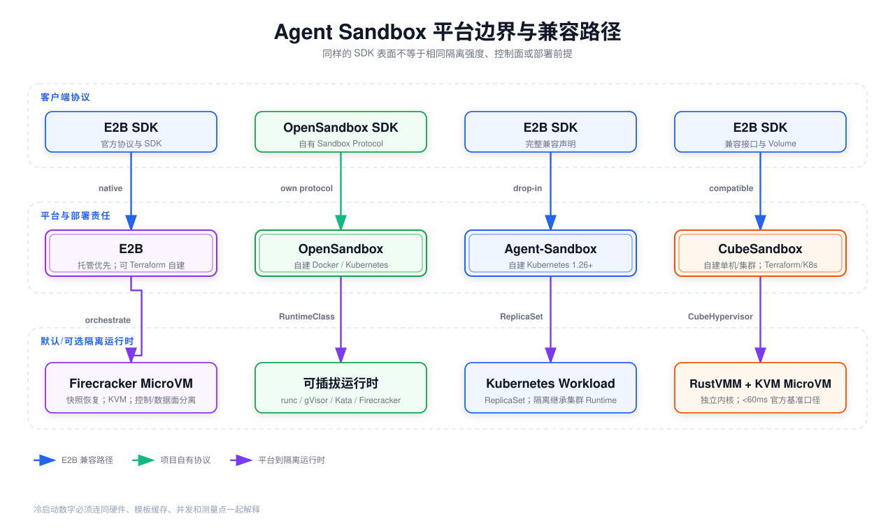

# Agent 代码沙箱选型：E2B、OpenSandbox、Agent-Sandbox 与 CubeSandbox

> 调研快照：2026-08-15。项目能力、许可证、安装前提和性能声明会变化，生产选型前应重新核验对应版本的官方文档与 Release Note。



## 阅读前术语表

| 术语 | 中文建议 | 工程含义 |
|---|---|---|
| Sandbox | 沙箱 | 为不可信代码提供受限 CPU、内存、文件、进程、网络和生命周期的执行环境。 |
| Managed | 托管服务 | 供应商负责控制面、容量、隔离宿主、升级和可用性，用户通过 API 使用。 |
| Self-hosted | 自建 | 团队在自己的云、Kubernetes 或裸机部署并承担容量、安全修补和故障恢复。 |
| Container | 容器 | 进程通常共享宿主内核，通过 Namespace、cgroup、Capabilities、Seccomp 等隔离。 |
| MicroVM | 微型虚拟机 | 每个工作负载有独立 Guest Kernel，由轻量 VMM 和硬件虚拟化隔离。 |
| Firecracker | Firecracker VMM | 面向微虚机的开源 VMM，通常依赖 Linux KVM。 |
| RustVMM | Rust VMM 组件生态 | 使用 Rust 编写的虚拟化组件集合；CubeSandbox 以此构建 MicroVM Runtime。 |
| KVM | Linux 内核虚拟机 | Linux 硬件虚拟化接口；通常要求 CPU 虚拟化能力和可访问的 `/dev/kvm`。 |
| gVisor | 用户态内核隔离 | 在容器与宿主内核之间增加系统调用实现层，增强隔离但有兼容/性能代价。 |
| Kata Containers | 轻量虚机容器运行时 | 以 VM 作为 Pod/容器隔离边界，可使用 QEMU、Firecracker 等 Hypervisor。 |
| E2B-compatible | E2B API/SDK 兼容 | 应用可通过 E2B 风格 SDK 调用替代后端；不表示底层隔离强度、行为和 SLO 完全相同。 |
| Control Plane | 控制面 | 创建、调度、认证、计费、策略和生命周期管理。 |
| Data Plane | 数据面 | 真正运行命令、文件和网络 I/O 的隔离实例及代理。 |
| Cold Start | 冷启动 | 从请求到新隔离环境可用的延迟；必须说明镜像、模板、并发和测量起止点。 |
| Prewarm Pool | 预热池 | 预先准备实例，创建请求到来时分配，以空间换取启动延迟。 |
| Snapshot | 快照 | 保存磁盘及可能的内存/VM 状态，用于快速恢复或持久化。 |

## 1. 先明确：沙箱解决什么，不解决什么

沙箱的核心目标是压缩不可信代码的爆炸半径：即使模型生成了危险代码，也限制它访问宿主、其他租户、控制面、Secret 和任意网络。它不能单独阻止：

- Agent 用合法业务 API 读取或删除越权数据；
- 被授权的网络请求把敏感信息发送到错误目的地；
- OAuth Token 的 Scope、audience 或租户配置错误；
- 恶意依赖在沙箱权限范围内窃取文件；
- 输出内容诱骗用户批准外部动作。

因此完整控制链应是：

```text
最小工具集与委托授权
  → 代码/依赖准入与固定版本
  → 独立沙箱
  → 文件、系统调用、资源和网络出口限制
  → Secret 代理注入
  → 运行审计、销毁与数据删除
```

## 2. 结论先行：四个平台不是同一层产品

| 维度 | E2B | OpenSandbox | Agent-Sandbox | CubeSandbox |
|---|---|---|---|---|
| 主要定位 | 托管优先的云 Sandbox，也开源自建基础设施 | 通用、自建的 Sandbox 平台与协议 | Kubernetes 原生、E2B 兼容的自建控制面 | 基于 RustVMM/KVM 的高性能自建 MicroVM 平台 |
| 托管／自建 | 官方托管；可自建 | 自建为主 | 自建 | 自建，支持单机与集群形态 |
| 默认／核心隔离 | Firecracker MicroVM | 可选 Docker、gVisor、Kata/QEMU、Kata/Firecracker 等 | Kubernetes Workload；隔离强度取决于集群 Runtime/Blueprint | RustVMM + KVM MicroVM、独立 Guest Kernel |
| E2B 兼容 | 原生 | 官方使用自己的 Sandbox Protocol；本次未找到“完整 E2B SDK 兼容”承诺 | 官方仓库声明完整 E2B 协议/SDK 兼容 | 官方仓库声明 E2B 兼容 |
| 降低启动延迟方式 | 预启动模板快照、按需恢复、Pause/Resume | 运行时选择与平台调度；Kata 等有运行时启动开销 | 预热池、Pause/Resume、Snapshot、Scale-to-zero | 轻量 MicroVM、快照、池化/集群调度 |
| 多租户 | 托管平台提供；自建需自行配置网络、身份和容量边界 | 平台提供网络策略、Credential Vault 等能力；强隔离取决于运行时与部署 | 以 Agent/User 为隔离和管理对象；底层安全仍继承 Kubernetes | MicroVM 边界、eBPF 网络隔离和集群能力；仍需正确的身份/存储分区 |
| 主要部署前提 | 托管只需 API；自建需要云/IaC、KVM/Firecracker 与运维能力 | 本地 Docker + Python；生产通常需 Kubernetes 和选定安全 Runtime | Kubernetes 1.26+ | Quick Start 重点要求 x86_64 Linux + KVM；新版本已有受限 ARM64 原生 KVM 支持 |

表中的“兼容”只描述客户端/API 路径。使用相同 E2B SDK，并不能推导出相同内核隔离、镜像语义、Volume 持久性、网络策略、冷启动或故障语义。

## 3. E2B：托管体验与 Firecracker 快照架构

E2B 将 Sandbox 定义为可由 SDK 控制的安全 Linux VM。官方开源基础设施采用 Firecracker MicroVM，并将控制面与数据面分离。[E2B Docs](https://e2b.dev/docs) [E2B Infrastructure](https://github.com/e2b-dev/infra)

### 3.1 启动机制

E2B Template 构建后形成预启动快照。创建 Sandbox 时不是从头引导完整 OS，而是恢复磁盘与内存状态，并使用按需内存页与写时复制根文件系统减少初始化成本。Pause/Resume 用于暂停计算并恢复状态。

官方文档给出的 Resume 量级约为 1 秒，Pause 时间与内存大小相关，示例口径约 4 秒/GiB；这不是所有新建 Sandbox 的统一冷启动承诺。网络、区域、模板大小、并发和首次镜像获取仍会影响端到端延迟。

### 3.2 托管与自建权衡

托管模式的价值在于把宿主补丁、MicroVM 调度、容量池和控制面可用性交给供应商。自建仓库提供 Terraform 路径，但团队要承担：

- KVM/Firecracker 宿主和云权限配置；
- 控制面、数据面、网络和存储的高可用；
- 镜像/模板供应链、宿主内核修补与逃逸响应；
- 租户配额、日志、成本、升级和灾难恢复。

若需求只是快速为 Coding Agent 提供隔离执行，托管通常是最低运维路径；若有数据驻留、内网访问、强定制或规模成本要求，再评估自建。

## 4. OpenSandbox：协议与运行时可插拔

[OpenSandbox 官方仓库](https://github.com/opensandbox-group/OpenSandbox) 的特点是用统一平台管理不同隔离运行时，而不是把自己绑定为单一 MicroVM 实现。它提供 SDK、CLI、MCP 接入、网络策略和 Credential Vault 等能力，并支持 Docker 与 Kubernetes 部署。

### 4.1 隔离强度是一项部署选择

官方安全运行时文档列出多个选项：

| Runtime | 边界 | 官方文档中的近似启动开销 | 适用判断 |
|---|---|---:|---|
| runc | 共享宿主内核容器 | 约 0 ms 额外 Runtime 开销 | 可信或低风险任务，不能默认视为强敌对多租户 |
| gVisor | 用户态内核 | 约 10–50 ms | 在兼容性与隔离间折中 |
| Kata + QEMU | VM 隔离 | 约 500 ms | 强隔离、兼容范围较广，但资源成本更高 |
| Kata + Firecracker | MicroVM 隔离 | 约 125 ms | 更快 VM 启动，需满足相应宿主与 Runtime 条件 |

这些数字是文档中的运行时额外开销估算，不是从 API 请求到用户命令可执行的完整冷启动 SLO，不能直接与 CubeSandbox 的项目基准或 E2B 的恢复延迟横向相减。

### 4.2 适用场景

OpenSandbox 适合希望保留运行时选择权的团队：开发环境用 Docker，生产敏感租户用 gVisor/Kata；同时通过平台统一生命周期、网络和凭证策略。代价是团队需要测试各 Runtime 的系统调用兼容性、镜像格式、节点配置和资源开销。

截至本次核验，官方主线强调自己的 Sandbox Protocol，而非“完整 E2B SDK 兼容”。若现有应用强依赖 E2B SDK，应先做真实兼容测试，不应根据“都是 Sandbox”推断可直接替换。

## 5. Agent-Sandbox：Kubernetes 原生的 E2B 兼容层

[Agent-Sandbox 官方仓库](https://github.com/agent-sandbox/agent-sandbox) 将平台设计为 Kubernetes 原生组件，并声明完整兼容 E2B 协议/SDK。它以 Kubernetes 对象保存状态，不要求外部 etcd、数据库或消息队列，也不依赖 CRD；Sandbox Workload 以 ReplicaSet 等原生对象承载。

### 5.1 它不是固定的 MicroVM

Agent-Sandbox 的控制面可管理多租户、预热池、暂停/恢复、快照、Scale-to-zero 和指标，但真正隔离强度由集群采用的容器运行时、RuntimeClass、节点和 Blueprint 决定：

```text
Agent-Sandbox API
  → Kubernetes ReplicaSet / Pod
  → runc、gVisor、Kata 或平台提供的隔离 Runtime
```

因此不能把“E2B compatible”误读成“内部必然使用 Firecracker”。选型评审必须同时检查 K8s RuntimeClass、Pod Security、NetworkPolicy、Node 隔离和存储策略。

### 5.2 启动与部署

官方使用预热池降低创建延迟，但没有找到一个适用于所有 Blueprint/集群的固定冷启动数字。应在自己的集群测量：池命中、池未命中、镜像已缓存、镜像未缓存、不同 Runtime 和高并发场景。

部署前提为 Kubernetes 1.26+。优势是能复用企业 K8s 的调度、监控和治理；代价是其可靠性和隔离质量也会继承集群复杂度。

## 6. CubeSandbox：RustVMM + KVM MicroVM

[CubeSandbox 官方仓库](https://github.com/tencentcloud/CubeSandbox) 以 RustVMM 与 KVM 构建 MicroVM，每个 Sandbox 有独立 Guest Kernel，并提供 E2B 兼容接口、快照、Volume、eBPF 网络隔离和 L7 凭证注入等能力。

### 6.1 x86_64 / KVM 要求必须明确记录

官方 Quick Start 的基础部署要求是 **x86_64 Linux 主机并可使用 KVM**。这意味着：

- 普通 macOS/Windows Docker Desktop 不能直接等价提供该生产运行时；
- 云 VM 必须支持嵌套虚拟化，或选择裸机/具备 KVM 的实例；
- `/dev/kvm`、CPU 虚拟化扩展、内核模块和设备权限必须正确；
- Kubernetes 节点需要调度标签、设备权限与安全配置。

版本差异需要同时记录：当前 v0.5 资料显示已增加原生 ARM64 KVM 支持，但 PVM、Live Migration 等能力仍有 x86_64 限制，ARM64 也要求原生裸机 KVM。故不能把最新版概括为“只支持 x86_64”，但若按 Quick Start 和完整特性部署，x86_64/KVM 仍是最稳妥、必须核验的前提。

### 6.2 性能声明如何理解

项目主页给出“小于 60 ms 启动、每实例小于 5 MB”等声明，并公布特定裸机环境下 50 并发时平均约 67 ms、P95 约 90 ms、P99 约 137 ms 的基准。应把它视为项目在指定硬件、模板和测量点下的结果，而不是跨云、跨镜像的保证。

生产验证至少要同时测量：冷宿主、热宿主、首次模板、快照恢复、并发 1/10/50/100、磁盘和网络就绪、第一条命令完成，以及失败/超时分布。

## 7. 冷启动对比的正确方法

“冷启动 60 ms”和“恢复约 1 秒”可能测量的是不同区间。统一 Benchmark 应定义：

```text
T0 API 接收 create 请求
T1 调度完成
T2 隔离边界创建
T3 Guest/容器 Agent 就绪
T4 文件与网络策略就绪
T5 第一条命令开始
T6 第一条命令完成
```

至少报告 `T0→T3`、`T0→T5`、`T0→T6` 的 P50/P95/P99，并注明：

- 池命中还是池未命中；
- 镜像和内存页是否已缓存；
- 模板大小、CPU/内存、宿主型号和区域；
- 并发与到达模式；
- 网络策略、Volume 和 Secret 注入是否包含在内；
- 失败、排队和超时是否被排除。

否则一个平台测“VMM 构造”，另一个测“公网 API 到 Shell”，数字不可比较。

## 8. 多租户安全检查表

无论选择哪个平台，都要逐项验证：

### 8.1 计算与内核

- 不同租户是否共享宿主内核或 Guest Kernel；
- 默认是否非 root，是否删除 Capabilities、启用 Seccomp/LSM；
- 是否限制 CPU、内存、PIDs、磁盘、IO、运行时间和输出；
- 逃逸后能否访问控制面凭证、Kubelet、Docker Socket 或云元数据。

### 8.2 存储与快照

- 工作目录、Volume、模板和快照是否包含 `tenant_id`；
- 实例回收到池前是否擦除可写层；
- 快照是否可能保留 Token、Shell History、环境变量和临时文件；
- 删除请求能否传播到快照、对象存储、日志和备份。

### 8.3 网络和 Secret

- 默认出口是拒绝还是全开放；
- DNS、IP、域名、端口、协议和 HTTP 路径策略在哪里执行；
- 是否阻断环回、链路本地、RFC1918、云元数据和控制面；
- Secret 是否由可信代理按 host/path/method 注入，还是以环境变量暴露给代码；
- 是否记录外发目的地、字节量和数据分类。

### 8.4 控制面

- Sandbox ID 是否足够且仍做资源授权，不能只靠不可猜测 ID；
- E2B SDK/API Key、用户、租户与 Sandbox 所有权如何绑定；
- Create、Connect、Pause、Snapshot、Delete 是否都重新鉴权；
- 数据面能否伪造完成状态或审计；
- 控制面失效时高风险实例如何终止和隔离。

## 9. 选型决策

### 9.1 推荐路径

```text
需要最快上线且接受外部托管？
  ├─ 是 → 优先验证 E2B 托管的数据驻留、网络和合规
  └─ 否 → 必须自建
          ├─ 已有 K8s，且强依赖 E2B SDK？
          │    └─ 评估 Agent-Sandbox + 明确的安全 Runtime
          ├─ 需要在 Docker/gVisor/Kata 间灵活选择？
          │    └─ 评估 OpenSandbox
          └─ 有 x86_64/KVM 裸机或合适云实例，重视 MicroVM 性能？
               └─ 评估 CubeSandbox
```

### 9.2 不应只看一个指标

最终评分至少包含：隔离模型、逃逸响应、控制面成熟度、网络出口、Secret 处理、SDK 兼容、工作负载兼容性、冷启动分布、稳态吞吐、实例密度、可观测性、升级路径、团队运维能力和总成本。

一个 20 ms 更快但默认开放网络、共享 Secret 或无法删除快照的平台，不一定是更好的 Agent 安全方案。

## 10. 最小验收实验

1. 创建 100 次冷/热 Sandbox，记录分阶段 P50/P95/P99；
2. 并发 1、10、50、100，验证排队、超时和容量降级；
3. 尝试读取宿主文件、`/dev/kvm`、Docker Socket、Kubelet 和云元数据；
4. 尝试连接同租户、跨租户、内网、Internet Allowlist 与未批准域名；
5. 在日志、进程环境、文件系统和快照中搜索 Canary Secret；
6. 实例销毁并重新分配后检查残留文件、进程和网络连接；
7. SDK 覆盖 Create、Command、Files、PTY、Pause/Resume、Snapshot、Timeout、Cancel 和 Delete；
8. 数据面断连、节点故障、控制面重启时验证状态收敛与重复提交；
9. 恶意 Fork Bomb、磁盘填满、大输出和死循环不得影响其他租户；
10. 运行已知逃逸探针并确认告警、隔离、宿主下线和证据保全流程。

## 11. 本文结论

1. E2B 是托管优先的 Firecracker MicroVM 路径；自建可行但会接管完整基础设施责任。
2. OpenSandbox 的核心是自建平台和可插拔运行时，隔离强度由实际选择的 runc、gVisor 或 Kata/Firecracker 决定。
3. Agent-Sandbox 提供 Kubernetes 原生、E2B 兼容控制面，但不是固定 MicroVM；安全边界继承集群 Runtime。
4. CubeSandbox 以 RustVMM/KVM MicroVM 追求高密度与低启动延迟；必须核验 x86_64/KVM 部署前提及版本相关的 ARM64 能力限制。
5. E2B API 兼容只降低应用迁移成本，不保证隔离、冷启动、持久化和多租户语义相同。
6. 沙箱只是 RCE 纵深防御的一层；OAuth、工具授权、网络出口、Secret、数据隔离和审计仍需独立设计。

## 参考资料

- [E2B Documentation](https://e2b.dev/docs)
- [E2B Open-source Infrastructure](https://github.com/e2b-dev/infra)
- [OpenSandbox 官方仓库](https://github.com/opensandbox-group/OpenSandbox)
- [OpenSandbox Secure Container Runtime Guide](https://github.com/opensandbox-group/OpenSandbox/blob/main/docs/guides/secure-container.md)
- [Agent-Sandbox 官方仓库](https://github.com/agent-sandbox/agent-sandbox)
- [CubeSandbox 官方仓库](https://github.com/tencentcloud/CubeSandbox)
- [Firecracker 官方仓库](https://github.com/firecracker-microvm/firecracker)
- [Kata Containers 官方文档](https://katacontainers.io/)
- [gVisor 官方文档](https://gvisor.dev/docs/)
