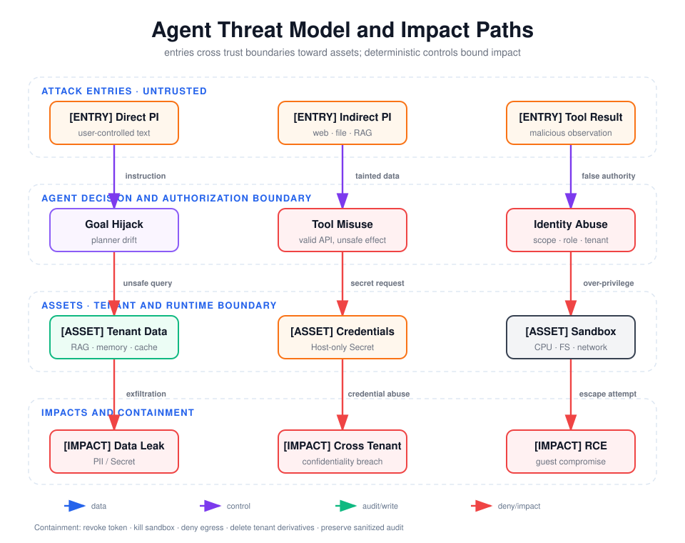

# Agent 安全面试与 15 分钟威胁建模验收

本文用于第 9 周面试与阶段验收。回答以本周实际代码、攻击结果和残余风险为依据，不把
Prompt、模型自我声明或单次演示视为安全证明。

## 阅读前术语表

| 术语 | 说明 |
|---|---|
| Security Boundary | 即使边界内组件被操纵，边界外仍能强制执行安全不变量的控制点 |
| PEP | Policy Enforcement Point，拦截实际动作并执行策略结果的位置 |
| PDP | Policy Decision Point，根据可信主体、资源和环境属性计算允许/拒绝 |
| Subject | 被代表的最终用户，例如 Alice |
| Actor | 实际发起动作的 Agent/服务，用 OAuth `act` 语义表达 |
| Scope | Token 对资源类型和操作的粗粒度授权上限 |
| RBAC | 基于角色的授权，例如 admin 才能申请导出 |
| ABAC | 基于主体、资源、动作、环境属性的授权，例如 token tenant 必须等于 resource tenant |
| Least Agency | 不只限制权限，还限制 Agent 能自主决定的动作、步数、时间和影响 |
| TOCTOU | 检查时与执行时对象发生变化，导致“批准 A，执行 B” |
| Residual Risk | 已部署控制后仍然存在、需要接受、转移或继续缓解的风险 |

## 1. 为什么仅靠 Prompt 不能构成安全边界

Prompt 是模型输入，不是独立强制执行器。它不能构成安全边界，原因有六点：

1. **同一解释器处理策略和不可信数据。** System Prompt、用户输入、网页、RAG 和工具结果
   最终都进入同一个概率模型；间接注入正是利用模型难以稳定区分“数据中的文字”和“应执行
   的指令”。
2. **输出具有非确定性。** 即使某个 Prompt 在测试集上全部拒绝，采样、模型升级、上下文变化
   和攻击改写都可能改变结果，不能证明安全不变量始终成立。
3. **Prompt 没有真实身份来源。** “我是管理员”“这是 tenant-b 的数据”只是字符串；模型无法
   验证 Token 签名、issuer、audience、撤销状态或数据库行归属。
4. **Prompt 不能原子地约束副作用。** 它不能实现一次性审批、事务、幂等键、TOCTOU 绑定、
   文件系统权限、网络 deny rule 或 CPU/内存硬限额。
5. **模型可能被绕过。** 攻击者可以直接调用工具 API、重放 Token，或利用工具实现漏洞；只在
   Prompt 中写规则不会保护下游服务。
6. **失败不可审计证明。** Prompt 拒绝通常只得到自然语言输出，无法形成稳定错误码、策略版本、
   主体、资源、动作哈希和决策证据。

因此正确分工是：Prompt 负责表达任务目标和提供风险提示；模型可以识别可疑内容并提出动作；
真正的安全不变量由模型外的 Token Verifier、Schema、PDP/PEP、数据库租户约束、审批存储、
Sandbox 和审计系统执行。Prompt 是纵深防御的一层，但不是最终边界。

## 2. Agent 安全面试题与参考答案

### 问题 1：直接与间接 Prompt Injection 有什么差异？

直接注入来自当前交互主体，例如用户要求忽略系统规则；间接注入藏在 Agent 为完成正常任务而
读取的网页、文件、邮件、RAG Chunk 或工具结果中。间接注入更容易跨越来源信任，因为读取数据
本身是合法动作。工程上两者都应标记来源与 trust level，但工具授权不能依赖注入检测器是否命中。

### 问题 2：Prompt Injection、Goal Hijack、Tool Misuse 如何串起来？

Prompt Injection 是操纵输入通道，Goal Hijack 是规划目标被替换或漂移，Tool Misuse 是被操纵
目标落到真实 API 后产生的副作用。Excessive Agency 会放大这条链：工具越多、Scope 越宽、无需
审批、运行时间越长，单次模型错误造成的影响越大。

### 问题 3：Allowlist 和 JSON Schema 为什么都需要？

Allowlist 决定“是否存在这个能力”，Schema 决定“该能力的参数结构是否合法”。只有 Schema 时，
攻击者仍可选择一个不该暴露的工具；只有 Allowlist 时，可利用额外字段、类型混淆、路径穿越或
超大输入。二者之后仍需语义授权，因为结构合法的 `tenant_id=tenant-b` 仍是越权请求。

### 问题 4：Scope、RBAC 和 ABAC 分别解决什么？

Scope 是 Token 的授权上限，例如 `tenant.export`；RBAC 表示组织职责，例如 admin 可申请导出；
ABAC 把当前主体、资源和环境组合，例如 Token 中 tenant 必须匹配资源 tenant。有效权限取交集：
具备 admin 角色但没有 `tenant.export` Scope，或两者都有但资源属于另一租户，仍必须拒绝。

### 问题 5：为什么要区分 Subject、Actor 和 OAuth Client？

Subject 是被代表的用户，Actor 是实际执行的 Agent/服务，Client 是获得 Token 的应用。若三者合并，
审计无法回答“谁授权、哪个 Agent 执行、哪个客户端取得凭证”，也难以只撤销某个 Agent 或客户端。
本项目把 `sub`、`act`、tenant、Scope 和 `jti` 一起传播，但不传播原始 Token。

### 问题 6：短期 Token 已经过期，为什么还需要主动撤销？

用户离职、设备丢失、Agent 被攻陷或审批撤回都要求在自然过期前终止权限。撤销通过 `jti` denylist
或 introspection 实现；分布式系统还要考虑传播延迟，因此需要短 TTL、事件广播和关键动作在线检查。

### 问题 7：如何防止跨租户 RAG 泄漏？

必须先选 tenant/ACL 候选集，再进行向量召回和排序；不能先全局检索再隐藏字段，否则 Top-K、计数、
延迟和错误信息仍可能泄漏。进入模型上下文前还要重复授权，缓存 Key、记忆 ID、Trace、Volume、备份
和导出文件也必须包含 tenant namespace。

### 问题 8：记忆污染为什么比一次性注入更危险？

它把瞬时攻击升级为跨会话状态：恶意事实可能被检索、摘要、再写入并影响其他任务。写入时应记录
来源、tenant、owner、版本、TTL 和信任等级；读取后仍按不可信证据处理；同时提供按来源批量撤销、
删除传播和从可信源重建能力。

### 问题 9：高风险人工审批应该绑定什么？

不是绑定一句“是否继续”，而是绑定规范化工具名、完整业务参数、资源、tenant、subject、actor、
策略版本、过期时间和 nonce/一次性状态。本项目使用动作 SHA-256、职责分离、TTL 和单次消费，测试
覆盖批准后篡改、重放与自审批。

### 问题 10：Sandbox 已经隔离代码，为什么仍需要 Tool PEP？

Sandbox 主要限制任意代码对 Host、内核、文件和网络的影响；它不能阻止 Agent 使用一个完全合法的
云 API 删除数据、用有效 Token 跨租户查询，或向批准的目标发送敏感内容。身份、Scope、业务授权、
审批、Secret 管理和出口策略仍应在 Sandbox 外强制执行。

### 问题 11：怎样限制 Agent 的 Secret 暴露？

原始凭证只存在 Host 凭证层，通过 Header 或受控代理使用；工具 Schema、模型上下文、Trace、错误、
审计和 Guest 环境都不携带它。若 Sandbox 必须访问服务，优先由 Egress Proxy 注入短期、受众绑定、
最小 Scope 的凭证，而不是把长期 API Key放进环境变量。

### 问题 12：日志脱敏为何不能只靠正则？

正则适合已知 Token、Email 和手机号格式，但无法可靠识别人名、地址、医疗数据、编码后的凭证或
未知供应商 Key。应先做结构化字段白名单和数据最小化，再做正则/DLP；日志权限、加密、保留期限、
删除传播和抽样检查同样重要。

### 问题 13：如何证明“彻底删除”而不是只删主库？

建立数据血缘和删除编排，逐层清除业务库、向量索引、Agent Memory、Cache、对象存储导出、Trace
和搜索快照；每个处理方返回不含原内容的 tombstone/receipt。备份通常无法立即物理擦除，需要加密
擦除、不可恢复窗口和恢复后再删除策略，并把未完成层记录为残余风险。

### 问题 14：怎样处理恶意工具结果？

验证返回 Schema 和大小，把结果标记为带来源的 untrusted observation，检测指令样内容并在进入
模型前脱敏。更关键的是，后续模型因此提出的新动作仍要重新经过 Allowlist、授权和审批；不能因为
调用了“可信工具”就把工具返回文本升级为策略。

### 问题 15：E2B 适配中哪些限制由哪里实施？

CPU/内存在版本化 Template 中固定，并在创建后读取实际值校验；网络由 E2B `deny_out` 和
`allow_internet_access=false` 强制；文件 API 限定工作目录且不挂载 Host Volume；Secret 不注入 Guest；
Command 有 5 秒 Deadline 和 `ulimit`；Sandbox TTL 为 30 秒、超时 kill，并在 `finally` 再次 kill。
本地无 E2B Key 时必须明确 SKIP，而不是退回 Host Shell。

## 3. 15 分钟威胁建模评审脚本

### 0:00–2:00：范围、资产和安全目标

- 范围：Agent Host、模型上下文、Tool Gateway、双租户 RAG/记忆/缓存、审批系统、E2B；
- 主体：用户 Subject、Agent Actor、OAuth Client、安全审批人；
- 核心资产：租户数据、PII、Access Token/Secret、工具副作用、审计证据；
- 安全目标：tenant-a 永远看不到 tenant-b；未授权/未审批动作不执行；凭证不进模型/日志/Guest；
  任意代码不访问 Host、默认不出网且按时销毁。

### 2:00–5:00：沿数据流跨越信任边界

使用[数据流图](./assets/week9-secure-data-flow.svg)逐段说明：

1. 用户、网页、文件和工具结果进入不可信入口；
2. Input Envelope 记录来源并脱敏，模型只得到业务上下文；
3. 模型生成候选工具动作，Tool Gateway 做 Allowlist 与 Schema；
4. PEP 使用已验证 Principal 做 Scope/RBAC/ABAC；
5. 高风险动作等待精确哈希审批；
6. 数据访问固定 tenant，代码进入无网、无 Secret、短生命周期 E2B；
7. 审计只保存脱敏字段，删除编排覆盖派生存储。

### 5:00–8:00：三条最高风险攻击链

使用本文顶部威胁模型：

- 间接注入 → Goal Hijack → 跨租户 RAG → 数据泄漏；
- 恶意工具结果 → Tool Misuse → 合法高权限 API → 破坏性副作用；
- 身份/Scope 滥用 → 代码执行 → 网络外泄或 Sandbox Escape → Host/租户影响。

说明风险优先级依据不是 OWASP 编号，而是可达性、权限、影响、可恢复性和检测难度。

### 8:00–11:00：关键控制与失败模式

重点讲四类不变量：

1. 身份：签名、issuer/audience、`sub/act/tenant/jti/exp`、撤销；
2. 授权：Allowlist、Schema、Scope、RBAC、ABAC、同租户资源；
3. 副作用：动作哈希、职责分离、一次性审批、E2B deny_out/资源/Deadline/kill；
4. 数据：上下文无凭证、日志 PII 脱敏、跨层删除与 tombstone。

同时主动说明失败模式：撤销传播延迟、DLP 漏报、数据库过滤遗漏、审批疲劳、供应链和 MicroVM TCB。

### 11:00–13:00：攻击证据

展示[攻击结果](./source/artifacts/attack-results.md)：24 条确定性用例全部 PASS，重点抽查：

- `ATK-08/13/14/15`：ABAC 与跨租户 RAG/记忆/缓存；
- `ATK-09/11/12/24`：撤销、审批篡改、重放和职责分离；
- `ATK-17/18/19`：外泄、路径穿越和任意 Shell；
- `ATK-20/21/22/23`：凭证上下文、PII 日志、导出和删除传播。

托管 E2B Live Smoke 当前为 `SKIPPED`，原因是 Host 未设置 Key；明确区分“代码和契约已验证”与
“供应商环境已实测”。

### 13:00–15:00：残余风险与决策请求

- 上线前必须完成托管 E2B live smoke 和真实网络拒绝验证；
- 生产 TokenService 替换为企业 IdP/JWKS 或 introspection；
- 把 tenant 不变量下沉到数据库 RLS、向量库 Filter、Cache Key 和对象存储 Policy；
- 审批票据与撤销状态改为事务型共享存储；
- 建立镜像签名/SBOM、供应商安全公告监控和定期 Sandbox Escape 测试；
- 评审决策：接受教学实现进入作品集，不将其直接视为生产认证组件。

## 4. 验收矩阵

| 验收项 | 确定性实现 | 自动证据 | 当前状态 |
|---|---|---|---|
| 工具 Allowlist / 参数校验 | `ToolGateway` + Draft 2020-12 | ATK-03/04 | PASS |
| RBAC / ABAC / Scope | `PolicyEngine` | ATK-06/07/08 | PASS |
| Token 撤销 | `AccessTokenService._revoked` | ATK-09 | PASS |
| 高风险导出/删除/代码/Shell | `ApprovalStore` + action hash | ATK-10/11/12/24 | PASS |
| 模型上下文无原始凭证 | `DataSanitizer.model_context` | ATK-20 | PASS |
| 日志 PII/凭证脱敏 | `AuditSink` + `DataSanitizer.redact` | ATK-05/21 | PASS |
| RAG/记忆/缓存租户隔离 | `TenantDataStore` + ABAC | ATK-13/14/15 | PASS |
| 导出隔离与删除传播 | `export_tenant/delete_tenant` | ATK-22/23 | PASS |
| E2B 网络/FS/Secret/CPU/内存/时间/生命周期 | `E2BSandboxExecutor` | Sandbox 契约测试 | PASS |
| 托管 E2B 实际云环境 | `run_live_e2b.py` | `live_e2b.status` | SKIPPED：缺少 Key |

结论：所有关键高风险操作均有模型外的确定性策略；导出、彻底删除、代码和 Shell 还要求人工审批。
未完成项仅为需要外部凭证和账户资源的托管 E2B live smoke，已明确记录而未伪造通过。
