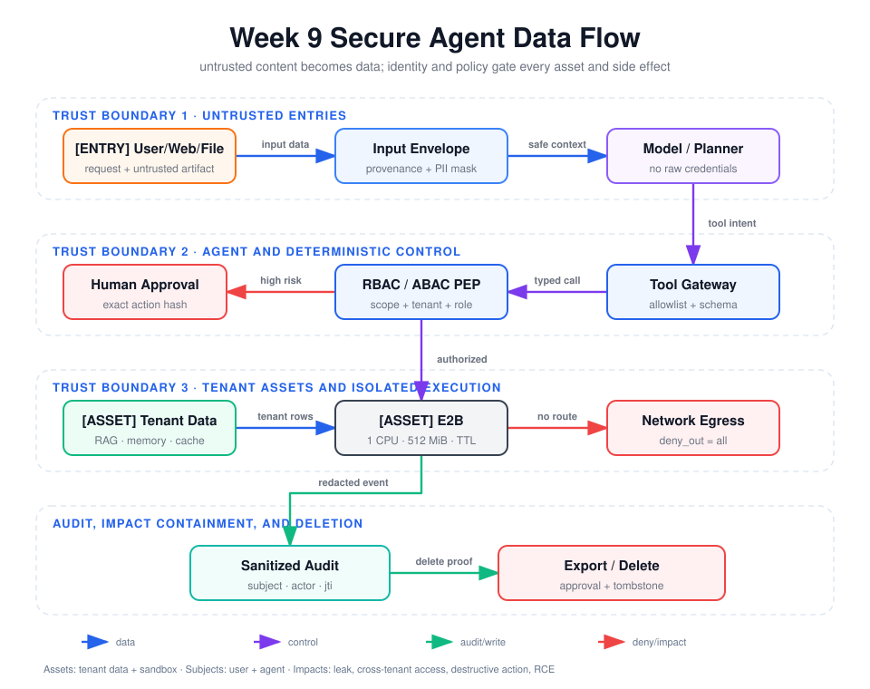

# 第 9 周编码实验：Agent Security Gateway、Tenant Isolation 与 E2B Sandbox

本目录把第 9 周安全设计落成一个框架无关的最小实现。模型只能提出工具名和业务参数；
工具 Allowlist、JSON Schema、Token 验证/撤销、Scope、RBAC、ABAC、人工审批、租户过滤、
日志脱敏和 E2B 策略全部由确定性代码执行。



## 1. 交付结构

```text
source/
├── security_runtime.py       # Token、撤销、RBAC/ABAC、审批、Tool Gateway、脱敏
├── tenant_store.py           # 双租户 RAG/记忆/缓存、导出与删除传播
├── sandbox.py                # E2B 网络/文件/Secret/资源/超时/生命周期策略
├── build_e2b_template.py     # 显式构建 1 CPU / 512 MiB 托管模板
├── attack_cases.py           # 24 条可执行攻击用例与残余风险
├── run_attacks.py            # 生成 JSON/Markdown 实际结果
├── run_live_e2b.py           # 有 Host 凭证时才运行的托管 E2B Smoke Test
├── tests/                    # 确定性单元和集成契约测试
└── artifacts/
    ├── attack-results.json
    └── attack-results.md
```

配套视图：

- [数据流图](../assets/week9-secure-data-flow.svg)：标出入口、信任边界、租户资产、执行环境和影响面；
- [身份传播图](../assets/week9-identity-propagation.svg)：显示原始 Token 在 Host 终止，后续仅传播已验证 Claims；
- [威胁模型](../assets/week9-threat-model.svg)：把直接/间接注入、工具结果、身份滥用映射到资产和影响。

## 2. 工具执行安全流水线

`ToolGateway.invoke()` 的顺序固定为：

```text
Allowlist
  -> Credential-in-arguments check
  -> Token signature / iss / aud / exp / jti revocation
  -> JSON Schema
  -> minimal Scope
  -> RBAC
  -> ABAC tenant/resource attributes
  -> exact-action approval for high-risk tools
  -> handler or E2B
  -> untrusted observation wrapper
  -> sanitized audit event
```

顺序很重要。模型不能通过在 Prompt 中声明“我是管理员”改变 `Principal`；`tenant_id`、
`subject_id`、`actor_id`、Scope、角色和 `jti` 均来自验证后的 Token。模型工具 Schema
不包含 Token 或 Secret 字段，原始凭证也不会进入日志。

已注册工具及最小权限：

| 工具 | 角色 | Scope | 高风险审批 | 额外边界 |
|---|---|---|---|---|
| `rag_search` | viewer/editor/admin | `rag.read` | 否 | 召回前固定 tenant 分区 |
| `memory_read` | viewer/editor/admin | `memory.read` | 否 | tenant + owner |
| `memory_write` | editor/admin | `memory.write` | 否 | tenant + owner + Schema |
| `cache_get` | viewer/editor/admin | `cache.read` | 否 | tenant namespace + owner |
| `tenant_export` | admin | `tenant.export` | 是 | 精确动作哈希、一次性票据 |
| `tenant_delete` | admin | `tenant.delete` | 是 | RAG/记忆/缓存删除传播 + tombstone |
| `run_shell` | operator/admin | `sandbox.execute` | 是 | argv Allowlist + E2B |
| `run_code` | operator/admin | `sandbox.execute` | 是 | 大小限制 + E2B |

审批绑定 `tool + canonical arguments + tenant + subject + actor` 的 SHA-256，并要求不同的
`security_approver` 主体批准；票据有 TTL 且只能消费一次。这同时防止 TOCTOU 篡改、跨主体
复用和批准重放。

## 3. 凭证、PII 与工具结果

- Host 使用原始 Access Token 完成验证后，只保留 `sub/act/tenant/scopes/roles/jti/attrs`；
- `DataSanitizer.model_context()` 检出原始凭证后直接 fail-closed；
- 审计详情递归处理敏感字段，并对 Bearer/API Key、Email、手机号执行脱敏；
- 工具结果始终包装为 `trust=untrusted` 的 Observation；发现指令样文本时增加
  `instruction_like_content`，但不把检测器当作最终授权边界；
- 导出数据可以包含数据主体自己的原始 PII，审计日志只记录脱敏摘要，避免把“可携带数据”
  和“日志可存数据”混为一谈。

## 4. E2B 实际限制

实现基于已安装的 `e2b==2.35.0`：

- 网络：`allow_internet_access=False`，并设置 `deny_out=[0.0.0.0/0, ::/0]`；
- 对外入口：`allow_public_traffic=False`；
- 文件系统：不挂载 Host/Persistent Volume；File API 只接受 `/home/user/work` 下的相对路径；
- Shell：只接受一个解析后的 argv，禁止管道、重定向、命令替换、绝对路径和 `..`；
- Secret：Guest 只收到随机 `WEEK9_TASK_ID`，不会注入 `E2B_API_KEY` 或业务 Token；
- CPU/内存：模板固定 1 CPU / 512 MiB，连接后读取实际 SandboxInfo 并 fail-closed 校验；
- 执行时间：Command Deadline 为 5 秒，并设置 guest `ulimit -t`；
- 文件/输出：单文件上限 1 MiB，输出上限 32 KiB；
- 生命周期：创建 TTL 30 秒、`on_timeout=kill`、`auto_resume=false`，且 `finally` 主动 kill。

E2B 的 CPU/内存是在 Template 构建时指定，Sandbox 创建时负责选择并验证模板；网络配置和
生命周期则在每次创建时传入。对应官方接口可参考 [Sandbox 文档](https://e2b.dev/docs/sandbox)、
[Create Sandbox API](https://e2b.dev/docs/api-reference/sandboxes/create-sandbox) 和
[Template Build](https://e2b.dev/docs/template/build)。

当前工作区没有 `E2B_API_KEY`，因此没有伪造托管实测结果，`attack-results` 中明确记录
`live_e2b.status=SKIPPED`。代码没有 Host 本地执行降级路径；无凭证时直接失败。

在有 E2B 账号的 Host 上，显式执行：

```bash
export E2B_API_KEY='从密钥管理器读取，不要写入仓库'
python 9-w/source/build_e2b_template.py --name week9-secure-1c-512m
export E2B_TEMPLATE='week9-secure-1c-512m'
python 9-w/source/run_live_e2b.py
```

构建模板会修改外部 E2B 账号状态并产生资源费用，因此不属于自动测试步骤。

## 5. 攻击测试与实际结果

运行：

```bash
python 9-w/source/run_attacks.py
```

当前确定性攻击集为 24 条，结果为 `24 PASS / 0 FAIL / 0 ERROR`。覆盖：

- 直接/间接 Prompt Injection；
- 未知工具、Schema 绕过、凭证参数注入和恶意工具结果；
- Scope、RBAC、ABAC、Token 撤销；
- 缺少审批、动作篡改、重放和自审批；
- 跨租户 RAG、记忆和缓存；
- curl 外泄、Shell/路径逃逸尝试；
- PII 日志污染；
- 租户导出隔离和 RAG/记忆/缓存彻底删除。

每条用例的预期防护、实际证据和残余风险见
[攻击测试报告](./artifacts/attack-results.md)，机器可读结果见
[attack-results.json](./artifacts/attack-results.json)。

## 6. 测试

```bash
/Users/shiyiliu/workspace/pyproject/.venv/bin/python -m pytest -q \
  -o cache_dir=/tmp/week9-pytest-cache \
  9-w/source/tests
```

测试不会执行 Host Shell，也不会 Mock 一个“已经安全”的大模型。E2B 工厂契约测试验证创建
参数、CPU/内存校验、路径策略、Command Deadline 和 kill；真实托管路径由单独的 live smoke
负责，避免缺少凭证时把 Fake 结果冒充平台隔离结果。

## 7. 已知残余风险

1. HS256 TokenService 只模拟 Resource Server；生产环境应使用企业 IdP、JWKS/introspection、
   sender-constrained Token 和分布式撤销传播。
2. Python 本身是强能力：它可以读取 Guest 基础镜像文件，因此 Guest 不能包含 Host Secret，
   并必须依赖 MicroVM 与平台网络策略隔离。
3. 应用内存储只证明查询和生命周期不变量；生产数据库、向量库、缓存、备份和对象存储必须
   各自提供 tenant 过滤与删除证明。
4. Prompt Injection 检测只提供信号；真正的安全边界是模型外的 PEP、Scope、审批、沙箱和
   数据库约束。
5. E2B MicroVM、控制面和镜像供应链仍属于可信计算基；需要补充供应商安全公告、镜像签名、
   依赖 SBOM 和独立逃逸测试。
